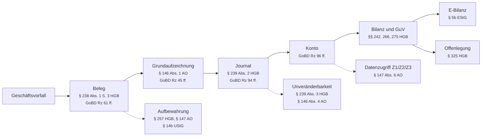

# Anforderungskatalog Buchfink

**Stand:** 2026-09-11, gezielter Abgleich. Aktuelle Funktionen und bekannte Grenzen stehen im [Umsetzungsstand](../projekt/umsetzungsstand.md).

Der Katalog verbindet fachliche Anforderungen mit Prüfkriterien und
Fundstellen im Code. Sein Geltungsbereich ist das Prüfraster, keine Zusage
über unterstützte Rechtsformen oder Geschäftsvorfälle. Den verfügbaren
Funktionsumfang beschreibt der [Umsetzungsstand](../projekt/umsetzungsstand.md).

[Dokumentation](../README.md) · [Fachkonzepte](../fachkonzepte/README.md) ·
[Architektur](../entwicklung/architektur.md) · [Roadmap](../projekt/roadmap.md)

Zum Nachschlagen: [Module und Rechtsgrundlagen](#normenlandkarte),
[Legende](#legende), [Modulübersicht](#übersicht-nach-modul),
[Abgrenzungen](#abgrenzungen-was-hier-nicht-gefordert-ist) und
[Rechtsstand und Quellen](#rechtsstand-und-quellen).

## Geltungsbereich und Annahmen

| Merkmal | Annahme |
|---|---|
| Rechtsform | Kapitalgesellschaft (GmbH, UG, AG, SE) oder haftungsbeschränkte Personengesellschaft nach § 264a HGB |
| Buchführung | Doppelte Buchführung, Bilanzierung nach §§ 238 ff. HGB, keine Einnahmenüberschussrechnung |
| Größe | Kleinst bis mittelgroß nach §§ 267, 267a HGB, nicht kapitalmarktorientiert |
| Konsolidierung | Keine Konzernrechnungslegung nach §§ 290 ff. HGB |
| Bargeschäft | Kein elektronisches Aufzeichnungssystem im Sinne des § 146a AO (siehe Abgrenzungen) |
| Lohn | Lohnbuchhaltung nicht im Scope, Verbuchung der Lohnjournale schon |

Nicht abgedeckt: Konzernabschluss, IFRS, Branchenrecht (KWG, VAG, WpIG), Nachhaltigkeitsberichterstattung, Kassenführung, Lohnabrechnung.

---

## Legende

Die erste Spalte jeder Anforderung nennt die Verbindlichkeit der Norm:

| Kennzeichen | Bedeutung |
|---|---|
| `MUSS` | Unbedingte gesetzliche Pflicht. Verstoß gefährdet die Ordnungsmäßigkeit der Buchführung. |
| `MUSS*` | Pflicht nur bei Vorliegen des Sachverhalts. Wird der Sachverhalt unterstützt, gilt die Anforderung unbedingt. |
| `SOLL` | Verwaltungsauffassung oder Prüfungserwartung. Rechtlich nicht unmittelbar erzwingbar, aber Beanstandungsrisiko in der Betriebsprüfung. |
| `TERMIN` | Pflicht mit künftigem Stichtag. Siehe Terminplan am Ende. |

Die Statustabelle je Anforderung bewertet jedes Akzeptanzkriterium gegen den Code:

| Status | Bedeutung |
|---|---|
| ✅ | Erfüllt. Die Fundstelle nennt die Stelle im Code, an der es nachweisbar ist. |
| 🟡 | Teilweise erfüllt. Die Fundstelle nennt den vorhandenen Teil, die Spalte Grund den fehlenden. |
| ❌ | Fehlt. Wo eine Fundstelle steht, benennt sie die Stelle, an der die Funktion fehlt oder unvollständig aufhört. |
| ⛔ | Außerhalb des Funktionsumfangs. Bewusste Entscheidung nach docs/entwicklung/architektur.md Abschnitt 2, mit Grund. |

Die Spalte Welle dokumentiert die frühere Umsetzungsplanung und ist keine aktuelle Terminzusage. Offene Arbeiten stehen auf der [Roadmap](../projekt/roadmap.md). Ältere Zeilenangaben können durch Umbauten verschoben sein; bei der Prüfung ist die benannte Funktion im aktuellen Code maßgeblich.

Die Akzeptanzkriterien sind als Prüfschritte formuliert. Jedes Kriterium ist so geschrieben, dass ein Tester oder ein Prüfer es an der laufenden Software nachvollziehen kann.

---

## Normenlandkarte

| Modul | Kernnormen | Anforderungen |
|---|---|---|
| [A. Buchführungspflicht und Grundsätze](grundsaetze.md#a-buchführungspflicht-und-grundsätze) | §§ 238, 239, 244 HGB, §§ 140, 145, 146 AO | GOB-01 bis GOB-06 |
| [B. Beleg, Journal, Konten](beleg-journal-konten.md#b-beleg-journal-konten) | § 238 HGB, § 146 AO, GoBD Rz 61 bis 99 | BEL-01 bis BEL-09 |
| [C. Unveränderbarkeit und Protokollierung](unveraenderbarkeit.md#c-unveränderbarkeit-und-protokollierung) | § 239 Abs. 3 HGB, § 146 Abs. 4 AO, GoBD Rz 100 bis 112 | UNV-01 bis UNV-06 |
| [D. Aufbewahrung und Archivierung](aufbewahrung.md#d-aufbewahrung-und-archivierung) | § 257 HGB, § 147 AO, § 14b UStG | ARC-01 bis ARC-08 |
| [E. Ausgangsrechnungen und E-Rechnung](rechnungen.md#e-ausgangsrechnungen-und-e-rechnung) | §§ 14, 14a, 14c UStG, §§ 33, 34, 34a UStDV | RECH-01 bis RECH-10 |
| [F. Umsatzsteuer, Aufzeichnung und Meldewesen](umsatzsteuer.md#f-umsatzsteuer-aufzeichnung-und-meldewesen) | §§ 15, 15a, 18, 18a, 19, 20, 22 UStG | UST-01 bis UST-09 |
| [G. Bewertung, Anlagen, Fremdwährung](bewertung.md#g-bewertung-anlagen-fremdwährung) | §§ 252 bis 256a HGB, §§ 5 bis 7g EStG | BEW-01 bis BEW-13 |
| [H. Jahresabschluss, E-Bilanz, Offenlegung](jahresabschluss.md#h-jahresabschluss-e-bilanz-offenlegung) | §§ 242 bis 289, 325 ff. HGB, § 5b EStG | JAB-01 bis JAB-09 |
| [I. Betriebsprüfung und Verfahrensdokumentation](betriebspruefung.md#i-betriebsprüfung-und-verfahrensdokumentation) | § 147 Abs. 6, §§ 147b, 158 AO, GoBD Rz 151 bis 177 | PRF-01 bis PRF-06 |
| [J. Querschnitt](querschnitt.md#j-querschnitt) | DSGVO, BGB, GoBD Rz 20, 103 | QUE-01 bis QUE-06 |

Die GoBD sind kein Gesetz, sondern eine norminterpretierende Verwaltungsanweisung. Maßgeblich ist das BMF-Schreiben vom 28.11.2019 (IV A 4 - S 0316/19/10003 :001) in der Fassung der Änderungsschreiben vom 11.03.2024 und vom 14.07.2025. Die Randziffern beziehen sich durchgehend auf diese Fassung.

---

## Die Kette, an der alles hängt

Fast jede Anforderung dieses Katalogs sichert eine Station in derselben Kette. Wer die Kette an einer Stelle unterbricht, verliert die Beweiskraft der Buchführung nach § 158 AO und damit den Schutz vor der Schätzung nach § 162 AO.

Die gestrichelten Kanten sind die Querschnittspflichten. Sie greifen an jeder Station und nicht nur dort, wo sie eingezeichnet sind.

---

## Übersicht nach Modul

Gezählt werden Akzeptanzkriterien, nicht Anforderungen. 82 Anforderungen zerfallen in 349 Kriterien.

| Modul | Anforderungen | ✅ erfüllt | 🟡 teilweise | ❌ fehlt | ⛔ außerhalb | Kriterien |
|---|---|---|---|---|---|---|
| A. Buchführungspflicht und Grundsätze | GOB-01 bis GOB-06 | 21 | 1 | 0 | 0 | 22 |
| B. Beleg, Journal, Konten | BEL-01 bis BEL-09 | 31 | 0 | 0 | 4 | 35 |
| C. Unveränderbarkeit und Protokollierung | UNV-01 bis UNV-06 | 19 | 0 | 0 | 3 | 22 |
| D. Aufbewahrung und Archivierung | ARC-01 bis ARC-08 | 23 | 5 | 0 | 3 | 31 |
| E. Ausgangsrechnungen und E-Rechnung | RECH-01 bis RECH-10 | 35 | 2 | 0 | 6 | 43 |
| F. Umsatzsteuer, Aufzeichnung und Meldewesen | UST-01 bis UST-09 | 27 | 2 | 0 | 13 | 42 |
| G. Bewertung, Anlagen, Fremdwährung | BEW-01 bis BEW-13 | 33 | 12 | 3 | 15 | 63 |
| H. Jahresabschluss, E-Bilanz, Offenlegung | JAB-01 bis JAB-09 | 24 | 9 | 8 | 3 | 44 |
| I. Betriebsprüfung und Verfahrensdokumentation | PRF-01 bis PRF-06 | 10 | 4 | 2 | 7 | 23 |
| J. Querschnitt | QUE-01 bis QUE-06 | 20 | 2 | 1 | 1 | 24 |
| **Summe** | **82** | **243** | **37** | **14** | **55** | **349** |

Der Abgleich vom 11. September 2026 berichtigt die bisher als fehlend
beschriebene Anhang-Ausgabe. Die Skontokorrektur ist ebenfalls vorhanden;
UST-01 bleibt wegen anderer nicht abgedeckter Steuerfälle teilweise erfüllt.
Die Bewertung der übrigen Kriterien wurde nicht vollständig neu durchgeführt.
Kriterienzahlen sind kein Nachweis einer insgesamt gesetzeskonformen Anwendung.

## Abgrenzungen: was hier nicht gefordert ist

Diese Punkte tauchen in Anforderungslisten regelmäßig auf, obwohl sie für eine reine Finanzbuchhaltung im beschriebenen Geltungsbereich nicht gelten. Sie bewusst wegzulassen spart erheblichen Aufwand.

**Technische Sicherheitseinrichtung nach KassenSichV.** § 1 Abs. 1 Nr. 3 KassenSichV nimmt elektronische Buchhaltungsprogramme ausdrücklich vom Anwendungsbereich aus. TSE, Belegausgabepflicht und die Mitteilungspflicht nach § 146a Abs. 4 AO treffen elektronische Aufzeichnungssysteme für Bargeschäfte, nicht die Finanzbuchhaltung. Sobald das Produkt eine Kassenfunktion mit Bareinnahmen erhält, kippt diese Einordnung.

**Qualifizierte elektronische Signatur auf Rechnungen.** Seit 2011 genügt für Echtheit und Unversehrtheit ein innerbetriebliches Kontrollverfahren (§ 14 Abs. 3 UStG). Die Signatur bleibt eine von mehreren zulässigen Optionen und ist keine Pflicht.

**XBRL oder ESEF bei der handelsrechtlichen Offenlegung.** Die Pflicht zum einheitlichen elektronischen Berichtsformat nach § 328 Abs. 1 S. 4 HGB trifft nur Inlandsemittenten. XBRL ist für die E-Bilanz nach § 5b EStG erforderlich, für die Offenlegung im Unternehmensregister bei nicht kapitalmarktorientierten Gesellschaften nicht.

**Nachhaltigkeitsberichterstattung.** Die CSRD-Umsetzung in deutsches Recht ist noch nicht abgeschlossen. Nach der Omnibus-I-Änderungsrichtlinie (EU) 2026/470, veröffentlicht im Amtsblatt am 26.02.2026 und in Kraft seit 18.03.2026, greift die Berichtspflicht künftig erst ab 1.000 Beschäftigten und 450 Millionen Euro Umsatz, wobei beide Schwellen kumulativ zu erfüllen sind. Mittelständische Kapitalgesellschaften fallen aus dem direkten Anwendungsbereich.

**Geldwäscherechtliche Pflichten nach § 2 GwG.** Eine gewöhnliche GmbH oder AG ist keine Verpflichtete im Sinne des § 2 Abs. 1 GwG, solange sie keine der dort genannten Tätigkeiten ausübt. Davon zu trennen ist die Meldepflicht zum Transparenzregister nach § 20 GwG, die praktisch jede juristische Person trifft, aber keine Funktion der Buchhaltungssoftware ist.

**Buchführungsgrenzen nach § 141 AO und § 241a HGB.** Die Grenzen von 800.000 Euro Umsatz und 80.000 Euro Gewinn spielen für Kapitalgesellschaften keine Rolle. Sie sind als Formkaufleute unabhängig davon buchführungspflichtig.

### Was Buchfink zusätzlich nicht abbildet

Die folgenden Auslassungen sind Produktentscheidungen aus docs/entwicklung/architektur.md Abschnitt 2, keine Rechtsfragen. Sie haben im Katalog den Status `⛔`.

- **Einzelplatz, ein Bearbeiter.** Kein Rollenmodell, keine Benutzerkonten, keine Funktionstrennung im System (UNV-04). Der Schutz liegt beim Betriebssystem-Konto und beim Schlüsselbund; jede Buchung, jede Festschreibung und jede Protokollzeile hat seit Welle 6 als erkennbare Sammelkennung eine Bearbeiterkennung aus Betriebssystem-Benutzer und Rechnername. Wo der Katalog Benutzerkonten für Dritte verlangt (JAB-08, PRF-01, QUE-06), tritt ein schreibgeschützter Prüfermodus an ihre Stelle; er ist seit Welle 4 gebaut (internal/wailsbridge/readonly.go).
- **Local-First, Speicherort Inland.** Kein Cloud-Betrieb, keine Auftragsverarbeitung, keine Verlagerung nach § 146 Abs. 2a AO, und keine eigene Anbindung an eine Datenaustauschplattform — die Überlassung entsteht als Ordner, den der Anwender selbst weitergibt (ARC-06 Kriterien 2 bis 4, PRF-01 Kriterium 5, PRF-05, QUE-02 Kriterium 3). Der Speicherort wird in der Verfahrensdokumentation als Inland dokumentiert; wer den Datenordner in eine ausländische Cloud synchronisiert, wird beim Einrichten darauf hingewiesen.
- **Keine ERiC-Anbindung.** Buchfink übermittelt nichts selbst an die Finanzverwaltung. Umsatzsteuer-Voranmeldung, Zusammenfassende Meldung und E-Bilanz entstehen als Kennziffernblatt und als Exportdatei zum Übertragen in Mein ELSTER oder zur Übermittlung durch den Steuerberater (UST-03 Kriterium 2, JAB-05 Kriterium 1). Das Übermittlungsprotokoll wird nach der Übermittlung manuell erfasst (Datum, Transferticket) und ist danach unveränderlich.
- **Steuerfälle sind eine geschlossene Liste.** Ausgeschlossen sind Kleinunternehmer (UST-09, RECH-05 Kriterium 4), Differenzbesteuerung, Reiseleistungen und Dreiecksgeschäft (RECH-04), OSS und IOSS (UST-08), Konsignationslager (UST-01), Bauleistungen nach § 13b Abs. 2 Nr. 4 UStG (UST-05 Kriterium 2) und die Option nach § 9 UStG. Unentgeltliche Wertabgaben kommen als Buchungsgruppe, die Einfuhrumsatzsteuer als Belegart in Welle 5 hinzu. Die Oberfläche sagt bei einem ausgeschlossenen Fall, dass Buchfink ihn nicht abbildet.
- **Keine Abrechnungsgutschrift.** Die Gutschrift des § 14 Abs. 2 Satz 2 UStG ist die Abrechnung durch den Leistungsempfänger; Buchfink stellt sie nicht aus (RECH-02 Kriterium 3). Die Rücknahme einer eigenen Rechnung ist die Stornorechnung, die Änderung ihres Inhalts die Berichtigung — beide mit Typcode 384 und beide ohne das Wort "Gutschrift", das beim Empfänger einen eigenen Umsatz behaupten würde. Empfangen und erkannt wird eine Abrechnungsgutschrift dagegen.
- **Nur Sollversteuerung.** Die Istversteuerung nach § 20 UStG wird beim Buchen ausdrücklich abgewiesen, statt still falsch gebucht zu werden (UST-01 Kriterium 2, UST-02 Kriterien 1, 2 und 5).
- **Keine Kasse, kein Lager, kein Lohn.** Kein Kassenbuch, kein Vorratsmodul, keine Lohnabrechnung (BEW-09, PRF-04 Kriterien 1 und 2). Der Vorratsbestand wird zum Stichtag als Inventurwert erfasst und als Bestandsveränderung gebucht (Welle 5); der Lohn kommt als Sammelbuchung aus dem Lohnjournal des Lohnbüros.
- **Kein ersetzendes Scannen.** Buchfink erklärt das Verfahren nach GoBD Rz 136 ff. nicht zum unterstützten Verfahren (BEL-08). Der Herkunftswert `scan` benennt nur, woher der Beleg kam; der Papierbeleg ist weiter aufzubewahren.
- **Kapitalgesellschaften zuerst.** Kapitalkonten, Entnahmen und der Schuldzinsenabzug nach § 4 Abs. 4a EStG sind nicht abgebildet (BEW-13). Die Rechtsformen mit Entnahmen bleiben wählbar und zeigen seit Welle 6 den Hinweis in der Oberfläche.
- **Einheitsbilanz.** Ein Wertansatz, kein zweiter Bewertungskreis (BEW-02 Kriterium 5, BEW-03 Kriterium 3, BEW-04 Kriterium 4, BEW-07 Kriterium 4, JAB-06 Kriterium 3). Abweichende steuerliche Werte entstehen nur durch die Sonderabschreibung nach § 7g Abs. 5 EStG und werden am Anlagegut mitgeführt; daraus entstehen das Verzeichnis nach § 5 Abs. 1 S. 2 EStG (BEW-06) und die Überleitungsrechnung (JAB-06) in Welle 5. Handels- und steuerrechtlich unterschiedliche Nutzungsdauern werden nicht unterstützt. Latente Steuern entfallen für kleine Kapitalgesellschaften nach § 274a Nr. 4 HGB (BEW-11); ab mittelgroß warnt die Größenklasse aus Welle 2 und Buchfink verweist an den Steuerberater.
- **Nur Gesamtkostenverfahren.** Das Umsatzkostenverfahren ist nicht wählbar (JAB-01 Kriterium 2); die SKR04-Gliederung GuV.1 bis GuV.16 entspricht dem Gesamtkostenverfahren.
- **Nicht kapitalmarktorientiert.** Das Merkmal des § 264d HGB ist nicht setzbar (JAB-02 Kriterium 4).
- **Deutsch.** Rechnungshinweise werden nicht mehrsprachig geführt (RECH-04 Kriterium 3); die erste Fassung richtet sich an den deutschsprachigen Raum.
- **Kein Versandweg.** Peppol, EDI und Portal-Upload sind nicht Teil der Software (RECH-06 Kriterium 6); der Versand läuft per E-Mail außerhalb. Dass eine Rechnung hinausgegangen ist, wird an ihr vermerkt — Datum, Weg und Notiz, im Protokoll.
- **Keine Leistungsabschreibung.** § 7 Abs. 1 S. 6 EStG ist nicht abgebildet (BEW-04 Kriterium 1).
- **Keine Auftrags- und Leistungsobjekte.** Ohne sie ist "Leistung erbracht, Rechnung fehlt" nicht erkennbar (RECH-01 Kriterien 1 und 2). Die Rechnung gegen die Bestellung zu halten geschieht deshalb als Vermerk und nicht als Auflösung einer Nummer: der Leistungsnachweis am Eingangsbeleg ist ab der eingestellten Grenze Pflicht und ist das innerbetriebliche Kontrollverfahren des § 14 Abs. 3 UStG (RECH-08).

---

## Terminplan

Pflichten mit Stichtag, sortiert nach Datum. Jeder Eintrag ist ein Releasetermin.

| Datum | Pflicht | Anforderung | Norm |
|---|---|---|---|
| erledigt, 01.01.2025 | Empfangspflicht für E-Rechnungen für alle inländischen Unternehmer | RECH-07 | § 14 Abs. 1 UStG |
| erledigt, 01.01.2025 | Verkürzte Aufbewahrungsfrist von acht Jahren für Buchungsbelege und Rechnungen | ARC-01 | § 257 Abs. 4 HGB, § 147 Abs. 3 AO, § 14b UStG |
| WJ ab 01.01.2025 | Unverdichtete Kontennachweise mit Kontensalden in der E-Bilanz | JAB-05 | § 5b Abs. 1 EStG |
| WJ ab 01.01.2026 | Taxonomie 6.9 verpflichtend | JAB-05 | BMF-Schreiben vom 10.06.2025 |
| 31.12.2026 | Ende der allgemeinen Übergangsfrist für sonstige Rechnungen | RECH-06 | § 27 Abs. 38 Nr. 1 UStG |
| 01.01.2027 | Sendepflicht für E-Rechnungen bei Vorjahresumsatz über 800.000 Euro | RECH-06 | § 27 Abs. 38 Nr. 2 UStG |
| 01.01.2027 | Monatliche Voranmeldungspflicht für Neugründer lebt wieder auf | UST-03 | § 18 Abs. 2 S. 4 und 6 UStG |
| WJ ab 01.01.2027 | Taxonomie 6.10 verpflichtend, Übermittlung in Echtfällen voraussichtlich ab Mai 2027 | JAB-05 | BMF-Schreiben vom 08.06.2026 |
| 01.01.2028 | Sendepflicht für E-Rechnungen für alle inländischen B2B-Umsätze, Ende der EDI-Übergangsregel | RECH-06 | § 27 Abs. 38 UStG |
| WJ ab 01.01.2028 | Anlagenspiegel und Anlagenverzeichnis in der E-Bilanz | BEW-03, JAB-05 | § 5b Abs. 1 EStG |
| offen | Einheitliche digitale Buchführungsschnittstelle, Verordnung noch nicht erlassen | PRF-06 | § 147b AO |
| 01.07.2030 | ViDA: strukturierte E-Rechnung und Digital Reporting für innergemeinschaftliche B2B-Umsätze, Rechnungsstellung binnen zehn Tagen | RECH-06, UST-04 | Richtlinie (EU) 2025/516 |

Zum ViDA-Paket: Die Richtlinie (EU) 2025/516 wurde am 11. März 2025 beschlossen. Die deutschen Umsetzungsgesetze stehen noch aus. Die genannten Termine stammen aus der Richtlinie und der Fachliteratur und sind vor der Roadmap-Planung gegen den Richtlinientext zu prüfen.

---

## Rechtsstand und Quellen

Der Katalog enthält fachliche Bewertungen aus September 2026. Der gezielte Abgleich vom 11. September ist im Prüfbericht dokumentiert; er ersetzt keine erneute Prüfung sämtlicher Normen und Kriterien. Gesetzestexte wurden gegen gesetze-im-internet.de geprüft, Verwaltungsanweisungen gegen die Originalschreiben des Bundesfinanzministeriums.

**Gesetze und Verordnungen:** HGB, EGHGB, AO, EGAO, EStG, EStDV, EStR 2012, UStG, UStDV, KassenSichV, BGB, GmbHG, AktG, GwG, DSGVO, Richtlinie 2014/55/EU, Richtlinie (EU) 2025/516, Richtlinie (EU) 2026/470.

**Verwaltungsanweisungen:**

- GoBD, BMF-Schreiben vom 28.11.2019 (IV A 4 - S 0316/19/10003 :001), geändert durch BMF-Schreiben vom 11.03.2024 (IV D 2 - S 0316/21/10001 :002) und vom 14.07.2025 (IV D 2 - S 0316/00128/005/088). Die zweite Änderung passt elf Randziffern an, fügt die neue Rz 185 ein und streicht in Rz 133 die Wendung "als Textdokumente".
- E-Rechnung, BMF-Schreiben vom 15.10.2024 (III C 2 - S 7287-a/23/10001 :007), ergänzt durch BMF-Schreiben vom 15.10.2025 (III C 2 - S 7287-a/00019/007/243) mit der Unterscheidung von Format-, Geschäftsregel- und Inhaltsfehlern (Rn. 35a)
- Kleinunternehmerregelung, BMF-Schreiben vom 18.03.2025 (III C 3 - S 7360/00027/044/105)
- Bewirtungsaufwendungen, BMF-Schreiben vom 19.11.2025 (IV C 6), ersetzt das Schreiben vom 30.06.2021 und gilt für Bewirtungen ab dem 1. Januar 2025; für Bewirtungen bis 31.12.2024 gilt das alte Schreiben fort
- E-Bilanz-Taxonomien 6.9, BMF-Schreiben vom 10.06.2025
- E-Bilanz-Taxonomien 6.10 (Taxonomien vom 01.04.2026), BMF-Schreiben vom 08.06.2026
- Mitteilungspflicht nach § 146a Abs. 4 AO, BMF-Schreiben vom 28.06.2024 (IV D 2 - S 0316-a/19/10011 :009)
- AfA-Tabelle AV, BMF-Schreiben vom 15.12.2000 (IV D 2 - S 1551 - 188/00)
- Nutzungsdauer von Computerhardware und Software, BMF-Schreiben vom 22.02.2022 (IV C 3 - S 2190/21/10002 :025)
- Buchführungsdatenschnittstellenverordnung (DSFinVBV), Diskussionsentwurf des BMF, Fassung 2026 mit Stellungnahme der Bundessteuerberaterkammer vom 09.03.2026; Format xBRL-CSV Version 1.0

**Punkte mit Restunsicherheit.** Diese Angaben ließen sich nicht abschließend gegen eine Primärquelle absichern und sind vor einer verbindlichen Festlegung nachzuprüfen:

- Die genauen ViDA-Termine ab 2028 stammen aus Fachliteratur, nicht aus dem Richtlinientext.
- Der Zeitpunkt des Erlasses der Verordnung nach § 147b AO ist offen; der Diskussionsentwurf 2026 legt xBRL-CSV 1.0 fest, eine Verkündung steht aus. Die Exportschicht ist deshalb formatunabhängig zu schneiden (PRF-06).
- Der Status des Diskussionsentwurfs DSFinV-K 3.0 ist offen. Für den beschriebenen Geltungsbereich ohne Kassenfunktion ist das ohne Auswirkung.

Der Katalog ersetzt keine steuerliche oder rechtliche Beratung. Vor einer Produktfreigabe sollte ein Steuerberater oder Wirtschaftsprüfer die Umsetzung der Module C, D, E und I gegenlesen, weil dort die Beanstandungsrisiken in der Betriebsprüfung konzentriert sind.
