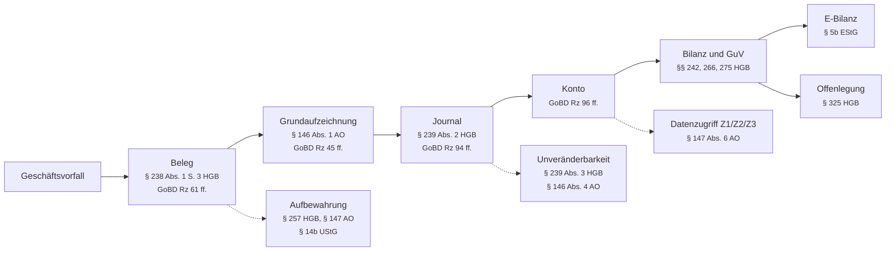

# Anforderungskatalog Buchfink

**Stand:** 2026-09-05

Dieses Dokument führt drei Dinge zusammen: die gesetzlichen Anforderungen an eine Finanzbuchhaltung für bilanzierungspflichtige Unternehmen nach deutschem Recht, das Bewertungsraster, an dem sich eine Software messen lassen muss, und den Umsetzungsstand von Buchfink mit Fundstellen im Code. Warum Buchfink so geschnitten ist und welche Entscheidungen hinter den als `⛔` markierten Auslassungen stehen, steht in [docs/architektur.md](architektur.md), Abschnitt 2; die Reihenfolge der offenen Punkte in Abschnitt 7 desselben Dokuments. Eine erzählende Bestandsaufnahme ohne Normbezug bietet [docs/stand-der-umsetzung.md](stand-der-umsetzung.md).

---

## Geltungsbereich und Annahmen

| Merkmal | Annahme |
|---|---|
| Rechtsform | Kapitalgesellschaft (GmbH, UG, AG, SE) oder haftungsbeschränkte Personengesellschaft nach § 264a HGB |
| Buchführung | Doppelte Buchführung, Bilanzierung nach §§ 238 ff. HGB, keine Einnahmenüberschussrechnung |
| Größe | Kleinst bis mittelgroß nach §§ 267, 267a HGB, nicht kapitalmarktorientiert |
| Konsolidierung | Keine Konzernrechnungslegung nach §§ 290 ff. HGB |
| Bargeschäft | Kein elektronisches Aufzeichnungssystem im Sinne des § 146a AO (siehe Abgrenzungen) |
| Lohn | Lohnbuchhaltung nicht im Scope, Verbuchung der Lohnjournale schon |

Nicht abgedeckt: Konzernabschluss, IFRS, Branchenrecht (KWG, VAG, WpIG), Nachhaltigkeitsberichterstattung, Kassenführung, Lohnabrechnung.

---

## Legende

Die erste Spalte jeder Anforderung nennt die Verbindlichkeit der Norm:

| Kennzeichen | Bedeutung |
|---|---|
| `MUSS` | Unbedingte gesetzliche Pflicht. Verstoß gefährdet die Ordnungsmäßigkeit der Buchführung. |
| `MUSS*` | Pflicht nur bei Vorliegen des Sachverhalts. Wird der Sachverhalt unterstützt, gilt die Anforderung unbedingt. |
| `SOLL` | Verwaltungsauffassung oder Prüfungserwartung. Rechtlich nicht unmittelbar erzwingbar, aber Beanstandungsrisiko in der Betriebsprüfung. |
| `TERMIN` | Pflicht mit künftigem Stichtag. Siehe Terminplan am Ende. |

Die Statustabelle je Anforderung bewertet jedes Akzeptanzkriterium gegen den Code:

| Status | Bedeutung |
|---|---|
| ✅ | Erfüllt. Die Fundstelle nennt die Stelle im Code, an der es nachweisbar ist. |
| 🟡 | Teilweise erfüllt. Die Fundstelle nennt den vorhandenen Teil, die Spalte Grund den fehlenden. |
| ❌ | Fehlt. Wo eine Fundstelle steht, benennt sie die Stelle, an der die Funktion fehlt oder unvollständig aufhört. |
| ⛔ | Außerhalb des Funktionsumfangs. Bewusste Entscheidung nach docs/architektur.md Abschnitt 2, mit Grund. |

Die Spalte Welle verweist auf die Umsetzungsreihenfolge aus docs/architektur.md Abschnitt 7. Erfüllte Kriterien tragen `–`. Fundstellen sind als `Datei:Zeile` angegeben und beziehen sich auf das Repository-Wurzelverzeichnis.

Die Akzeptanzkriterien sind als Prüfschritte formuliert. Jedes Kriterium ist so geschrieben, dass ein Tester oder ein Prüfer es an der laufenden Software nachvollziehen kann.

---

## Normenlandkarte

| Modul | Kernnormen | Anforderungen |
|---|---|---|
| [A. Buchführungspflicht und Grundsätze](#a-buchführungspflicht-und-grundsätze) | §§ 238, 239, 244 HGB, §§ 140, 145, 146 AO | GOB-01 bis GOB-06 |
| [B. Beleg, Journal, Konten](#b-beleg-journal-konten) | § 238 HGB, § 146 AO, GoBD Rz 61 bis 99 | BEL-01 bis BEL-09 |
| [C. Unveränderbarkeit und Protokollierung](#c-unveränderbarkeit-und-protokollierung) | § 239 Abs. 3 HGB, § 146 Abs. 4 AO, GoBD Rz 100 bis 112 | UNV-01 bis UNV-06 |
| [D. Aufbewahrung und Archivierung](#d-aufbewahrung-und-archivierung) | § 257 HGB, § 147 AO, § 14b UStG | ARC-01 bis ARC-08 |
| [E. Ausgangsrechnungen und E-Rechnung](#e-ausgangsrechnungen-und-e-rechnung) | §§ 14, 14a, 14c UStG, §§ 33, 34, 34a UStDV | RECH-01 bis RECH-10 |
| [F. Umsatzsteuer, Aufzeichnung und Meldewesen](#f-umsatzsteuer-aufzeichnung-und-meldewesen) | §§ 15, 15a, 18, 18a, 19, 20, 22 UStG | UST-01 bis UST-09 |
| [G. Bewertung, Anlagen, Fremdwährung](#g-bewertung-anlagen-fremdwährung) | §§ 252 bis 256a HGB, §§ 5 bis 7g EStG | BEW-01 bis BEW-13 |
| [H. Jahresabschluss, E-Bilanz, Offenlegung](#h-jahresabschluss-e-bilanz-offenlegung) | §§ 242 bis 289, 325 ff. HGB, § 5b EStG | JAB-01 bis JAB-09 |
| [I. Betriebsprüfung und Verfahrensdokumentation](#i-betriebsprüfung-und-verfahrensdokumentation) | § 147 Abs. 6, §§ 147b, 158 AO, GoBD Rz 151 bis 177 | PRF-01 bis PRF-06 |
| [J. Querschnitt](#j-querschnitt) | DSGVO, BGB, GoBD Rz 20, 103 | QUE-01 bis QUE-06 |

Die GoBD sind kein Gesetz, sondern eine norminterpretierende Verwaltungsanweisung. Maßgeblich ist das BMF-Schreiben vom 28.11.2019 (IV A 4 - S 0316/19/10003 :001) in der Fassung der Änderungsschreiben vom 11.03.2024 und vom 14.07.2025. Die Randziffern beziehen sich durchgehend auf diese Fassung.

---

## Die Kette, an der alles hängt

Fast jede Anforderung dieses Katalogs sichert eine Station in derselben Kette. Wer die Kette an einer Stelle unterbricht, verliert die Beweiskraft der Buchführung nach § 158 AO und damit den Schutz vor der Schätzung nach § 162 AO.

Die gestrichelten Kanten sind die Querschnittspflichten. Sie greifen an jeder Station und nicht nur dort, wo sie eingezeichnet sind.

---

## A. Buchführungspflicht und Grundsätze

### GOB-01 Doppelte Buchführung und Bilanzierung `MUSS`

**Norm:** §§ 238, 242 HGB, § 6 HGB in Verbindung mit § 13 Abs. 3 GmbHG und § 3 Abs. 1 AktG, § 140 AO

**Bedeutung:** Kapitalgesellschaften sind Formkaufleute und damit unabhängig von Umsatz und Gewinn buchführungs- und bilanzierungspflichtig. Die Erleichterung des § 241a HGB gilt nur für Einzelkaufleute und greift hier nicht. Aus dem Handelsrecht folgt über § 140 AO die gleiche Pflicht für das Steuerrecht.

| Kriterium | Status | Fundstelle / Grund | Welle |
|---|---|---|---|
| Jeder Geschäftsvorfall wird als Buchungssatz mit mindestens einer Soll- und einer Habenposition erfasst, Sollsumme gleich Habensumme | ✅ | internal/domain/journal.go:215-278, :208 (`IsBalanced`, ohne Toleranz) | – |
| Ein Buchungssatz ohne Ausgleich lässt sich nicht speichern | ✅ | internal/service/journal_service.go:96, internal/domain/journal.go:266; `Post` ist der einzige Schreibweg | – |
| Summen- und Saldenliste zu jedem Stichtag mit übereinstimmenden Summen | ✅ | internal/service/accounting_service.go:326-330 (`GetSuSaOverviewAt`) baut die Liste aus den Verkehrszahlen bis zum Stichtag (:76-120, internal/repository/journal_gorm.go:274-293 `AccountTurnoversUntil`), statt das Jahr zu summieren und danach Zeilen auszublenden; die Differenz weist :389-400 exakt aus, die Bestandskonten tragen seit dem Saldenvortrag (internal/service/closing_service.go:995-1100) ihren Eröffnungswert. Der Stichtag steht als Feld an der Liste (frontend/src/pages/AccountsPage.tsx:171-177, :366) | – |
| Bilanz und GuV aus den Kontensalden abgeleitet, ohne Nacherfassung | ✅ | internal/accounting/statement.go:291-358 (`BuildStatement`) gliedert allein die Kontensalden und weist eine Bilanz ab, die nicht aufgeht (:354-356); die Eröffnungswerte kommen als gebuchter Saldenvortrag aus dem Vorjahr (internal/service/closing_service.go:1107-1175), nicht aus einer Nacherfassung | – |

**Stand.** Die Mechanik des Buchungssatzes ist streng und lückenlos abgesichert, und der Jahreswechsel trägt sie weiter: der Saldenvortrag bringt die Bestandskonten ins Folgejahr, die Bilanz ist ab dem zweiten Geschäftsjahr vollständig. Seit Welle 2 entsteht sie nicht mehr in der Ansicht, sondern im Backend, aus denselben Salden. Mit Welle 4 kommt der Stichtag dazu: die Summen- und Saldenliste lässt sich auf jeden Tag innerhalb des Jahres ziehen, und die Grenze liegt in der Abfrage. Alle vier Kriterien sind erfüllt.

### GOB-02 Nachvollziehbarkeit für einen sachverständigen Dritten `MUSS`

**Norm:** § 238 Abs. 1 S. 2 HGB, § 145 Abs. 1 AO, GoBD Rz 30 ff.

**Bedeutung:** Die Buchführung muss einem sachverständigen Dritten in angemessener Zeit einen Überblick über Geschäftsvorfälle und Lage des Unternehmens geben. Das ist der Maßstab, an dem ein Betriebsprüfer die Software misst. Er kennt das Produkt nicht und muss trotzdem jeden Betrag bis zum Beleg zurückverfolgen können.

| Kriterium | Status | Fundstelle / Grund | Welle |
|---|---|---|---|
| Drill-down von jedem Wert in Bilanz oder GuV in höchstens vier Schritten zum Buchungssatz und zum Beleg | 🟡 | frontend/src/components/StatementView.tsx:116, :450-471 verlinkt jedes Konto unter einer Gliederungsposition ins Kontoblatt, frontend/src/pages/AccountsPage.tsx:105-113 öffnet es, :531-544 führt von der Kontoblattzeile zur Buchung (frontend/src/pages/JournalPage.tsx:92-107, frontend/src/App.tsx:193-197): drei Schritte von der Bilanz zum Buchungssatz. Der vierte fehlt — das Journal nennt Belegdatum und Belegnummer als Text (:472-478) und verlinkt den Beleg nicht | 2 |
| Drill-up vom Beleg zu den Buchungen und zu den Konten | 🟡 | internal/domain/receipt.go:152, internal/repository/receipt_gorm.go:56 tragen beide Richtungen im Datenmodell; die Oberfläche zeigt am versiegelten Beleg nicht einmal die Buchungsnummer | 2 |
| Bezeichnungen im Klartext oder als exportierbares Schlüsselverzeichnis | ✅ | internal/domain/tax.go:154, internal/accounting/chart.go:49 lösen alles im Klartext auf; seit Welle 4 geht dasselbe Verzeichnis auch als Datei hinaus und liegt jeder Datenüberlassung bei (internal/service/export_tables.go:530-714, internal/service/export_service.go:229-247, siehe GOB-04) | – |
| Testlauf mit einer fachkundigen Person ohne Produktkenntnis | ❌ | Kein Nachweis eines solchen Durchlaufs im Repository; ohne Drill-down absehbar erfolglos | 2 |

**Stand.** Seit Welle 2 führt der Weg von der Bilanzposition über das Konto ins Kontoblatt und von dort zur Buchung. Dort endet er: vom Buchungssatz zum versiegelten Beleg und vom Beleg zurück verlinkt die Oberfläche nichts, obwohl das Datenmodell beide Richtungen trägt. Welle 2.

### GOB-03 Vollständig, richtig, zeitgerecht, geordnet `MUSS`

**Norm:** § 239 Abs. 2 HGB, § 146 Abs. 1 S. 1 AO, GoBD Rz 36 ff.

**Bedeutung:** Die vier Ordnungsmerkmale sind der Kern der GoB. Die Software muss Verstöße erkennbar machen, statt sie zu verdecken.

| Kriterium | Status | Fundstelle / Grund | Welle |
|---|---|---|---|
| Lücken in der Nummerierung von Belegen und Buchungen im Prüfbericht | ✅ | internal/service/check_service.go:540-613 (`checkNumberGaps`, Regel `number_gap` in internal/domain/check.go:35) vergleicht je Nummernkreis den Zähler gegen die vorhandenen Nummern und nennt jede Lücke mit Kreis und Nummer; internal/repository/numberrange_gorm.go:47-70 vergibt weiterhin in der Transaktion, internal/accounting/journalhash.go:131-145 meldet entfernte Buchungen | – |
| Nicht kontierte Belege in eigener Liste, blockieren den Periodenabschluss | ✅ | internal/service/check_service.go:445-505 (`receipt_unbooked`) führt jeden abgelegten, nicht gebuchten Beleg auf und macht ihn blockierend, sobald sein Eingang in den festzuschreibenden Zeitraum fällt; internal/wailsbridge/festschreibung_service.go:41-43, :93-103 lässt die Festschreibung nur durch, wenn der Lauf frei ist oder eine Begründung vorliegt | – |
| Plausibilitätsprüfung vor dem Periodenabschluss | ✅ | internal/service/check_service.go:151-237 rechnet zwölf Regeln über Buchungen, Belege, Bank, Nummernkreise, Kontenzuordnung, Voranmeldung und Festschreibungsstand (internal/domain/check.go:28-39), :238-252 (`EnsureCommittable`) entscheidet daraus über die Festschreibung; frontend/src/pages/DeadlinesPage.tsx:252-280 zeigt den Bericht vor dem Knopf | – |
| Reproduzierbare Sortierung von Journal und Kontenblatt | ✅ | internal/repository/journal_gorm.go:32, :70-78; jede Leseabfrage ordnet nach `id asc`, Anzeige als stabile Sortierung | – |

**Stand.** Seit Welle 3 steht die Kontrolle neben der Ordnung: vor jeder Festschreibung läuft ein Prüfbericht aus zwölf Regeln, blockierende Befunde halten sie auf, und übergehen lässt sich nur mit einer Begründung, die am Lauf und im Protokoll steht.

### GOB-04 Sprache, Abkürzungen, Währung `MUSS`

**Norm:** § 239 Abs. 1 HGB, § 244 HGB

**Bedeutung:** Handelsbücher sind in einer lebenden Sprache zu führen. Wer Abkürzungen, Ziffern oder Symbole verwendet, muss deren Bedeutung eindeutig festlegen. Der Jahresabschluss ist zwingend in deutscher Sprache und in Euro aufzustellen.

| Kriterium | Status | Fundstelle / Grund | Welle |
|---|---|---|---|
| Schlüsselverzeichnis aller Codes als Datei exportierbar, Teil der Verfahrensdokumentation | ✅ | internal/service/export_tables.go:530-714 (`keyDirectoryTable`) führt jeden Code aus Quelle, Buchungsart, Steuerfall, Belegart, Belegstatus, Prüfregeln und Steuerschlüssel mit Bedeutung; internal/service/export_service.go:229-247 schreibt ihn als CSV an einen gewählten Ort (Bridge: internal/wailsbridge/export_service.go:78-90), er liegt jeder Datenüberlassung als `schluesselverzeichnis.csv` bei und steht im Klartext in der Feldbeschreibung (internal/export/fielddoc.go:12, :165-174). Die Oberfläche zeigt dieselbe Tabelle (frontend/src/pages/DataAccessPage.tsx:722) | – |
| Bilanz, GuV und Anhang in deutscher Sprache und in Euro | 🟡 | internal/service/statement_export.go:149-210 setzt Bilanz, GuV und die Angaben unter der Bilanz als PDF (`lang: "de"`, :152), :20-116 gibt dieselbe Gliederung als CSV mit Semikolon und deutsch geschriebenen Beträgen aus (:88-116); die Bezeichnungen folgen dem Gesetzeswortlaut (internal/accounting/statement.go:64-188), die E-Bilanz rechnet in Euro (internal/ebilanz/ebilanz.go:142-146). Ein Anhang entsteht nicht (JAB-03) | 2 |
| Buchungswährung des Hauptbuchs ist Euro, Fremdwährung zusätzlich | 🟡 | internal/domain/journal.go:154-157 führt Kurs, Kursquelle und Kursdatum im Hash; ein Feld für den Fremdwährungsbetrag fehlt, Euro wird nur von der Oberfläche gesetzt | 5 |

**Stand.** Bilanz und Gewinn- und Verlustrechnung verlassen das Programm seit Welle 2 als PDF und als CSV, deutsch und in Euro. Das Schlüsselverzeichnis geht seit Welle 4 als Datei hinaus und liegt jeder Datenüberlassung bei — die Bedeutung jeder Abkürzung steht damit dort, wo die Abkürzung ankommt. Der Anhang fehlt weiterhin. Welle 2.

### GOB-05 Einzelaufzeichnung `MUSS`

**Norm:** § 146 Abs. 1 S. 1 AO, GoBD Rz 39 ff.

**Bedeutung:** Jeder Geschäftsvorfall wird einzeln aufgezeichnet. Verdichtete Sammelbuchungen sind nur zulässig, wenn die Einzelpositionen jederzeit aus dem System heraus nachweisbar bleiben.

| Kriterium | Status | Fundstelle / Grund | Welle |
|---|---|---|---|
| Sammelbuchungen verweisen auf eine gespeicherte Einzelpostenliste mit gleicher Aufbewahrungsfrist | 🟡 | internal/domain/payment.go:48-65; die Allokationen der Sammelzahlung stehen in der Datenbank und gehen als eigene Tabelle in die Überlassung (internal/service/export_tables.go:210-244), eine Fristenklasse gibt es nicht (siehe ARC-01). Kassenbuch, Lohnjournal und Stapelerfassung sind außerhalb des Funktionsumfangs | 6 |
| Einzelpostenliste mit einem Klick erreichbar und maschinell auswertbar exportierbar | ✅ | frontend/src/pages/JournalPage.tsx:594-660 klappt die Einzelposten einer Sammelzahlung an der Buchung auf, mit Belegverweis und Betrag je Posten (Bridge: internal/wailsbridge/export_service.go:266-273, internal/service/payment_service.go:129-163); dieselben Zeilen gehen als Tabelle `zahlungszuordnungen` in die Datenüberlassung (internal/service/export_tables.go:210-244) | – |
| Je Geschäftsvorfall mindestens Datum, Betrag, Steuerbetrag und -satz, Leistungsgegenstand, Partner, Belegverweis | 🟡 | internal/domain/journal.go:110-145, :79-91 erfassen alles auf dem Belegweg; bei der manuellen Buchung (internal/wailsbridge/app_service.go:823) sind Partner und Belegverweis optional und eine Steuerzeile nicht erfassbar | 3 |

**Stand.** Der Belegweg zeichnet vollständig einzeln auf, der manuelle Weg daneben nicht. Die einzige Sammelbuchung, die Buchfink erzeugt, gibt ihre Einzelposten seit Welle 4 auch heraus: an der Buchung aufklappbar und als eigene Tabelle der Überlassung. Offen bleiben die Steuerzeile im manuellen Weg und die Aufbewahrungsfrist an der Einzelpostenliste. Wellen 3 und 6.

### GOB-06 Geschäftsjahr und Periodenabgrenzung `MUSS`

**Norm:** § 240 Abs. 2 S. 2 HGB, § 252 Abs. 1 Nr. 5 HGB, § 4a EStG

**Bedeutung:** Das Geschäftsjahr darf zwölf Monate nicht überschreiten. Aufwendungen und Erträge gehören in die Periode ihrer wirtschaftlichen Verursachung, unabhängig vom Zahlungszeitpunkt.

| Kriterium | Status | Fundstelle / Grund | Welle |
|---|---|---|---|
| Geschäftsjahr frei definierbar, höchstens zwölf Monate, Rumpfgeschäftsjahre möglich | ✅ | internal/domain/fiscalyear.go:81-120 führt Beginn und Ende je Jahr, :161-197 weist mehr als zwölf Monate nach § 240 Abs. 2 Satz 2 HGB ab, :124-130 kennzeichnet das Rumpfjahr; internal/service/closing_service.go:213-231 setzt den Beginn des Gründungsjahres auf die Beurkundung | – |
| Buchungsdatum getrennt vom Belegdatum, Periodenzuordnung nach Buchungsdatum | ✅ | internal/domain/journal.go:110-114, internal/service/journal_service.go:257; vier getrennte Datumsfelder | – |
| Buchung in ein abgeschlossenes Jahr nur nach dokumentierter Wiedereröffnung, protokolliert | ✅ | internal/service/journal_service.go:489-505 (`ensureYearNotAdopted`) weist jede Buchung in ein festgestelltes Jahr ab und nennt den Weg zurück; internal/service/closing_service.go:443-474 (`ReopenFiscalYear`) verlangt einen Grund und schreibt ihn ins Protokoll. Berechtigte Rollen entfallen im Einzelplatzbetrieb | – |
| Abgrenzungsbuchungen mit automatischer Auflösung im Folgejahr | ✅ | internal/domain/accrual.go:151-184 führt den Abgrenzungsposten mit Zeitraum, Verfahren und Auflösungsplan, internal/accounting/accrual.go:157-218 (`AccrualReleasePlanFor`) legt den Plan bei der Bildung an, internal/service/accrual_service.go:374-439 (`Book`) bucht sie auf 1900 bzw. 3900; die Auflösung stößt der Saldenvortrag an (internal/service/closing_service.go:1157-1165, internal/service/accrual_service.go:561-625 `ReleaseInto`) und die Vortragsvorschau kündigt sie vorher an (internal/service/closing_service.go:612-616, :646-652) | – |

**Stand.** Das Geschäftsjahr ist eine eigene Entität mit Zeitraum, Rumpfjahrkennzeichen und Abschlussstand; die Periodenzuordnung folgt weiterhin dem Buchungsdatum, und die Wiedereröffnung ist ein dokumentierter Vorgang statt einer Lücke. Mit Welle 5 kommt die Periodenabgrenzung dazu: der Abgrenzungsposten trägt seinen Zeitraum, sein Verteilungsverfahren und seinen Auflösungsplan, und die Auflösung bucht der Saldenvortrag von selbst ins Folgejahr. Alle vier Kriterien sind erfüllt.

---

## B. Beleg, Journal, Konten

### BEL-01 Keine Buchung ohne Beleg `MUSS`

**Norm:** § 238 Abs. 1 S. 3 HGB, § 145 Abs. 1 AO, GoBD Rz 61 ff.

**Bedeutung:** Der Beleg verbindet den Geschäftsvorfall mit der Buchung. Fehlt er, fehlt der Nachweis, und die Buchung ist formal angreifbar. Bei fehlendem Fremdbeleg tritt ein Eigenbeleg an seine Stelle.

| Kriterium | Status | Fundstelle / Grund | Welle |
|---|---|---|---|
| Jede Buchung referenziert einen Beleg oder einen Eigenbeleg | 🟡 | internal/service/posting_service.go:269-272 erzwingt die Referenz auf dem Belegweg; die manuelle Buchung (internal/wailsbridge/app_service.go:823) und die AfA-, Zahlungs- und Gründungsbuchungen kommen ohne durch, `Validate` prüft `ReceiptID` nicht | 3 |
| Eigenbelege gekennzeichnet, mit Aussteller, Datum, Betrag, Grund und erfassender Person | ❌ | internal/domain/receipt.go:166 kennt nur den Herkunftswert `self_issued`; einen Erfassungsweg für Eigenbelege gibt es nicht | 3 |
| Buchungen ohne Belegzuordnung im Prüfbericht, verhindern die Festschreibung | ✅ | internal/service/check_service.go:307-343 (`entry_without_receipt`) meldet jede Buchung ohne Beleg als blockierenden Befund — der Nachweis zählt in beide Richtungen (:289-306), die Generalumkehr erbt ihn von der Ursprungsbuchung —, internal/wailsbridge/festschreibung_service.go:41-43, :93-103 hängt die Festschreibung daran | – |
| Belegverweis bidirektional | 🟡 | internal/domain/journal.go:129-131, internal/domain/receipt.go:152; Datenmodell und Repository tragen beide Richtungen, die Oberfläche keine | 2 |

**Stand.** Der Belegzwang gilt beim Erfassen weiterhin nur dort, wo er automatisch entsteht — `ReceiptID` ist in internal/domain/journal.go:215 keine Pflicht. Seit Welle 3 kommt eine belegfreie Buchung aber nicht mehr unbemerkt in den Abschluss: der Prüfbericht nennt sie, und sie hält die Festschreibung auf. Der Erfassungsweg für Eigenbelege fehlt.

### BEL-02 Belegangaben und eindeutige Belegnummer `MUSS`

**Norm:** GoBD Rz 64, 71 bis 77

**Bedeutung:** Die GoBD zählen die Mindestangaben eines Belegs auf. Die eindeutige Belegnummer ist das technische Bindeglied zwischen Papier- oder Dateiablage und Buchungssatz.

| Kriterium | Status | Fundstelle / Grund | Welle |
|---|---|---|---|
| Je Beleg Nummer, Belegdatum, Aussteller oder Empfänger, Betrag mit Währung, Steuersatz und Steuerbetrag, Leistungsbeschreibung, Erfassungszeitpunkt | 🟡 | internal/domain/receipt.go:109-157 trägt Nummer, Richtung, Eingangsdatum, Eingangsweg, Erfassungszeitpunkt und je Datei Prüfsumme; Belegdatum, Aussteller, Betrag, Steuersatz und Leistungsbeschreibung stehen erst an der Buchung | 6 |
| Belegnummer systemseitig vergeben, eindeutig, nicht nachträglich änderbar | ✅ | internal/repository/receipt_gorm.go:74-86 vergibt in derselben Transaktion, `uniqueIndex` auf der Nummer, kein Änderungsweg | – |
| Fehlende Pflichtangaben blockieren die Freigabe und werden benannt | 🟡 | internal/domain/receipt.go:204-293 prüft streng je Datei; inhaltliche Pflichtangaben werden mangels Feldern nicht geprüft | 6 |
| Belegnummernkreis je Geschäftsjahr und Belegart konfigurierbar, ohne Doppelvergabe | 🟡 | internal/domain/numberrange.go:19-23, :58-65 trennt je Jahr und Art ohne Doppelvergabe; das Format ist in `FormatReceiptNumber` fest verdrahtet | 6 |

**Stand.** Die Nummernvergabe ist vorbildlich, die Belegkopfdaten fehlen: ein abgelegter, noch nicht gebuchter Beleg trägt weder Datum noch Aussteller noch Betrag (internal/domain/receipt.go:109). Welle 6.

### BEL-03 Belegsicherung `MUSS`

**Norm:** GoBD Rz 67 bis 70

**Bedeutung:** Der Beleg ist gegen Verlust zu sichern, sobald er im Unternehmen eingeht. Zwischen Eingang und Sicherung darf kein Zeitraum liegen, in dem ein Beleg spurlos verschwinden kann.

| Kriterium | Status | Fundstelle / Grund | Welle |
|---|---|---|---|
| Eingehender Beleg unveränderlich gespeichert, mit Zeitstempel, Quelle und Prüfsumme | ✅ | internal/receiptstore/store.go:104-120 legt die Datei unter ihrem SHA-256 ab, internal/domain/receipt.go:92, :127 führen `CreatedAt`, `ReceivedAt`, `ReceivedVia` | – |
| Löschen ausgeschlossen, fehlerhafte Belege storniert und mit Vermerk sichtbar | 🟡 | internal/service/receipt_service.go:319-333 kennt nur `Discard` mit Pflichtbegründung; einzelne Dateien eines noch nicht versiegelten Belegs lassen sich entfernen (:176-201), das Protokoll nennt nur die neue Dateizahl | 6 |
| Import erst mit persistierter Prüfsumme, keine halb gespeicherten Zustände | ✅ | internal/service/receipt_service.go:98-153, internal/receiptstore/store.go:58-62; Dateien gehen atomar auf die Platte, dann läuft die Transaktion | – |

**Stand.** Die Belegsicherung ist der solideste Teil des Moduls. Offen bleibt eine Kleinigkeit mit Wirkung: die empfangene Originaldatei eines offenen Belegs lässt sich noch entfernen, protokolliert nur als Zahl (internal/service/receipt_service.go:176). Welle 6.

### BEL-04 Zeitgerechte Erfassung und Festschreibungsfristen `MUSS`

**Norm:** § 146 Abs. 1 AO, GoBD Rz 45 bis 52

**Bedeutung:** Die Finanzverwaltung nennt konkrete Zeiträume. Unbare Geschäftsvorfälle sind innerhalb von zehn Tagen zu erfassen. Kasseneinnahmen und Kassenausgaben sind täglich festzuhalten. Waren- und Kostenrechnungen müssen innerhalb von acht Tagen kontokorrentmäßig erfasst werden. Die endgültige Verbuchung ist bis zum Ablauf des Folgemonats unbedenklich, wenn die Grundaufzeichnung vorher erfolgt ist.

| Kriterium | Status | Fundstelle / Grund | Welle |
|---|---|---|---|
| Bericht über Belege, deren Eingang mehr als zehn Tage zurückliegt und die nicht erfasst sind | ✅ | internal/service/check_service.go:445-505 (`receipt_overdue`) misst den Belegeingang gegen die Frist aus internal/domain/settings.go:60-63 (`ReceiptCaptureDays`, ohne Einstellung zehn Tage nach GoBD Rz. 47) und nennt jeden liegen gebliebenen Beleg mit Nummer und Eingangstag | – |
| Festschreibung des Vormonats erzwingen oder erinnern, Schwellenwert konfigurierbar | ✅ | internal/service/deadline_service.go:285-317 führt je Monat einen Festschreibungstermin zum Ende des Folgemonats zuzüglich der Nachfrist aus internal/domain/settings.go:64-67 (`CommitGraceDays`) und gilt als erledigt, sobald der Monat festgeschrieben ist; internal/service/check_service.go:700-731 (`commit_overdue`) mahnt denselben Tag im Prüfbericht an, frontend/src/pages/DashboardPage.tsx:184-196 stellt beides auf die Aufgabenliste | – |
| Abstände zwischen Belegdatum, Erfassung und Festschreibung je Buchung gespeichert und auswertbar | 🟡 | internal/domain/journal.go:111, :175 führen Belegdatum und Erfassungszeitpunkt, internal/domain/receipt.go:127 den Belegeingang, und internal/service/check_service.go:445-505 wertet den Abstand Eingang bis Erfassung aus; der Festschreibungszeitpunkt hängt weiterhin am Zeitraum (internal/domain/festschreibung.go:13-31) und nicht an der Buchung, der dritte Abstand ist deshalb nur rechnerisch | 3 |

**Stand.** Die zehn Tage sind seit Welle 3 eine Zahl: sie stehen als `receipt_capture_days` in den Einstellungen, laufen im Prüfbericht gegen jeden liegen gebliebenen Beleg und haben in der Festschreibungsfrist des Vormonats ein Gegenstück. Was fehlt, ist der Festschreibungszeitpunkt an der einzelnen Buchung (UNV-02).

### BEL-05 Journalfunktion `MUSS`

**Norm:** § 239 Abs. 2 HGB, § 146 Abs. 1 AO, GoBD Rz 94 bis 99

**Bedeutung:** Das Journal bildet die zeitliche Ordnung ab. Es ist die Grundlage der Progressiv- und Retrogradprüfung, mit der ein Prüfer vom Beleg zum Abschluss und zurück arbeitet.

| Kriterium | Status | Fundstelle / Grund | Welle |
|---|---|---|---|
| Jede Buchung genau einmal, chronologisch, mit fortlaufender lückenloser Journalnummer | ✅ | internal/repository/journal_gorm.go:203-231 vergibt Nummer und Kettenkopf in einer Transaktion, `uniqueIndex` auf `EntryNumber` | – |
| Journalnummer bei der Festschreibung vergeben und danach unveränderlich | ✅ | internal/accounting/journalhash.go:32, internal/repository/journal_gorm.go:209; die Nummer entsteht bereits bei der Erfassung und geht in den Hash ein, strenger als gefordert | – |
| Journal für jeden Zeitraum als Bericht und als maschinell auswertbare Datei | ✅ | frontend/src/pages/JournalPage.tsx:285-315 grenzt das Journal auf ein Datumsfenster ein, über Jahresgrenzen hinweg, und gibt genau dieses Fenster als CSV aus; internal/service/export_service.go:190-224 schreibt dafür dieselbe Tabelle wie der Z3-Export (internal/service/export_tables.go:68-165, einschließlich der Hashwerte) und protokolliert den Lauf, die Buchungen liefert internal/repository/journal_gorm.go:100-115 | – |
| Stornierungen als eigene Journalzeilen, nicht als Löschung | ✅ | internal/service/journal_service.go:133-215; die Generalumkehr ist eine neue Buchung mit eigener Nummer | – |

**Stand.** Das Journal selbst erfüllt die Anforderung strenger als verlangt, und seit Welle 4 verlässt es auch das Programm: jeder Zeitraum geht als CSV hinaus, mit denselben Spalten wie die Datenüberlassung nach Z3 und mit den Hashwerten, an denen sich die Kette von außen nachrechnen lässt (UNV-01). Alle vier Kriterien sind erfüllt.

### BEL-06 Kontenfunktion und Kontenrahmen `MUSS`

**Norm:** § 238 HGB, GoBD Rz 96 bis 99

**Bedeutung:** Die sachliche Ordnung überführt die Journalzeilen in Konten. Der Kontenrahmen selbst ist gesetzlich nicht vorgeschrieben. Vorgeschrieben ist, dass sich aus den Konten die Gliederungen nach §§ 266 und 275 HGB und die Positionen der E-Bilanz-Taxonomie ableiten lassen.

| Kriterium | Status | Fundstelle / Grund | Welle |
|---|---|---|---|
| Standardkontenrahmen als Vorlage, je Mandant erweiterbar | 🟡 | internal/accounting/skr04.go, internal/accounting/skr04_2026.json liefern SKR04 mit 1.855 Konten; SKR03 entfällt nach der Entscheidung für einen Kontenrahmen (docs/architektur.md Abschnitt 2), ein Weg zum Anlegen eigener Konten fehlt in Bridge und Oberfläche | 2 |
| Je Konto Zuordnung zu einer Position nach §§ 266, 275 HGB und zur E-Bilanz-Taxonomie | ✅ | internal/accounting/statement_mapping.go:27-234 führt alle 206 SKR04-Positionen (internal/domain/account.go:30-34) auf eine Gliederungsposition nach §§ 266, 275 HGB; internal/accounting/statement_test.go:70-73 prüft die Tabelle gegen den Katalog. Daran hängt internal/ebilanz/taxonomy.go:68-80 mit der Ressource internal/ebilanz/taxonomy_6.9.json das Taxonomie-Element, lückenlos geprüft von internal/ebilanz/ebilanz.go:379-394 (`StatementCoverage`); internal/accounting/statement.go:710-721 trifft für die E-Bilanz dieselbe Entscheidung wie für die Bilanz | – |
| Konten ohne Zuordnung werden vor dem Jahresabschluss gemeldet | ✅ | internal/ebilanz/mapping.go:52-107 stellt vor jedem Export jedes Konto mit Saldo gegen Gliederung und Taxonomie, :111-128 (`BlockingError`) benennt die ungeklärten einzeln und internal/ebilanz/ebilanz.go:118-124 bricht ab, bevor eine Datei entsteht; in der Bilanz stehen dieselben Konten unter „Nicht zugeordnet" (internal/accounting/statement.go:434-448, :553-572), gezeigt in frontend/src/components/StatementView.tsx:208-215 und frontend/src/pages/EBilanzPage.tsx:116-170 | – |
| Summe der Kontensalden gleich Summe der Journalbuchungen, automatische Abstimmung | ✅ | internal/service/accounting_service.go:294-341, :93-119; Salden und Summen entstehen aus denselben Verkehrszahlen, `Difference` weist jede Abweichung aus | – |

**Stand.** Der Kontenrahmen ist vollständig und richtig an die HGB-Gliederung gehängt, und die E-Bilanz hängt seit Welle 2 an denselben 206 Positionen statt an einer 72-zeiligen Kontotabelle; ein Konto ohne Zuordnung verschwindet nicht mehr still auf einer Sammelposition, sondern blockiert den Export namentlich. Offen bleibt der Weg zu eigenen Konten. Welle 2.

### BEL-07 Kontokorrent und offene Posten `MUSS`

**Norm:** § 238 HGB, § 240 HGB, GoBD Rz 49

**Bedeutung:** Forderungen und Verbindlichkeiten sind personenbezogen zu führen. Ohne offene Posten lassen sich Bilanzausweis, Wertberichtigung und Fälligkeitsgliederung nach § 268 Abs. 4 und 5 HGB nicht belegen.

| Kriterium | Status | Fundstelle / Grund | Welle |
|---|---|---|---|
| Personenkonten rollen auf Sammelkonten auf, Saldo stimmt immer überein | ✅ | internal/service/accounting_service.go:87-119 verdichtet an einer Stelle auf 1200/3300, internal/service/journal_service.go:340-350 weist die direkte Buchung auf das Sammelkonto ab | – |
| Offene-Posten-Liste je Debitor und Kreditor zu jedem Stichtag, mit Fälligkeit und Altersstruktur | 🟡 | internal/service/payment_service.go:176-189 (`OpenItemsAt`) liest die zum Stichtag offenen Buchungen (internal/repository/journal_gorm.go:134-141) und die bis dahin gebuchten Ausgleiche (internal/repository/payment_gorm.go:66-72), beide Grenzen auf dem Buchungsdatum; die Oberfläche führt den Stichtag als Feld und rechnet die Überfälligkeit gegen ihn (frontend/src/pages/AccountsPage.tsx:159-169, :393, :622-630). Eine Altersstruktur gibt es weiterhin nicht | 6 |
| Restlaufzeiten für §§ 268 Abs. 4, 5 und 285 Nr. 1 HGB auswertbar | ❌ | internal/domain/payment.go:67-93; `OpenItem` kennt kein Restlaufzeitband, keine Auswertung gliedert danach | 6 |
| Teilzahlungen, Skonti, Gutschriften und Ausbuchungen je Posten dokumentiert | 🟡 | internal/service/payment_service.go:426-520 hält Teilzahlung, Skonto mit Steuerkorrektur nach § 17 UStG sowie Rundungs- und Kursdifferenzen je Allokation fest; Gutschrift und Ausbuchung fehlen als eigener Weg | 6 |

**Stand.** Das Kontokorrent stimmt rechnerisch immer und kennt seit Welle 4 den Stichtag: die Liste zeigt, welche Posten am Bilanzstichtag offen waren, und nicht, was heute davon übrig ist. Für Bilanzausweis und Anhangangaben fehlen weiterhin Altersstruktur und Restlaufzeitbänder. Welle 6.

### BEL-08 Ersetzendes Scannen `MUSS*`

**Norm:** GoBD Rz 130, 136 bis 141

**Bedeutung:** Papierbelege dürfen digitalisiert und anschließend vernichtet werden, wenn das Verfahren dokumentiert ist und die bildliche wie inhaltliche Übereinstimmung sichergestellt ist. Ohne Organisationsanweisung ist das Verfahren angreifbar.

| Kriterium | Status | Fundstelle / Grund | Welle |
|---|---|---|---|
| Scanprotokoll mit Zeitpunkt, Person, Gerät und Ergebnis der Qualitätssicherung | ⛔ | Buchfink erklärt das ersetzende Scannen nicht zum unterstützten Verfahren. Der Herkunftswert `scan` (internal/domain/receipt.go:165) benennt nur, woher der Beleg kam; das Papier ist weiter aufzubewahren | – |
| Digitalisat bildlich vollständig und unverändert gespeichert | ⛔ | Wie oben. Unveränderlich ist die Datei ohnehin (internal/receiptstore/store.go), eine Vollständigkeitsprüfung über Seiten und Rückseiten wäre Teil des nicht unterstützten Verfahrens | – |
| Fehlerprotokoll exportierbar | ⛔ | Wie oben | – |
| Organisationsanweisung mit der Verfahrensdokumentation verknüpft | ⛔ | Wie oben; die Verfahrensdokumentation hält den Ausschluss fest (siehe PRF-03) | – |
| Nachträgliche Bildbearbeitung des Digitalisats ausgeschlossen | ✅ | internal/service/receipt_service.go:162-166, internal/domain/receipt.go:55; nach dem Buchen ist die Dateiliste versiegelt, die Inhalte sind inhaltsadressiert und werden bei jedem Lesen gegen ihre Prüfsumme gehalten | – |

**Stand.** Das `MUSS*` löst nicht aus, weil Buchfink das ersetzende Scannen nicht anbietet. Technisch wäre die Unveränderbarkeit da; was fehlt, sind Scanprotokoll und Organisationsanweisung, und deshalb bleibt der Papierbeleg aufbewahrungspflichtig. Das ist eine Entscheidung, keine Lücke.

### BEL-09 Storno und Korrektur `MUSS`

**Norm:** § 239 Abs. 3 HGB, GoBD Rz 58 bis 59

**Bedeutung:** Eine festgeschriebene Buchung wird nicht korrigiert, sondern storniert und neu gebucht. Der ursprüngliche Inhalt muss feststellbar bleiben.

| Kriterium | Status | Fundstelle / Grund | Welle |
|---|---|---|---|
| Korrektur erzeugt Stornopaar plus Neubuchung, die Ursprungsbuchung bleibt im Journal | ✅ | internal/service/journal_service.go:133-215, :372-387; die Generalumkehr ist auf den Korrekturtag datiert, einen Änderungsweg gibt es überhaupt nicht | – |
| Storno und Neubuchung mit der Ursprungsbuchung verknüpft, in beide Richtungen navigierbar | 🟡 | internal/domain/journal.go:149 verknüpft Storno und Ursprung über `ReversalOfID`; die Neubuchung nach dem Storno hängt an nichts, es gibt kein Feld dafür | 6 |
| Stornogrund ist Pflichtfeld | ✅ | internal/service/journal_service.go:149-151; ohne Grund bricht `Reverse` ab, der Grund geht in den Hash ein | – |
| Änderungen vor der Festschreibung mit Vorher- und Nachherwert, Zeitpunkt und Benutzer protokolliert | 🟡 | internal/domain/audit.go:21-32; Änderungen an Buchungen sind gar nicht möglich, insoweit strenger erfüllt, das Protokoll führt aber nur Freitext ohne Vorher- und Nachherwert. Der Benutzer entfällt im Einzelplatzbetrieb | 6 |

**Stand.** Storno und Korrektur sind streng gebaut, die Verkettung endet aber nach dem Storno: welche Buchung die stornierte ersetzt, steht nirgends. Welle 6.

---

## C. Unveränderbarkeit und Protokollierung

### UNV-01 Unveränderbarkeit der Aufzeichnung `MUSS`

**Norm:** § 239 Abs. 3 HGB, § 146 Abs. 4 AO, GoBD Rz 107 bis 112

**Bedeutung:** Die zentrale technische Anforderung des ganzen Katalogs. Eine Eintragung darf nicht so verändert werden, dass der ursprüngliche Inhalt nicht mehr feststellbar ist. Unzulässig sind auch Änderungen, bei denen unklar bleibt, ob sie ursprünglich oder erst später vorgenommen wurden. Die GoBD nennt Software, die Buchungen spurlos entfernt, ausdrücklich als Ordnungswidrigkeitstatbestand.

| Kriterium | Status | Fundstelle / Grund | Welle |
|---|---|---|---|
| Kein UPDATE oder DELETE auf festgeschriebene Buchungszeilen, technisch abgesichert | ✅ | internal/repository/journal_gorm.go:352 kennt nur `Append`, internal/accounting/journalhash.go:105 verkettet kryptografisch. Einschränkung: keine Datenbanktrigger (internal/repository/db.go:70), die Kette wirkt zusammen mit der Feldverschlüsselung (internal/repository/encryption.go) | – |
| Manipulationstest wird erkannt und benannt, mit erwartetem und tatsächlichem Prüfwert | ✅ | internal/accounting/journalhash.go:173-236 (`verifyYear`) meldet je Bruch Geschäftsjahr, Buchung, Grund (unterbrochene Kette oder veränderter Inhalt) sowie erwarteten und tatsächlichen Hash als `domain.IntegrityBreak` (internal/domain/journal.go:432-445) und hält beim ersten Bruch nicht an (:229-231); frontend/src/pages/AuditPage.tsx:176-220 zeigt beide Hashwerte in voller Länge, weil sich nur damit außerhalb von Buchfink nachrechnen lässt, welche Seite recht hat | – |
| Integritätsprüfung für Anwender und Prüfer aufrufbar, mit Protokoll über Ergebnis, Zeitpunkt und Umfang | ✅ | internal/service/journal_service.go:310-346, frontend/src/pages/AuditPage.tsx:61-72; der Lauf wird als `AuditActionIntegrityCheck` mit allen geprüften Geschäftsjahren protokolliert (:325-341). Geprüft wird seit Welle 4 jedes Geschäftsjahr für sich und nicht mehr nur das aktive (internal/accounting/journalhash.go:136-170) | – |
| Export der Buchungsdaten enthält die Integritätsmerkmale | ✅ | internal/service/export_tables.go:94-97 gibt je Buchung Erfassungszeitpunkt in UTC, Vorgängerhash, Eigenhash und den Tag der Festschreibung in `journal.csv` aus; internal/export/fielddoc.go:25-89 beschreibt die kanonische Form mit Feldreihenfolge, Längenpräfixen und der Behandlung leerer Werte, sodass sich die Kette ohne Buchfink nachrechnen lässt, und internal/service/export_service.go:761-808 legt dem Prüferpaket den Nachweis über Kette und Belegdateien bei | – |

**Stand.** Die Kette ist seit Welle 4 auch von außen prüfbar: die Überlassung trägt beide Hashwerte je Buchung, die Feldbeschreibung nennt das Verfahren, mit dem sie entstehen, und ein Bruch wird mit erwartetem und tatsächlichem Wert benannt, über alle Geschäftsjahre. Alle vier Kriterien sind erfüllt.

### UNV-02 Festschreibung `MUSS`

**Norm:** § 146 Abs. 4 AO, GoBD Rz 107

**Bedeutung:** Die Festschreibung markiert den Übergang von der änderbaren Erfassung zur unveränderlichen Buchung. Ohne diesen Zeitpunkt ist die Unveränderbarkeit nicht belegbar.

| Kriterium | Status | Fundstelle / Grund | Welle |
|---|---|---|---|
| Festschreibung spätestens zum Periodenabschluss, mindestens monatlich, zusätzlich manuell auslösbar | 🟡 | internal/wailsbridge/festschreibung_service.go:24-85 erzwingt lückenlose Reihenfolge und lässt jederzeit von Hand festschreiben; internal/service/deadline_service.go:285-317 führt jeden Monat als Termin und internal/service/check_service.go:700-731 mahnt den nicht festgeschriebenen Vormonat an. Die Erinnerung steht damit, erzwungen wird der monatliche Rhythmus aber nicht: die Festschreibung bleibt ein Knopf, den jemand drücken muss | 3 |
| Festschreibungszeitpunkt je Buchung gespeichert, im Journal und im Export sichtbar | ❌ | internal/domain/journal.go:100-175 hat kein Feld dafür; gespeichert wird nur der Zeitraumsatz mit `CutoffDate` und `ChainHead` (internal/domain/festschreibung.go:11-38) | 3 |
| Rücknahme der Festschreibung ausgeschlossen | ✅ | internal/repository/festschreibung_gorm.go:19-27 kennt kein `Delete`, `CommitPeriod` weist einen zurückliegenden Stichtag ab | – |
| Entwürfe gekennzeichnet und außerhalb von Bilanz, GuV und Meldungen | ✅ | internal/service/journal_service.go:83-123; eine Buchung entsteht erst mit `Post` und ist sofort verkettet, Rechnungsentwürfe (internal/domain/invoice.go:19) sind nicht gebucht | – |

**Stand.** Die Festschreibung ist echt und unwiderruflich, und seit Welle 3 erinnert die Fristenliste an jeden nicht festgeschriebenen Monat. Ausgelöst wird sie weiterhin von Hand, und ihr Nachweis an der einzelnen Buchung fehlt: welcher Lauf eine Buchung festgeschrieben hat, ist nur rechnerisch über das Buchungsdatum herstellbar. Welle 3.

### UNV-03 Änderungsprotokoll `MUSS`

**Norm:** § 146 Abs. 4 AO, GoBD Rz 58 f., 109

**Bedeutung:** Protokollpflichtig sind auch Stammdaten, wenn sie das Buchungsergebnis beeinflussen. Ein nachträglich geänderter Steuerschlüssel verändert vergangene Auswertungen, wenn er nicht historisiert wird.

| Kriterium | Status | Fundstelle / Grund | Welle |
|---|---|---|---|
| Änderungen an buchungsrelevanten Stammdaten mit Vorher- und Nachherwert, Zeitpunkt und Benutzer | 🟡 | internal/service/contact_service.go:97-100, internal/domain/audit.go:20-33 protokollieren Zeitpunkt und den neuen Zustand in Kurzform; der Vorherwert wird nirgends gelesen. Der Benutzer entfällt im Einzelplatzbetrieb | 6 |
| Zeitabhängige Stammdaten versioniert, Auswertung nutzt die damals gültige Version | 🟡 | internal/accounting/tax_params.go:39-65 löst Bewirtungsanteil und Kleinbetragsgrenze über `ValidFrom` auf, internal/accounting/groessenklasse.go:39-74 seit Welle 2 auch die Schwellenwerte der Größenklassen nach dem Beginn des Geschäftsjahres; die Steuersätze selbst sind feste Konstanten (internal/domain/tax.go:25-27), die Kontenzuordnung trägt nur den String `PostingRuleVersion` | 6 |
| Protokoll mit derselben Aufbewahrungsfrist, maschinell auswertbar exportierbar | 🟡 | Seit Welle 4 geht das Protokoll als `aenderungsprotokoll.csv` mit Zeitpunkt in UTC, Art, Objekt und Einzelheiten in jede Datenüberlassung (internal/service/export_tables.go:716-735); eine Fristenlogik gibt es nicht (siehe ARC-01) | 6 |
| Protokoll selbst nicht änderbar oder löschbar | 🟡 | internal/repository/audit_gorm.go:20-30 bietet nur `Log`, `FindAll`, `Count`; technisch abgesichert ist es nicht, die Felder `PreviousHash` und `EntryHash` (internal/domain/audit.go:29-30) werden nie gesetzt | 6 |

**Stand.** Das Protokoll ist chronologisch vorhanden und verlässt seit Welle 4 als eigene Tabelle das Programm; es sagt aber weiterhin nicht, was sich geändert hat, und schützt sich nicht selbst. Der Bruch zur sonst konsequenten Linie steht in internal/repository/audit_gorm.go:20. Welle 6.

### UNV-04 Berechtigungen und Funktionstrennung `MUSS`

**Norm:** § 146 Abs. 4 AO, GoBD Rz 100 bis 103

**Bedeutung:** Das interne Kontrollsystem ist Teil der Ordnungsmäßigkeit. Wer alles darf, kann alles verdecken.

| Kriterium | Status | Fundstelle / Grund | Welle |
|---|---|---|---|
| Rollen für Erfassen, Freigeben und Festschreiben, Stammdaten, Auswertung und Administration | ⛔ | Einzelplatz, ein Bearbeiter: Buchfink läuft ohne Anmeldung und ohne Benutzerkonten (internal/domain/app_config.go). Der Schutz liegt beim Betriebssystem-Konto und beim Schlüsselbund (internal/security/keyring.go) | – |
| Berechtigungsvergabe protokolliert | ⛔ | Ohne Berechtigungen gibt es keine Vergabe | – |
| Jede Buchung, Freigabe und Festschreibung trägt die Kennung der handelnden Person | ⛔ | Ein Rollenmodell entfällt; als erkennbare Sammelkennung erhält jede Buchung und jede Protokollzeile künftig eine Bearbeiterkennung aus Betriebssystem-Benutzer und Rechnername. Heute fehlt das Feld an internal/domain/journal.go:100-175 und internal/domain/audit.go:20-33 | 6 |
| Bericht über die aktuelle Rechtevergabe, exportierbar | ⛔ | Kein Rechtemodell, kein Bericht | – |

**Stand.** Bewusst nicht gebaut: für eine Person wären Rollen und Freigabestufen Theater. Die Funktionstrennung wird in der Verfahrensdokumentation als "ein Bearbeiter, Kontrolle durch Steuerberater und Abschlussprüfung" beschrieben; die Bearbeiterkennung kommt in Welle 6.

### UNV-05 Internes Kontrollsystem `SOLL`

**Norm:** GoBD Rz 100 bis 102

**Bedeutung:** Die GoBD verlangen ein IKS und dessen Beschreibung als Teil der Verfahrensdokumentation. Die Software muss die Kontrollen ausführen und ihr Ergebnis nachweisen können.

| Kriterium | Status | Fundstelle / Grund | Welle |
|---|---|---|---|
| Regelbasierte Prüfungen vor Freigabe und Periodenabschluss | ✅ | internal/service/journal_service.go:96-109, :309-354 prüfen beim Buchen Ausgeglichenheit, Kontoexistenz, Steuerautomatik, gesperrte Sammelkonten und die Bewirtungsaufzeichnung; vor dem Periodenabschluss laufen zwölf weitere Regeln (internal/service/check_service.go:151-237), darunter Doppelbelege (:344-391), Doppelzahlungen (:614-651), Interimskonten (:392-433) und nicht zugeordnete Bankumsätze (:506-539) | – |
| Ergebnis jedes Kontrolllaufs mit Zeitpunkt, Prüfumfang und Befunden gespeichert | ✅ | internal/domain/check.go:65-84 ist der Prüflauf eine Entität mit Stichtag, Anlass, Zeitpunkt, gezählten Buchungen, Belegen und Bankumsätzen und allen Befunden je Regel und Bezugsobjekt (:42-58); internal/service/check_service.go:129-149 speichert ihn und protokolliert ihn, internal/repository/check_gorm.go:26-44 legt ihn mit seinen Befunden ab, frontend/src/pages/AuditPage.tsx:226-250 zeigt die Läufe im Prüfprotokoll | – |
| Übergangene Warnungen mit Begründung und Benutzer protokolliert | ✅ | internal/service/check_service.go:238-252 lässt einen blockierenden Befund nur mit Begründung übergehen, :220-227 hängt sie an den Lauf, der etwas zu übergehen hatte, :139-146 und internal/wailsbridge/festschreibung_service.go:75-83 schreiben sie ins Änderungsprotokoll; internal/domain/check.go:78-80 speichert sie. Eine Bearbeiterkennung führt Buchfink als Einzelplatz nicht (UNV-04, Welle 6) | – |

**Stand.** Mit Welle 3 gibt es das Kontrollsystem als Sache und nicht als Absicht: zwölf Regeln vor jeder Festschreibung, jeder Lauf mit Zeitpunkt, Prüfumfang und Befunden gespeichert, und wer einen blockierenden Befund übergeht, hinterlässt dafür eine Begründung im Protokoll.

### UNV-06 Programmidentität und Versionsnachweis `MUSS`

**Norm:** GoBD Rz 154, § 147 Abs. 1 Nr. 1 AO

**Bedeutung:** Über die gesamte Aufbewahrungsfrist muss nachweisbar sein, welche Programmversion welche Daten erzeugt hat. Arbeitsanweisungen und Organisationsunterlagen gehören zu den aufbewahrungspflichtigen Unterlagen.

| Kriterium | Status | Fundstelle / Grund | Welle |
|---|---|---|---|
| Jede festgeschriebene Buchung speichert die Versionskennung der erzeugenden Programmversion | 🟡 | internal/accounting/posting_groups.go:14 führt `PostingRuleVersion` in den Hash, das ist die Version der Kontenzuordnung, nicht des Programms; `applyDefaults` setzt sie nicht, eine manuelle Buchung trägt gar keine Kennung. Seit Welle 4 gibt es die Programmfassung als geführte Größe (internal/buildinfo/buildinfo.go:22, vom Bau aus `git describe` gesetzt) und sie steht in Datenüberlassung (internal/service/export_service.go:441), Sicherungslauf (internal/service/backup_service.go:151) und Einstellungen (internal/wailsbridge/export_service.go:24) — an der einzelnen Buchung steht sie nicht | 6 |
| Versionshistorie mit Datum, Version und Änderungsbeschreibung, exportierbar | ❌ | Ohne Versionskennung gibt es keine Historie und keinen Export | 6 |
| Update ändert festgeschriebene Daten nicht, Migrationen protokolliert | ❌ | internal/repository/db.go:36, :70 führt bei jedem Start `AutoMigrate` über alle Entitäten ohne Protokoll; internal/repository/db.go:106 führt bei weniger als 100 Konten ein unprotokolliertes `DELETE FROM accounts` aus | 6 |

**Stand.** Seit Welle 4 weiß Buchfink, welche Fassung läuft, und schreibt sie in jede Überlassung und jeden Sicherungslauf. An der einzelnen Buchung steht sie nicht, und damit bleibt unbeantwortet, welche Programmversion eine Buchung erzeugt hat. Welle 6.

---

## D. Aufbewahrung und Archivierung

### ARC-01 Aufbewahrungsfristen `MUSS`

**Norm:** § 257 Abs. 4 HGB, § 147 Abs. 3 AO, § 14b Abs. 1 UStG, Art. 95 EGHGB, Art. 97 § 19a EGAO

**Bedeutung:** Seit dem 1. Januar 2025 gelten drei Fristen nebeneinander. Die Verkürzung für Buchungsbelege von zehn auf acht Jahre durch das Vierte Bürokratieentlastungsgesetz wirkt auch auf Fristen zurück, die am 31.12.2024 noch liefen.

| Unterlage | Frist | Norm |
|---|---|---|
| Handelsbücher, Inventare, Jahresabschlüsse, Lageberichte, Arbeitsanweisungen, Organisationsunterlagen | 10 Jahre | § 257 Abs. 4 HGB, § 147 Abs. 3 S. 1 AO |
| Buchungsbelege | 8 Jahre | § 257 Abs. 4 HGB, § 147 Abs. 3 S. 1 AO |
| Rechnungen (umsatzsteuerlich) | 8 Jahre | § 14b Abs. 1 S. 1 UStG |
| Empfangene und Kopien abgesandter Handels- und Geschäftsbriefe, sonstige Unterlagen | 6 Jahre | § 257 Abs. 4 HGB, § 147 Abs. 3 S. 1 AO |
| Aufzeichnungen zu OSS, IOSS und § 21a UStG | 10 Jahre | § 22 Abs. 1 S. 4 UStG |

| Kriterium | Status | Fundstelle / Grund | Welle |
|---|---|---|---|
| Jedes archivierte Objekt trägt eine Fristenklasse und ein daraus berechnetes frühestes Löschdatum | ❌ | Weder internal/domain/receipt.go:109-157 noch internal/domain/asset_document.go noch die Buchung haben ein solches Feld | 6 |
| Fristenklasse aus der Belegart abgeleitet, überschreibbar mit Protokollierung | ❌ | Es gibt keine Fristenklasse; `Receipt` kennt nur `Direction` und `ReceivedVia` | 6 |
| Löschung vor Fristablauf technisch ausgeschlossen | 🟡 | internal/service/receipt_service.go:319-333; faktisch gibt es keinen Löschweg für Belege, `Discard` behält sie sichtbar. Eine Frist, gegen die geprüft würde, existiert aber nicht | 6 |
| Fristenlogik konfigurierbar ohne Codeänderung | ❌ | Keine Fristenlogik vorhanden | 6 |

**Stand.** Buchfink löscht nichts, und darin liegt die faktische Sicherheit; eine Aufbewahrungsfrist als geführte Größe gibt es aber nicht, und damit auch keine Aussage darüber, wann etwas gelöscht werden dürfte. Welle 6.

### ARC-02 Fristbeginn und Ablaufhemmung `MUSS`

**Norm:** § 257 Abs. 5 HGB, § 147 Abs. 3 S. 5 AO, §§ 169, 170 AO

**Bedeutung:** Die Frist beginnt mit dem Schluss des Kalenderjahres, in dem die letzte Eintragung gemacht, das Inventar aufgestellt oder der Beleg entstanden ist. Sie endet nicht, solange die Festsetzungsfrist für die betroffene Steuer läuft. Die Regelfristen sind Mindestfristen. Eine laufende Außenprüfung oder ein Rechtsbehelf verlängert sie faktisch.

| Kriterium | Status | Fundstelle / Grund | Welle |
|---|---|---|---|
| Fristbeginn auf den 31.12. des Entstehungsjahres normiert | ❌ | Es gibt keine Fristberechnung; internal/domain/receipt.go:127 (`ReceivedAt`) ist der einzige Zeitbezug und wird dafür nicht verwendet | 6 |
| Aufbewahrungs-Hold je Geschäftsjahr, Steuerart und Belegmenge | ❌ | Kein Hold-Konzept im Datenmodell | 6 |
| Setzen und Aufheben eines Holds mit Grund, Zeitpunkt und Benutzer protokolliert | ❌ | Ohne Hold kein Protokoll | 6 |
| Bericht über aktive Holds und betroffene Datenmengen | ❌ | Kein Bericht | 6 |

**Stand.** Vollständig offen und ohne ARC-01 nicht sinnvoll zu bauen. Welle 6.

### ARC-03 Originalformat und maschinelle Auswertbarkeit `MUSS`

**Norm:** § 147 Abs. 2 AO, GoBD Rz 131 bis 135

**Bedeutung:** Elektronisch eingegangene Unterlagen sind in dem Format aufzubewahren, in dem sie eingegangen sind. Eine Umwandlung darf die maschinelle Auswertbarkeit nicht einschränken. Wer eine strukturierte Datei in ein Bild umwandelt und nur dieses aufbewahrt, verletzt die Pflicht.

| Kriterium | Status | Fundstelle / Grund | Welle |
|---|---|---|---|
| Eingehende Dateien im Originalformat, zusätzlich zu jeder erzeugten Ansicht | ✅ | internal/domain/receipt.go:22-37, :251-268 erzwingen genau eine Datei in der Rolle `original`; internal/receiptstore/store.go:110-170 schreibt die Bytes unverändert | – |
| Strukturierte Formate bleiben strukturiert erhalten | ✅ | internal/service/einvoice_service.go:90-171 legt das eingebettete XML als eigene Datei ab; internal/service/bank_service.go:64-113 (`ImportCAMT053File`) legt die CAMT.053-Datei vor dem Parsen als Beleg der Art Kontoauszug ab und hängt jeden Umsatz daran (:127), sodass sie auch dann im Archiv liegt, wenn das Parsen scheitert. Ein zweiter Import derselben Datei erzeugt über die Prüfsumme keinen zweiten Beleg (:70-84) | – |
| Ursprünglicher Dateiname, Format, Zeitpunkt, Quelle und Prüfsumme gespeichert | ✅ | internal/domain/receipt.go:78-103, :125-128 | – |
| Konvertate gekennzeichnet und mit dem Original verknüpft | ✅ | internal/domain/receipt.go:94-99, :184-189; `Derived` markiert jede abgeleitete Datei, `DisplayFile` bevorzugt das Original | – |

**Stand.** Seit Welle 4 trägt auch der Bankimport: der Kontoauszug ist eine aufbewahrungspflichtige Unterlage und wird zuerst abgelegt und dann gelesen, nicht umgekehrt. Alle vier Kriterien sind erfüllt.

### ARC-04 Lesbarmachung `MUSS`

**Norm:** § 239 Abs. 4 HGB, § 147 Abs. 5 AO

**Bedeutung:** Wer Unterlagen elektronisch aufbewahrt, muss sie auf Verlangen innerhalb angemessener Frist lesbar machen und auf eigene Kosten die dafür nötigen Hilfsmittel bereitstellen. Das gilt für die gesamte Aufbewahrungsdauer, auch nach einem Systemwechsel.

| Kriterium | Status | Fundstelle / Grund | Welle |
|---|---|---|---|
| Jede archivierte Unterlage am Bildschirm anzeigbar und als Datei ausgebbar | ✅ | internal/wailsbridge/app_service.go:1451-1470 löst die Anzeige mit Prüfsummenwarnung; internal/wailsbridge/export_service.go:171-200 (`SaveReceiptFileAs`) gibt jede Belegdatei unter ihrem Originalnamen heraus — als Kopie, der Beleg bleibt im Archiv — und verweigert die Ausgabe, wenn die Prüfsumme nicht mehr stimmt (frontend/src/pages/ReceiptsPage.tsx:509-527) | – |
| Vollständiger Archivexport eines Geschäftsjahres in offenem Format mit Index und Feldbeschreibung | ✅ | internal/service/export_service.go:116-181 (`ExportArchive`) schreibt siebzehn Tabellen als CSV, dazu index.xml, die amtliche Grammatik und die Feldbeschreibung (internal/export/writer.go:146-163), und legt die Belegdateien unter Belegnummer und Originalnamen sowie die Anlagendokumente daneben (:700-757); jede geschriebene Datei steht mit Prüfsumme in export.json (internal/export/writer.go:234-252) | – |
| Export ohne die Anwendung lesbar, belegt durch einen Test auf fremdem System | 🟡 | Der Export ist klarschriftlich und erklärt sich selbst: CSV nach RFC 4180 mit benannten Trennzeichen (internal/export/csv.go:178-207), index.xml gegen die mitgelieferte amtliche Grammatik (internal/export/gdpdu.go:17-52) und die Feldbeschreibung mit jeder Spalte im Klartext (internal/export/fielddoc.go:97-175) — die Verschlüsselung der Datenbank steht der Lesbarkeit damit nicht mehr im Weg. Ein Einlesen auf einem fremden System ist nicht belegt (siehe PRF-02) | 6 |

**Stand.** Seit Welle 4 gibt Buchfink heraus, was es anzeigt: die einzelne Belegdatei unter ihrem Originalnamen, das Geschäftsjahr als Archivexport mit Index, Feldbeschreibung und Belegdateien. Derselbe Export trägt PRF-01, PRF-02 und UNV-01. Offen bleibt der Nachweis, dass ein fremdes System die Überlassung liest; er entsteht mit dem Testeinlesen aus PRF-02.

### ARC-05 Systemwechsel und Auslagerung `MUSS`

**Norm:** § 147 Abs. 6 S. 5 AO, GoBD Rz 142 bis 144

**Bedeutung:** Nach einem Systemwechsel oder einer Datenauslagerung genügt es erst nach Ablauf des fünften Kalenderjahres, das auf die Umstellung folgt, nur noch einen maschinell auswertbaren Datenträger vorzuhalten. Bis dahin ist das Altsystem vorzuhalten, wenn die Daten nicht qualitativ und quantitativ gleichwertig migriert wurden.

| Kriterium | Status | Fundstelle / Grund | Welle |
|---|---|---|---|
| Migrationsprotokoll mit Quelle, Ziel, Umfang je Objektart, Zeitpunkt und Abweichungen | ❌ | internal/wailsbridge/app_service.go:478-524 (`ImportTenant`) hängt eine vorhandene Datenbank an die Mandantenliste, ohne Protokoll, Zählung oder Audit-Eintrag | 6 |
| Abstimmung von Salden, Journalsummen und Belegzahlen vor und nach der Migration | ❌ | Findet nicht statt; die Bausteine (`AccountTurnovers`, `Count`) werden dafür nicht genutzt | 6 |
| Migrierte Datensätze gekennzeichnet, mit Verweis auf die Herkunft im Altsystem | ❌ | Kein Herkunftsfeld an Buchung oder Beleg; `EntrySource` benennt den erzeugenden Programmteil, nicht ein Altsystem | 6 |
| Zeitpunkt der Umstellung hinterlegt, Fünfjahresfrist berechenbar | ❌ | internal/wailsbridge/app_service.go:487-492 hält nur den Zeitpunkt der Anlage in Buchfink fest | 6 |

**Stand.** Der Umstieg von einem Altsystem ist der wahrscheinlichste Einstieg in Buchfink und zugleich der am wenigsten belegte Vorgang. Welle 6.

### ARC-06 Speicherort und Verlagerung ins Ausland `MUSS`

**Norm:** § 146 Abs. 2 bis 2c AO

**Bedeutung:** Elektronische Bücher sind grundsätzlich im Inland zu führen. Eine Verlagerung in einen EU-Mitgliedstaat ist der Finanzbehörde anzuzeigen und setzt den vollständigen Datenzugriff voraus. Eine Verlagerung in einen Drittstaat bedarf der Bewilligung. Verstöße können ein Verzögerungsgeld von 2.500 bis 250.000 Euro auslösen. Für Cloud-Betrieb ist das eine Architekturentscheidung und keine Betriebsdetailfrage.

| Kriterium | Status | Fundstelle / Grund | Welle |
|---|---|---|---|
| Speicherort dokumentiert und für Anwender einsehbar | ✅ | frontend/src/pages/SettingsPage.tsx:398-406 zeigt den Datenordner schreibgeschützt an; Land und Anbieter entfallen, der Ort ist der Rechner der Anwenderin | – |
| Verlagerung löst einen Hinweis auf die Anzeige- oder Bewilligungspflicht aus und wird protokolliert | ⛔ | Local-First: es gibt keinen Umzugsweg. `pickDirectory` (frontend/src/pages/SettingsPage.tsx:124-131) setzt nur den lokalen Zustand und verspricht eine Funktion, die es nicht gibt. Welle 6 entfernt entweder den Knopf oder baut den Umzug samt Hinweis auf § 146 Abs. 2 AO | 6 |
| Backups und Replikate unterliegen derselben Ortsbindung, Betriebsvertrag benennt die Regionen | ⛔ | Kein Betreiber und kein Betriebsvertrag; die Ortsbindung folgt aus dem lokalen Betrieb und wird in der Verfahrensdokumentation als Inland dokumentiert | – |
| Datenzugriff nach § 147 Abs. 6 AO aus dem Inland heraus möglich | ⛔ | Die Daten liegen als Datei auf dem Rechner des Unternehmens (internal/repository/db.go:19-46); ein Auslandsbezug entsteht nicht | – |

**Stand.** Die Ortsfrage stellt sich für eine lokale Anwendung kaum, und der Speicherort ist sichtbar. Unfertig ausgeliefert ist allein der Ordnerdialog in den Einstellungen. Welle 6.

### ARC-07 Aufbewahrung von E-Rechnungen `MUSS`

**Norm:** § 14b Abs. 1 UStG, § 14 Abs. 3 UStG, BMF-Schreiben vom 15.10.2025 Rn. 60

**Bedeutung:** Bei einer E-Rechnung ist zumindest der strukturierte Teil in seiner ursprünglichen Form aufzubewahren. Echtheit der Herkunft, Unversehrtheit des Inhalts und Lesbarkeit müssen über die gesamte Frist gewährleistet bleiben.

| Kriterium | Status | Fundstelle / Grund | Welle |
|---|---|---|---|
| Strukturiertes XML byteidentisch, Hybridformat vollständig einschließlich eingebettetem XML | ✅ | internal/receiptstore/store.go:110-170, internal/service/einvoice_service.go:111-155; bei einem Hybrid bleibt das PDF `original`, das herausgelöste XML kommt als `structured` hinzu | – |
| Prüfsumme bei Eingang gebildet und bei jedem Abruf verifiziert | ✅ | internal/service/receipt_service.go:259-285; jeder Abrufweg rechnet SHA-256 über die gelesenen Bytes neu und liefert `Intact` | – |
| Validierungsberichte mit der Rechnung gespeichert | ✅ | internal/domain/receipt.go:134-149, internal/service/einvoice_service.go:150-172; Zeitpunkt, Regelwerk, Version, Abdeckung und Befunde als JSON | – |
| Bildansicht ergänzt das Original, ersetzt es nicht | ✅ | internal/domain/receipt.go:30-33, :266-268; die Buchung liest immer den strukturierten Teil | – |

**Stand.** Der einzige Punkt des Moduls, der vollständig trägt. Der Validierungsbericht am Beleg (internal/domain/receipt.go:134) ist zugleich der Nachweis für den Vertrauensschutz nach dem BMF-Schreiben vom 15.10.2025 Rn. 35a. Seit Welle 4 wird die Unversehrtheit nicht mehr nur beim einzelnen Abruf geprüft: der Belegprüflauf rechnet die Prüfsumme jeder Beleg- und Anlagendatei über alle Geschäftsjahre neu (internal/service/file_check.go:22-44, frontend/src/pages/DataAccessPage.tsx:519) und findet den stillen Plattenfehler, bevor der Prüfer den Beleg sehen will.

### ARC-08 Verfügbarkeit und Wiederherstellbarkeit `MUSS`

**Norm:** § 239 Abs. 4 HGB, § 147 Abs. 5 AO, GoBD Rz 103 ff., Art. 32 Abs. 1 lit. b und c DSGVO

**Bedeutung:** Aufbewahrung ohne belegte Wiederherstellbarkeit ist keine Aufbewahrung. Der Nachweis liegt beim Unternehmen, nicht beim Prüfer.

| Kriterium | Status | Fundstelle / Grund | Welle |
|---|---|---|---|
| Automatisierte Sicherungen nach dokumentiertem Plan, Ergebnis je Lauf protokolliert | ✅ | internal/service/backup_service.go:147-170 schreibt Datenbank (`VACUUM INTO`), Schlüsseldatei, Belege und Dokumente als ZIP mit Prüfsumme je Datei (:173-318) und hält jeden Lauf mit Zeitpunkt, Umfang, Ergebnis und Programmfassung fest, auch den gescheiterten; internal/wailsbridge/backup_service.go:305-330 löst ihn beim Start und beim Beenden aus, sobald die letzte gelungene Sicherung älter als 24 Stunden ist (internal/service/backup_service.go:44, :134-140) | – |
| Mindestens jährlich vollständiger Wiederherstellungstest, dokumentiert | ✅ | internal/service/backup_service.go:326-402 (`VerifyBackup`) entpackt die Sicherung in einen Temporärordner, prüft die Prüfsummen aus backup.json, öffnet die Datenbank mit dem Schlüssel der Sicherung, rechnet die Hash-Chain über alle Geschäftsjahre nach, prüft die Belegdateien und räumt den Ordner wieder ab; der Lauf steht als eigene Art im Protokoll (internal/domain/backup.go:21-24) und ist über frontend/src/pages/DataAccessPage.tsx:653 jederzeit auszulösen | – |
| Nach der Wiederherstellung bestätigt die Integritätsprüfung den Bestand | ✅ | internal/wailsbridge/backup_service.go:222-245 ruft nach jeder Wiederherstellung zwingend Hash-Chain-Prüfung und Belegprüflauf über den wiederhergestellten Mandanten und schreibt das Ergebnis ins Änderungsprotokoll; wo nicht geprüft werden kann — verschlüsselt ohne Schlüssel, Mandant nicht offen —, sagt die Meldung das, statt Unversehrtheit zu behaupten (:191-220). Wiederhergestellt wird nur in einen leeren Ordner (internal/service/backup_service.go:443-461) | – |
| Aufbewahrungsdauer der Sicherungen deckt die Fristen ab oder das Archiv ist getrennt | 🟡 | internal/wailsbridge/backup_service.go:47-58 weist einen Sicherungsordner im Datenordner ab, das Archiv liegt also getrennt, und jeder Lauf legt eine neue Datei mit Zeitstempel an, ohne eine ältere zu löschen (internal/service/backup_service.go:198-200). Wie lange eine Sicherung aufzubewahren ist und wann eine alte weichen darf, führt Buchfink nicht (siehe ARC-01) | 6 |

**Stand.** Die Lücke mit dem größten Schadenspotenzial ist mit Welle 4 geschlossen: die Sicherung läuft von selbst, sobald die letzte einen Tag alt ist, sie liegt außerhalb des Datenordners, sie lässt sich versuchsweise zurückspielen, und nach einer echten Wiederherstellung prüft Buchfink Kette und Belegdateien, bevor jemand weiterbucht. Was fehlt, ist die Aufbewahrungsdauer der Sicherungen — sie hängt an den Fristen aus ARC-01. Welle 6.

---

## E. Ausgangsrechnungen und E-Rechnung

### RECH-01 Rechnungspflicht und Ausstellungsfrist `MUSS`

**Norm:** § 14 Abs. 2 UStG, § 14a Abs. 1 und 3 UStG

**Bedeutung:** Bei Leistungen an Unternehmer und juristische Personen besteht Rechnungspflicht innerhalb von sechs Monaten nach Leistungsausführung. Bei innergemeinschaftlichen Lieferungen und bei Reverse-Charge-Leistungen im übrigen Gemeinschaftsgebiet verkürzt sich die Frist auf den fünfzehnten Tag des Folgemonats.

| Kriterium | Status | Fundstelle / Grund | Welle |
|---|---|---|---|
| Offene Leistungen ohne Rechnung überwacht, Überschreitung der Sechsmonatsfrist gemeldet | ⛔ | Buchfink führt keine Aufträge und keine Leistungsobjekte; `domain.Invoice` entsteht erst beim Ausstellen (internal/domain/invoice.go:48). Ohne Auftragsobjekt ist "Leistungsdatum älter als sechs Monate ohne Rechnung" nicht erkennbar. Welle 7 ergänzt einen Hinweis auf der Rechnungsseite | 7 |
| Verkürzte Frist bis zum 15. des Folgemonats mit eigenem Warnbericht | ⛔ | Wie oben; kein Fristenmodell ohne Auftragsobjekt | 7 |
| Leistungsdatum ist Pflichtfeld und Grundlage der Fristberechnung | 🟡 | internal/domain/invoice.go:157 erzwingt das Pflichtfeld; internal/service/invoice_service.go:72 setzt ein leeres Leistungsdatum still auf das Rechnungsdatum | 7 |

**Stand.** Die Fristüberwachung des § 14 Abs. 2 UStG setzt ein Objekt voraus, das Buchfink nicht führt. Was bleibt und was zu beheben ist: das stille Auffüllen des Leistungsdatums in internal/service/invoice_service.go:72.

### RECH-02 Pflichtangaben `MUSS`

**Norm:** § 14 Abs. 4 UStG

**Bedeutung:** Fehlt eine Pflichtangabe, ist der Vorsteuerabzug beim Empfänger gefährdet (§ 15 Abs. 1 S. 1 Nr. 1 S. 2 UStG). Die Prüfung gehört in die Software und nicht in den Kopf des Sachbearbeiters.

| Kriterium | Status | Fundstelle / Grund | Welle |
|---|---|---|---|
| Jede erzeugte Rechnung enthält die zehn Pflichtangaben des § 14 Abs. 4 UStG | 🟡 | internal/invoice/zugferd.go:277 sichert Empfänger, Positionen, Daten und die Aufschlüsselung je Steuersatz; Straße und Ort des Empfängers werden nicht geprüft, die Steuernummer als Alternative zur USt-IdNr. steht nur im PDF (zugferd.go:400, BT-32 fehlt im Datensatz), im Voraus vereinbarte Entgeltminderungen fehlen | 5 |
| Bei Anzahlungen wird der Vereinnahmungszeitpunkt angegeben | ❌ | internal/domain/einvoice.go:96; Anzahlungsrechnungen sind nicht gebaut | 5 |
| Bei Gutschriften steht die Angabe "Gutschrift" auf dem Dokument | ❌ | internal/einvoice/profile.go:115 erkennt sie nur im Eingang; ausgangsseitig gibt es keinen Gutschrifttyp | 5 |
| Ohne vollständige Pflichtangaben keine Freigabe, die fehlende Angabe wird benannt | 🟡 | internal/service/invoice_service.go:196 blockiert mit konkreter Meldung; eine unvollständige Empfängeranschrift blockiert nicht, und ohne verdrahtete Dokumentpipeline entfällt die Prüfung ersatzlos | 5 |
| Gleiche Prüfung auf Eingangsrechnungen mit Beanstandungsliste | 🟡 | internal/service/einvoice_service.go:171 prüft und speichert das Ergebnis am Beleg; eine Beanstandungsliste gibt es nicht, Befunde blockieren den Vorsteuerabzug nicht (internal/service/einvoice_notice.go:12) | 5 |

**Stand.** Der Kern steht und blockiert wirksam, aber an drei Stellen ist die Rechnung nach § 14 Abs. 4 UStG unvollständig: Empfängeranschrift, Steuernummer im strukturierten Teil und Entgeltminderungen. Welle 5.

### RECH-03 Fortlaufende Rechnungsnummer `MUSS`

**Norm:** § 14 Abs. 4 S. 1 Nr. 4 UStG

**Bedeutung:** Die Nummer muss einmalig sein. Mehrere Nummernkreise sind zulässig, solange jede Nummer nur einmal vergeben wird und die Systematik nachvollziehbar ist.

| Kriterium | Status | Fundstelle / Grund | Welle |
|---|---|---|---|
| Nummernvergabe systemseitig, transaktionssicher und auch nebenläufig lückenlos | 🟡 | internal/repository/numberrange_gorm.go:47 serialisiert korrekt; internal/service/invoice_service.go:124 vergibt die Nummer aber in einer eigenen Transaktion vor Dokumenterzeugung und Buchung, ein Fehler danach verbraucht die Nummer | 5 |
| Nummernkreise je Mandant, Geschäftsjahr, Belegart oder Standort konfigurierbar, Systematik dokumentiert | 🟡 | internal/domain/numberrange.go:21, :63 trennt je Mandant, Jahr und Art; das Format ist hart kodiert, eine Verfahrensdokumentation im Produkt fehlt | 5 |
| Eine vergebene Nummer wird nie erneut vergeben, auch nicht nach Storno | ✅ | internal/domain/invoice.go:51 (`uniqueIndex`), internal/service/invoice_service.go:283 setzt beim Storno nur den Status | – |
| Bericht über Lücken im Nummernkreis mit Grundzuordnung | ❌ | Nirgends im Code | 5 |

**Stand.** Eindeutig ja, lückenlos nur solange nichts schiefgeht. Der Lückenbericht fehlt, und damit der Nachweis gegenüber einem Prüfer, der die fehlende Nummer findet. Welle 5.

### RECH-04 Pflichthinweise in Sonderfällen `MUSS*`

**Norm:** § 14a UStG

**Bedeutung:** Bestimmte Umsätze verlangen einen wörtlichen Hinweis auf der Rechnung. Fehlt er, ist die Rechnung fehlerhaft und der Umsatz im Zweifel falsch behandelt.

| Sachverhalt | Pflichtangabe | Norm |
|---|---|---|
| Steuerschuldnerschaft des Leistungsempfängers | "Steuerschuldnerschaft des Leistungsempfängers", kein gesonderter Steuerausweis | § 14a Abs. 5 UStG |
| Innergemeinschaftliche Lieferung | USt-IdNr. beider Parteien, Hinweis auf Steuerbefreiung | § 14a Abs. 3 UStG |
| Innergemeinschaftliches Dreiecksgeschäft | Hinweis auf Dreiecksgeschäft und Steuerschuldnerschaft des letzten Abnehmers | § 14a Abs. 7 UStG |
| Reiseleistungen | "Sonderregelung für Reisebüros" | § 14a Abs. 6 UStG |
| Differenzbesteuerung | "Gebrauchtgegenstände/Sonderregelung", "Kunstgegenstände/Sonderregelung" oder "Sammlungsstücke und Antiquitäten/Sonderregelung" | § 14a Abs. 6 UStG |
| Gutschriftsverfahren | "Gutschrift" | § 14 Abs. 4 S. 1 Nr. 10 UStG |
| Kleinunternehmer | Hinweis auf die Steuerbefreiung nach § 19 UStG | § 34a UStDV |

Dreiecksgeschäft, Reiseleistungen, Differenzbesteuerung und Kleinunternehmer sind keine Steuerfälle von Buchfink (docs/architektur.md Abschnitt 2). Die Oberfläche sagt bei einem ausgeschlossenen Fall, dass Buchfink ihn nicht abbildet.

| Kriterium | Status | Fundstelle / Grund | Welle |
|---|---|---|---|
| Der Steuerschlüssel steuert den Pflichthinweis automatisch | 🟡 | internal/invoice/zugferd.go:42, :333 liefert den Text für Reverse Charge, innergemeinschaftliche Lieferung, Ausfuhr und Steuerbefreiung; im Ausdruck der innergemeinschaftlichen Lieferung fehlt die nach § 14a Abs. 3 UStG geforderte USt-IdNr. des Empfängers (zugferd.go:357-375) | 5 |
| Bei Reverse Charge und Differenzbesteuerung unterdrückt die Software den gesonderten Steuerausweis | ✅ | internal/domain/invoice.go:126, internal/invoice/zugferd.go:320; Steuer wird nur bei `domestic` gerechnet. Differenzbesteuerung ist kein Steuerfall von Buchfink | – |
| Hinweistexte mehrsprachig hinterlegt, deutscher Wortlaut maßgeblich | ⛔ | Buchfink ist in dieser Fassung deutschsprachig (README, v1 Deutsch/DACH); internal/invoice/zugferd.go:42 führt nur deutsche Konstanten | – |
| Eine Rechnung mit Reverse-Charge-Schlüssel ohne Pflichthinweis lässt sich nicht freigeben | ✅ | internal/invoice/zugferd.go:48 (Hinweis nicht abschaltbar), internal/einvoice/validate_categories.go:253 erzwingt zusätzlich beide USt-IdNr. | – |

**Stand.** Für die unterstützten Steuerfälle sitzen die Pflichthinweise automatisch und unabschaltbar. Eine Lücke bleibt im Ausdruck der innergemeinschaftlichen Lieferung. Welle 5.

### RECH-05 Kleinbetragsrechnungen, Fahrausweise, Kleinunternehmer `MUSS*`

**Norm:** §§ 33, 34, 34a UStDV

**Bedeutung:** Bis 250 Euro Bruttobetrag gelten reduzierte Pflichtangaben. Diese Erleichterung greift nicht bei Fernverkäufen nach § 3c UStG, innergemeinschaftlichen Lieferungen nach § 6a UStG und Reverse-Charge-Umsätzen nach § 13b UStG.

| Kriterium | Status | Fundstelle / Grund | Welle |
|---|---|---|---|
| Erleichterung greift automatisch bis 250 Euro brutto, in den Ausnahmefällen abgeschaltet | ❌ | internal/accounting/tax_params.go:32 wertet die Grenze nur für den Eingangs-Hinweis zur E-Rechnungspflicht aus; die Ausstellung kennt keinen Kleinbetragsfall | 5 |
| Betragsgrenzwert parametrisierbar | 🟡 | internal/accounting/tax_params.go:44 hält 150 und 250 Euro datiert vor, bewusst nicht durch den Nutzer änderbar; ohne Wirkung auf die Ausstellung | 5 |
| Kleinbetragsrechnung gibt die reduzierten Mindestangaben aus | ❌ | internal/invoice/zugferd.go:304; es gibt nur ein Rechnungslayout mit vollem Umfang | 5 |
| Kleinunternehmerrechnung mit Steuernummer, USt-IdNr. oder Kleinunternehmer-Identifikationsnummer und § 19-Hinweis | ⛔ | § 19 UStG wird für den eigenen Mandanten nicht unterstützt (frontend/src/pages/SettingsPage.tsx:391); als Lieferanteneigenschaft ist der Status gepflegt und wird für die E-Rechnungspflicht ausgewertet | – |

**Stand.** Kleinbetragsrechnungen sind ausgangsseitig nicht abgebildet, obwohl die Parameter dafür bereits datiert hinterlegt sind. Welle 5.

### RECH-06 E-Rechnung erzeugen `MUSS` / `TERMIN`

**Norm:** § 14 Abs. 1 S. 3 bis 6 UStG, § 27 Abs. 38 UStG, Richtlinie 2014/55/EU, EN 16931, BMF-Schreiben vom 15.10.2024 und vom 15.10.2025

**Bedeutung:** Eine E-Rechnung ist eine Rechnung in einem strukturierten elektronischen Format, das der EN 16931 entspricht oder eine verlustfreie Extraktion in ein solches Format erlaubt. Ein reines PDF ist keine E-Rechnung, sondern eine sonstige Rechnung. Der Zeitplan des § 27 Abs. 38 UStG bindet die Roadmap:

| Zeitraum | Wer darf noch sonstige Rechnungen ausstellen |
|---|---|
| bis 31.12.2026 | alle Unternehmer, Papier ohne Zustimmung, anderes elektronisches Format mit Zustimmung |
| 01.01. bis 31.12.2027 | nur Unternehmer mit Vorjahresumsatz bis 800.000 Euro; EDI nach Empfehlung 94/820/EG unabhängig vom Umsatz |
| ab 01.01.2028 | niemand mehr im inländischen B2B |

| Kriterium | Status | Fundstelle / Grund | Welle |
|---|---|---|---|
| XRechnung und ZUGFeRD ab 2.0.1 ohne MINIMUM und BASIC-WL, Zielprofil je Empfänger konfigurierbar | 🟡 | internal/invoice/zugferd.go:177 erzeugt genau ein CII-Dokument nach `urn:cen.eu:en16931:2017`; eine XRechnung-Ausgabe fehlt, `internal/einvoice.RenderCII` wird nur in Tests benutzt, eine Profilwahl je Kontakt gibt es nicht | 5 |
| Validierung gegen Schema und Geschäftsregeln, Bericht mit der Rechnung gespeichert | 🟡 | internal/invoice/zugferd.go:273 verhindert die Erzeugung bei Verstoß; internal/service/invoice_service.go:215 legt aber nur PDF und XML ab, ohne `SaveValidation` | 5 |
| Alle Pflichtangaben im strukturierten Teil, kein externer Link | 🟡 | internal/invoice/zugferd.go:120 verweist auf nichts Externes; die Einheit jeder Position wird hart als `unitCode="C62"` geschrieben, obwohl `InvoiceItem.Unit` etwas anderes trägt, BT-32 fehlt ganz | 5 |
| Bei Hybridformaten stimmen strukturierter Teil und Bildteil überein, Abweichung wird gemeldet | 🟡 | internal/service/invoice_service.go:205; beide Teile entstehen aus derselben `Invoice`, ein Abgleich findet nicht statt, die Einheit weicht systematisch ab | 5 |
| Umsatzschwelle von 800.000 Euro des Vorjahres je Mandant geführt, steuert ab 2027 | ❌ | internal/accounting/tax_params.go:90 bewertet nur das Belegdatum und den Lieferanten; der eigene Vorjahresumsatz wird nirgends geführt | 5 |
| Übertragungsweg konfigurierbar, Versandzeitpunkt und Empfangsnachweis protokolliert | ⛔ | Peppol, EDI und Portal-Upload sind außerhalb des Funktionsumfangs; der Versand läuft per E-Mail außerhalb der Software. Der Versandzeitpunkt wird am Beleg erfasst, heute fehlt das Feld (internal/domain/receipt.go:161 kennt nur den Eingang) | 6 |

**Stand.** ZUGFeRD als hybrides PDF/A-3 nach EN 16931 ist solide gebaut und wird vor der Ausgabe validiert. Für die Sendepflicht ab 2027 fehlen XRechnung-Ausgabe, gespeicherter Validierungsbericht und die eigene Umsatzschwelle. Welle 5.

### RECH-07 E-Rechnung empfangen und prüfen `MUSS`

**Norm:** § 14 Abs. 1 UStG, § 15 Abs. 1 UStG, BMF-Schreiben vom 15.10.2025 Rn. 6a, 6b, 35a

**Bedeutung:** Die Empfangspflicht gilt seit dem 1. Januar 2025 ausnahmslos für jeden inländischen Unternehmer, unabhängig von Größe und Umsatz. Das ergänzende BMF-Schreiben unterscheidet drei Fehlerklassen mit unterschiedlichen Folgen für den Vorsteuerabzug: Formatfehler (Verstoß gegen Syntax oder Schema), Geschäftsregelfehler (Verstoß gegen die Geschäftsregeln der EN 16931) und Inhaltsfehler (Pflichtangaben nach §§ 14, 14a UStG fehlen im strukturierten Teil, Rn. 35a).

| Kriterium | Status | Fundstelle / Grund | Welle |
|---|---|---|---|
| XRechnung und ZUGFeRD ab 2.0.1 entgegennehmen, strukturierten Teil auslesen, Buchungsvorschlag erzeugen | ✅ | internal/invoice/reader.go:32 liest CII und UBL, XML wie Hybrid-PDF; MINIMUM und BASIC WL werden begründet abgewiesen (internal/einvoice/profile.go:50), der Vorschlag dreht die Steuerkategorie auf die Empfängersicht | – |
| Validierung mit Trennung von Formatfehlern, Geschäftsregelfehlern und Inhaltsfehlern, Ergebnis gespeichert | 🟡 | internal/domain/receipt.go:139 speichert Ergebnis, Zeitpunkt, Regelwerk, Version, Umfang und Befunde; eine Klassifikation fehlt, Parsefehler kommen als Go-Fehler zurück (internal/invoice/reader.go:34) und erreichen den Beleg nicht | 5 |
| Fehlerhafte Rechnungen archiviert und in eine Klärungsliste gestellt | 🟡 | internal/service/receipt_service.go:104 archiviert immer, die Ablage geht der Auswertung voraus; eine Klärungsliste gibt es nicht, nur eine Statusanzeige am einzelnen Beleg | 5 |
| Zurückweisen ohne Archivierung ausgeschlossen | ✅ | internal/service/einvoice_service.go:90; der Beleg wird abgelegt, bevor irgendetwas gelesen wird, Verwerfen verlangt einen Grund | – |
| Vorsteuerabzug erst nach fehlerfreier Prüfung oder dokumentierter Übersteuerung | ❌ | internal/service/einvoice_notice.go:12 blockiert ausdrücklich nie, internal/service/posting_service.go:86 fragt `ValidationErrors` nicht ab | 5 |

**Stand.** Der Empfang ist der ausgereifteste Teil des Moduls, bis zur letzten Station: der Vorsteuerabzug ist an das Prüfergebnis nicht gekoppelt. Welle 5.

### RECH-08 Echtheit, Unversehrtheit, Lesbarkeit `MUSS`

**Norm:** § 14 Abs. 3 UStG

**Bedeutung:** Der Nachweis erfolgt durch ein innerbetriebliches Kontrollverfahren, das einen verlässlichen Prüfpfad zwischen Rechnung und Leistung herstellt. Eine qualifizierte elektronische Signatur ist seit 2011 nicht mehr erforderlich.

| Kriterium | Status | Fundstelle / Grund | Welle |
|---|---|---|---|
| Abgleich jeder Eingangsrechnung gegen Bestellung, Auftrag, Vertrag oder Leistungsnachweis, Ergebnis gespeichert | ❌ | internal/domain/einvoice.go:57 liest `BuyerReference` und `OrderReference`, löst sie aber nirgends auf; Bestellungen gibt es als Objekt nicht | 7 |
| Prüfpfad Rechnung, Leistung, Zahlung in beide Richtungen navigierbar und exportierbar | ✅ | internal/domain/receipt.go:151 und die offenen Posten verketten Beleg, Buchung und Zahlung und sind in der Oberfläche erreichbar; seit Welle 4 geht derselbe Pfad als Datei hinaus — belege.csv nennt je Beleg die Buchung (internal/service/export_tables.go:748-750), journal.csv Belegnummer, Beleg-Prüfsumme und Leistungszeitraum (:74-96), zahlungszuordnungen.csv die Zahlung je offenem Posten (:210-244) | – |
| Prüfsumme bei Eingang gebildet und bei jedem Abruf verifiziert | ✅ | internal/service/receipt_service.go:276; die Oberfläche zeigt einen Bruch an, statt ihn zu verschweigen | – |
| Kontrollverfahren in der Verfahrensdokumentation beschrieben | ❌ | Es gibt keine erzeugte oder gepflegte Verfahrensdokumentation (siehe PRF-03) | 6 |

**Stand.** Die technische Unversehrtheit ist vorbildlich gelöst, das innerbetriebliche Kontrollverfahren als beschriebener Vorgang gar nicht. Wellen 6 und 7.

### RECH-09 Rechnungsberichtigung `MUSS`

**Norm:** § 14 Abs. 6 UStG, § 31 Abs. 5 UStDV, § 14c UStG

**Bedeutung:** Eine Rechnung wird nicht überschrieben, sondern durch ein Dokument berichtigt, das sich spezifisch und eindeutig auf die ursprüngliche Rechnung bezieht. Bei E-Rechnungen muss auch das Berichtigungsdokument den Formatanforderungen genügen.

| Kriterium | Status | Fundstelle / Grund | Welle |
|---|---|---|---|
| Berichtigung erzeugt ein neues Dokument mit Verweis auf Nummer und Datum der Ursprungsrechnung | ❌ | internal/service/invoice_service.go:283 erzeugt nur eine Generalumkehr im Journal und setzt den Status; ein Dokument für den Kunden entsteht nicht | 5 |
| Ursprungsrechnung bleibt unverändert archiviert | ✅ | internal/service/invoice_service.go:298; nur der Status ändert sich, der versiegelte Beleg bleibt | – |
| Berichtigungen zu E-Rechnungen im selben strukturierten Format | ❌ | internal/domain/invoice.go:91; es gibt keinen Erzeugungsweg für Korrektur- oder Stornodokumente (TypeCode 384, BG-3) | 5 |
| Storno und Neuausstellung alternativ möglich und verkettet | 🟡 | internal/service/journal_service.go:133 verkettet die Buchungen; die neue Rechnung trägt kein Feld, das auf die stornierte zeigt | 5 |
| Umsatzsteuerliche Wirkung der richtigen Periode zugeordnet und im Meldewesen nachvollziehbar | 🟡 | internal/service/journal_service.go:155 datiert die Umkehr auf den Korrekturtag und wirkt über die negative Bemessungsgrundlage; ein Meldewesen, in dem das nachvollziehbar wäre, gibt es nicht (siehe UST-03) | 3 |

**Stand.** Vorhanden ist der Buchungsstorno, nicht die Rechnungsberichtigung im Sinne des § 31 Abs. 5 UStDV: der Kunde bekommt kein Dokument. Welle 5.

### RECH-10 Unrichtiger und unberechtigter Steuerausweis `MUSS`

**Norm:** § 14c UStG, § 22 Abs. 2 Nr. 4 UStG

**Bedeutung:** Ein zu hoher oder unberechtigter Steuerausweis wird geschuldet, auch wenn er falsch war. Diese Beträge sind gesondert aufzuzeichnen.

| Kriterium | Status | Fundstelle / Grund | Welle |
|---|---|---|---|
| Risikokonstellationen nach § 14c UStG erkannt, Warnung vor der Freigabe | ✅ | internal/service/invoice_service.go:250-266 (`ensureNoUnlawfulTax`) weist eine Rechnung ab, deren Position einen Steuersatz trägt, obwohl der Steuerfall keine Steuer entstehen lässt; internal/domain/invoice.go:163-173 hält dieselbe Regel an der Entität, internal/service/journal_service.go:394-438 auf dem Handbuchungsweg — dort auch über das Erlöskonto, wenn die Buchung keinen Steuerfall trägt. Abgewiesen wird beim Ausstellen, weil die Berichtigung später die Zustimmung des Finanzamts voraussetzt (§ 14c Abs. 2 Sätze 3 bis 5 UStG) | – |
| Eigenes Konto oder eigener Steuerschlüssel, gesonderte Auswertung | ✅ | internal/domain/skr04_accounts.go:63-69 führt Konto 3851 („In Rechnung unrichtig oder unberechtigt ausgewiesene Steuerbeträge"), internal/accounting/tax_skr04.go:28-37 den Steuerschlüssel `UST14C` — bewusst ohne Automatik, weil kein Steuerfall dahintersteht —, :25 nimmt das Konto unter die Steuerkonten, und internal/accounting/tax_skr04.go:42-50 hält es aus der Inlandsumsatzsteuer heraus | – |
| Beträge fließen korrekt in die Umsatzsteuer-Voranmeldung ein | ✅ | internal/accounting/ustva.go:80 führt Kennziffer 69, :372-376 trägt den Betrag ohne Bemessungsgrundlage dorthin, :111 nimmt ihn in die geschuldete Steuer der Kennziffer 83 auf | – |

**Stand.** Mit Welle 3 geschlossen: Buchfink stellt eine Rechnung mit unrichtigem Steuerausweis gar nicht erst aus, und der Betrag aus einer außerhalb entstandenen Rechnung läuft über Konto 3851 in Kennziffer 69.

---

## F. Umsatzsteuer, Aufzeichnung und Meldewesen

### UST-01 Aufzeichnungspflichten `MUSS`

**Norm:** § 22 UStG

**Bedeutung:** § 22 Abs. 2 UStG listet abschließend auf, was aus den Aufzeichnungen ersichtlich sein muss. Die Liste geht über das hinaus, was eine Standardbuchführung ohnehin erfasst.

| Kriterium | Status | Fundstelle / Grund | Welle |
|---|---|---|---|
| Je Voranmeldungszeitraum ableitbar: Entgelte nach Steuersätzen und steuerfreien Umsätzen, § 9-Option, vereinnahmte Anzahlungen, unentgeltliche Wertabgaben, § 14c-Beträge, Vorsteuer inklusive Anzahlungen, Einfuhrumsatzsteuer, innergemeinschaftliche Erwerbe, § 13b getrennt | 🟡 | internal/accounting/ustva.go:34-86 führt den Vordruck USt 1 A vollständig, internal/accounting/ustva.go:301-396 leitet aus den Steuerschlüsseln je Kennziffer Bemessungsgrundlage und Steuer ab: Entgelte je Steuersatz (81, 86), steuerfreie Umsätze mit und ohne Vorsteuerabzug (41, 43, 48), innergemeinschaftliche Erwerbe (89, 93), § 13b als Leistungsempfänger mit beiden Beinen (46/47 und 67) und als Leistender in Kennziffer 21 (:352-361), Vorsteuer (66) und die Beträge nach § 14c UStG (69, :372-376). Es fehlen Anzahlungen, unentgeltliche Wertabgaben und die Einfuhrumsatzsteuer — Kennziffer 62 steht auf dem Blatt, aber kein Steuerschlüssel füllt sie; die Option nach § 9 UStG ist kein Steuerfall von Buchfink | 5 |
| Bei Ist-Versteuerung werden die vereinnahmten Entgelte aufgezeichnet | ⛔ | Buchfink führt nur die Sollversteuerung; internal/service/journal_service.go:277 weist die Istversteuerung ausdrücklich ab, statt sie still falsch zu buchen | – |
| Aufzeichnungen zu Konsignationslagern nach § 6b UStG und zur Vorsteuerberichtigung nach § 15a UStG gesondert | ❌ | Konsignationslager sind kein Steuerfall von Buchfink; das Verzeichnis nach § 15a UStG fehlt und ist zu bauen (siehe UST-07) | 5 |
| Jede Position der Voranmeldung per Drill-down bis auf die einzelne Buchung auflösbar | ✅ | internal/accounting/ustva.go:187-189, :246 sammelt je Kennziffer die Buchungen, aus denen sie entstanden ist, internal/domain/vatreturn.go:68-71, :191-197 trägt sie an der Zeile; frontend/src/pages/VatPage.tsx:1062, :1105-1128 klappt sie an der Kennziffernzeile auf und verlinkt jede Buchungsnummer ins Journal | – |

**Stand.** Die Aufzeichnung führt seit Welle 3 zum Vordruck: jede Kennziffer trägt die Buchungen, aus denen sie entstanden ist, und lässt sich an der Zeile bis zur einzelnen Buchung aufklappen. Von der Liste des § 22 Abs. 2 UStG fehlen noch die Anzahlungen, die unentgeltlichen Wertabgaben und die Einfuhrumsatzsteuer; § 14c ist mit Konto 3851 und Kennziffer 69 gebaut (RECH-10). Konsignationslager und § 9 UStG bleiben Entscheidungen, das Verzeichnis nach § 15a UStG kommt mit Welle 5.

### UST-02 Soll- und Ist-Versteuerung `MUSS`

**Norm:** §§ 13, 16, 20 UStG

**Bedeutung:** Die Steuer entsteht bei der Sollversteuerung mit Ablauf des Voranmeldungszeitraums der Leistungsausführung, bei der Istversteuerung mit Vereinnahmung. Die Istversteuerung setzt eine Genehmigung voraus und ist bis zu einem Gesamtumsatz von 800.000 Euro im Vorjahr möglich.

| Kriterium | Status | Fundstelle / Grund | Welle |
|---|---|---|---|
| Besteuerungsverfahren je Mandant einstellbar, wirkt auf die Periodenzuordnung | ⛔ | internal/domain/settings.go:33 führt das Feld, die Oberfläche bietet nur SOLL an und internal/service/journal_service.go:286 weist IST mit Begründung ab. Bewusste, dokumentierte Einschränkung | – |
| Wechsel des Verfahrens zum Jahreswechsel ohne Doppelerfassung, mit Abstimmbericht | ⛔ | Folgt aus dem Vorstehenden: ohne Istversteuerung gibt es keinen Wechsel | – |
| Bei Sollversteuerung steuert das Leistungsdatum die Periode | ✅ | internal/accounting/vat_period.go:34-75 (`VatPeriodFor`) ordnet Ausgangsumsatz und Erlös nach `ServiceDateTo`, hilfsweise `ServiceDateFrom`, Beleg- und Buchungsdatum zu (:39-42, § 13 Abs. 1 Nr. 1 UStG); die Vorsteuer folgt dem späteren von Leistung, Rechnung und Belegeingang (:58-70), Erwerbsteuer und § 13b dem Belegdatum (:44-56). internal/accounting/ustva.go:301-320 zerlegt das Journal nach dieser Regel, nicht nach dem Buchungsdatum | – |
| Anzahlungen führen im Zeitpunkt der Vereinnahmung zur Steuerentstehung | ❌ | internal/domain/einvoice.go:96; Anzahlungen sind nicht gebaut | 5 |
| Umsatzgrenze von 800.000 Euro überwacht und bei Überschreitung gemeldet | ⛔ | Die Grenze entscheidet allein über die Zulässigkeit der Istversteuerung, die Buchfink nicht führt | – |

**Stand.** Die Sollversteuerung ist der einzige Weg und wird ehrlich erzwungen; seit Welle 3 ordnet sie die Periode nach dem Leistungsdatum zu, und die Regel steht an einer Stelle (internal/accounting/vat_period.go:34). Offen bleiben allein die Anzahlungen, die zur Vereinnahmung Steuer auslösen. Welle 5.

### UST-03 Umsatzsteuer-Voranmeldung `MUSS`

**Norm:** § 18 UStG, §§ 46 bis 48 UStDV

**Bedeutung:** Die Voranmeldung ist bis zum zehnten Tag nach Ablauf des Voranmeldungszeitraums elektronisch nach amtlich vorgeschriebenem Datensatz zu übermitteln. Der Zeitraum ergibt sich aus der Steuer des Vorjahres: über 9.000 Euro monatlich, sonst vierteljährlich, bis 2.000 Euro kann das Finanzamt befreien. Die monatliche Voranmeldungspflicht für Neugründer nach § 18 Abs. 2 Satz 4 UStG ist für die Besteuerungszeiträume 2021 bis 2026 ausgesetzt (§ 18 Abs. 2 Satz 6 UStG); ab 2027 lebt sie wieder auf.

| Kriterium | Status | Fundstelle / Grund | Welle |
|---|---|---|---|
| Voranmeldungszeitraum aus der Vorjahressteuer ermittelt und vorgeschlagen, überschreibbar | 🟡 | internal/accounting/gruendung.go:180 leitet ihn aus dem Gründungsjahr nach § 18 Abs. 2 Sätze 4 und 6 UStG ab und lässt ihn überschreiben; internal/service/vat_return_service.go:102-113 liest ihn an einer Stelle für Voranmeldung, Prüflauf und Fristenliste, im Zweifel als Quartal. Die Schwellen 9.000 und 2.000 Euro werden weiterhin nirgends ausgewertet, obwohl die Vorjahressteuer mit den übermittelten Anmeldungen jetzt vorliegt | 3 |
| Amtlicher Datensatz, Übermittlung über ERiC oder ELSTER, alternativ ein in ELSTER importierbarer Export | 🟡 | internal/accounting/ustva.go:34-86 führt das vollständige Kennziffernblatt des Vordrucks USt 1 A, internal/service/vat_return_service.go:502-529 gibt es als CSV mit Kennziffer und Wert aus (Kennziffer 10 bei der Berichtigung, :508), frontend/src/pages/VatPage.tsx:228-231, :523 zeigt und speichert es. Buchfink bindet ERiC bewusst nicht ein: die Datei wird in Mein ELSTER übertragen, ein amtlich erzeugter Datensatz entsteht nicht | 3 |
| Übermittlungsprotokoll mit Zeitpunkt, Transferticket und Status revisionssicher gespeichert | ✅ | internal/domain/vatreturn.go:107-146 ist die Anmeldung eine Entität und zugleich das Protokoll: Status, Übermittlungsdatum, Transferticket, Vermerk, Zahllast, Fälligkeit und die Programmversion, die das Blatt gerechnet hat. internal/domain/vatreturn.go:205-222 (`ValidateSubmission`) verlangt Datum und Transferticket und weist jede Änderung einer bestätigten Anmeldung ab; internal/service/vat_return_service.go:418-452 schreibt die Bestätigung ins Änderungsprotokoll | – |
| Dauerfristverlängerung mit Sondervorauszahlung und Anrechnung | ✅ | internal/domain/settings.go:46, :59 führen Dauerfristverlängerung und Sondervorauszahlung, internal/accounting/vat_period.go:256-269 verschiebt die Fälligkeit um einen Monat, internal/service/vat_return_service.go:308-404 schlägt ein Elftel der Vorauszahlungen des Vorjahres vor — nur dem Monatszahler (§ 47 Abs. 1 UStDV) und mit den Zeiträumen, aus denen die Summe entstand —, :591-618 rechnet sie im letzten Zeitraum des Jahres an, internal/accounting/ustva.go:226 setzt sie in Kennziffer 39; internal/service/deadline_service.go:246-264 führt den Anmeldetermin | – |
| Korrigierte Voranmeldungen gekennzeichnet und mit der ursprünglichen Übermittlung verknüpft | ✅ | internal/service/vat_return_service.go:462-495 (`CreateCorrection`) rechnet den Zeitraum vollständig neu und verknüpft ihn über `CorrectsID` mit der übermittelten Anmeldung (internal/domain/vatreturn.go:115-117), :741-763 lässt je Zeitraum nur eine Erstanmeldung zu. Nachträge zu übermittelten Zeiträumen weist internal/accounting/ustva.go:203-219 aus, statt sie still in den laufenden Zeitraum zu ziehen | – |
| Übermittlung erst nach Festschreibung der zugrunde liegenden Periode | ✅ | internal/service/vat_return_service.go:718-733 (`ensureCommitted`) weist die Bestätigung ab, solange der Zeitraum nicht festgeschrieben ist; :764-785 (`ensureCurrent`) verlangt zusätzlich, dass das gespeicherte Blatt dem heutigen Journalstand entspricht | – |

**Stand.** Aus der Orientierungsauswertung ist mit Welle 3 eine Voranmeldung geworden: der Vordruck USt 1 A vollständig, als Entität gespeichert, mit Übermittlungsnachweis, Berichtigung nach § 153 AO, Dauerfristverlängerung und Sondervorauszahlung — und bestätigen lässt sie sich erst, wenn der Zeitraum festgeschrieben ist. Zwei Punkte bleiben: der amtliche Datensatz entsteht nicht in Buchfink (Entscheidung gegen ERiC, die Datei geht nach Mein ELSTER), und die Schwellen des § 18 Abs. 2 UStG entscheiden den Voranmeldungszeitraum noch nicht selbst.

### UST-04 Zusammenfassende Meldung `MUSS*`

**Norm:** § 18a UStG, § 4 Nr. 1 lit. b UStG

**Bedeutung:** Wer innergemeinschaftliche Lieferungen oder Reverse-Charge-Leistungen im übrigen Gemeinschaftsgebiet ausführt, meldet diese bis zum 25. Tag nach Ablauf des Meldezeitraums. Eine unterlassene oder falsche ZM kann die Steuerbefreiung der innergemeinschaftlichen Lieferung entfallen lassen.

| Kriterium | Status | Fundstelle / Grund | Welle |
|---|---|---|---|
| ZM aus den Buchungen, getrennt nach innergemeinschaftlichen Lieferungen, Dreiecksgeschäften und Leistungen nach § 3a Abs. 2 UStG | ✅ | internal/accounting/zm.go:58-107 (`ZMMovements`) zerlegt die Buchungen über die Erlöskonten in Lieferungen („L") und Leistungen an Empfänger im übrigen Gemeinschaftsgebiet („S"), nach demselben Leistungsdatum wie die Voranmeldung; :172-250 (`ZMLines`) fasst sie je USt-IdNr. und Meldeart zusammen und meldet die fehlende USt-IdNr. als Befund, der die Bestätigung verhindert. internal/service/zm_service.go:313-358 baut daraus die Meldung, :290-312 die CSV für das BZSt-Portal. Dreiecksgeschäfte sind kein Steuerfall von Buchfink; die Meldeart steht nur benannt in internal/domain/vatreturn.go:246-249 | – |
| Meldezeitraum folgt der 50.000-Euro-Grenze, Wechsel ab dem Überschreitungsmonat | ✅ | internal/accounting/zm.go:24 (`ZMThreshold`), :125-158 (`ZMPeriodsOfYear`) meldet vierteljährlich und wechselt für das ganze Quartal auf Monate, sobald die Lieferungen im laufenden oder in einem der vier vorangegangenen Quartale 50.000 Euro übersteigen (§ 18a Abs. 1 Satz 2 UStG); internal/service/zm_service.go:547-566 liest die Umsätze über drei Geschäftsjahre, damit die Rückschau trägt | – |
| Leistungen nach § 3a Abs. 2 UStG quartalsweise, auch bei monatlicher Warenmeldung | 🟡 | internal/accounting/zm.go:127-131 lässt die sonstigen Leistungen bei der Schwelle des § 18a Abs. 1 Satz 2 UStG außer Betracht, meldet sie aber im selben Zeitraum wie die Lieferungen: bei monatlicher Warenmeldung also monatlich. Das ist der Weg des § 18a Abs. 3 UStG und nicht falsch; die Wahl, sie weiter vierteljährlich zu melden, bietet internal/accounting/zm.go:125-158 nicht an | 3 |
| Summen der ZM stimmen mit den Kennzahlen der Voranmeldung überein, Abweichung wird angezeigt | ✅ | internal/service/zm_service.go:462-533 (`reconcile`) stellt die Meldesummen den Kennziffern 41 und 21 der jüngsten Anmeldungen desselben Zeitraums gegenüber und rechnet auch den umgekehrten Zuschnitt (monatliche ZM neben vierteljährlicher Anmeldung); internal/domain/vatreturn.go:352-367 trägt die Differenzen, frontend/src/pages/VatPage.tsx:796, :806 zeigt sie neben der Meldung | – |
| Berichtigungen möglich und protokolliert | ✅ | internal/service/zm_service.go:258-289 (`CreateCorrection`) meldet den Zeitraum vollständig neu und verknüpft ihn mit der übermittelten Meldung (internal/domain/vatreturn.go:294-295), :204-257 (`ConfirmSubmitted`) hält Datum und Transferticket fest und schreibt beides ins Änderungsprotokoll; :359-413 weist Nachträge zu bereits übermittelten Meldezeiträumen aus | – |

**Stand.** Mit Welle 3 gebaut: die Meldung entsteht je USt-IdNr. aus denselben Buchungen wie die Voranmeldung, kennt die Schwelle des § 18a Abs. 1 UStG, stimmt sich gegen die Kennziffern 41 und 21 ab und lässt sich berichtigen. Offen bleibt allein die Wahl, die sonstigen Leistungen neben monatlicher Warenmeldung weiter vierteljährlich zu melden.

### UST-05 Reverse Charge `MUSS*`

**Norm:** § 13b UStG, § 14a Abs. 5 UStG, § 22 Abs. 2 Nr. 8 UStG

**Bedeutung:** Bei einer wachsenden Fallgruppe schuldet der Leistungsempfänger die Steuer. Die Fälle unterscheiden sich in den Voraussetzungen erheblich, unter anderem gelten bei Mobilfunkgeräten, Tablets, Spielekonsolen, integrierten Schaltkreisen und den Gegenständen der Anlage 4 Betragsgrenzen von 5.000 Euro je wirtschaftlichem Vorgang.

| Kriterium | Status | Fundstelle / Grund | Welle |
|---|---|---|---|
| Steuerschlüssel für die Fälle des § 13b Abs. 2 UStG erzeugen Steuer- und korrespondierende Vorsteuerbuchung | ✅ | internal/accounting/tax_skr04.go:231; zwei Legs mit den Schlüsseln `RC19_UST` und `RC19_VST` auf 3835/3837 und 1407/1408 | – |
| Freistellungsbescheinigung mit Gültigkeitsdauer im Stammsatz, Meldung bei Ablauf | ⛔ | Bauleistungen und Gebäudereinigung nach § 13b Abs. 2 Nr. 4 UStG sind kein Steuerfall von Buchfink; internal/domain/contact.go:32 führt entsprechend kein Feld | – |
| Betragsgrenzen von 5.000 Euro je wirtschaftlichem Vorgang geprüft | ❌ | internal/service/posting_service.go:602 prüft nur Land und USt-IdNr. | 3 |
| Umsätze nach § 13b UStG getrennt aufgezeichnet und in den richtigen Kennzahlen ausgewiesen | ✅ | internal/accounting/tax_skr04.go:231 bucht auf eigene Konten, internal/accounting/ustva.go:58-60 führt die Kennziffern 46/47, 73/74 und 84/85 des Vordrucks, :381-382 trägt die Steuer des Leistungsempfängers in 46/47 und :387-388 die zugehörige Vorsteuer in 67. Die Kennziffern 73/74, 84/85 und 60 bleiben leer: die Fälle dahinter sind kein Steuerfall von Buchfink, stehen aber auf dem Blatt, damit niemand sie beim Abtippen übersieht | – |

**Stand.** Die Buchungslogik für die unterstützten Reverse-Charge-Fälle stimmt, und seit Welle 3 stehen beide Beine in den richtigen Kennziffern. Offen bleibt die Betragsgrenze von 5.000 Euro je wirtschaftlichem Vorgang.

### UST-06 Innergemeinschaftliche Lieferung und Nachweise `MUSS*`

**Norm:** §§ 4 Nr. 1 lit. b, 6a, 18e UStG, §§ 17a bis 17d UStDV

**Bedeutung:** Die Steuerbefreiung setzt voraus, dass der Abnehmer gegenüber dem Lieferer eine gültige USt-IdNr. eines anderen Mitgliedstaats verwendet hat. Der Belegnachweis läuft über die Gelangensvermutung des § 17a UStDV, für die entweder zwei einander nicht widersprechende Belege unabhängiger Parteien oder eine Gelangensbestätigung plus Beleg vorliegen müssen.

| Kriterium | Status | Fundstelle / Grund | Welle |
|---|---|---|---|
| Qualifizierte Bestätigungsabfrage beim BZSt, Ergebnis mit Zeitstempel und Abfrage-Identifikation dauerhaft gespeichert | ❌ | Nirgends im Code | 5 |
| Prüfung automatisiert vor jeder steuerfreien innergemeinschaftlichen Lieferung | ❌ | internal/service/invoice_service.go:232 prüft nur, dass ein nichtleeres Feld `VatID` existiert und das Land in der EU liegt | 5 |
| Fehlender oder negativer Prüfnachweis blockiert oder erzwingt eine dokumentierte Übersteuerung | 🟡 | internal/service/invoice_service.go:236 blockiert bei fehlender USt-IdNr.; eine ungültige blockiert nicht, weil sie nie geprüft wird | 5 |
| Belegnachweise je Lieferung zugeordnet, Software bewertet die Vermutung des § 17a UStDV | ❌ | Keine Nachweisverwaltung | 5 |
| Bericht über steuerfreie innergemeinschaftliche Lieferungen ohne vollständigen Belegnachweis | ❌ | Nicht vorhanden | 5 |

**Stand.** Die formale Voraussetzung wird nur oberflächlich geprüft, der materielle Nachweis gar nicht. Bei einer Prüfung fällt die Steuerbefreiung damit auf den Mandanten zurück. Welle 5.

### UST-07 Vorsteuerabzug und Vorsteuerberichtigung `MUSS`

**Norm:** §§ 15, 15a UStG, § 44 UStDV

**Bedeutung:** Der Vorsteuerabzug setzt eine ordnungsgemäße Rechnung voraus. Ändern sich die Verhältnisse innerhalb des Berichtigungszeitraums, ist die Vorsteuer anteilig zu korrigieren: fünf Jahre bei beweglichen Wirtschaftsgütern, zehn Jahre bei Grundstücken und Gebäuden.

| Kriterium | Status | Fundstelle / Grund | Welle |
|---|---|---|---|
| Vorsteuerabzug an das Vorliegen einer geprüften Rechnung gekoppelt | ❌ | internal/service/posting_service.go:86 liest die Validierungsbefunde des Belegs nicht; Warnungen blockieren ausdrücklich nie | 5 |
| Gemischt genutzte Wirtschaftsgüter tragen einen Vorsteuerschlüssel mit Aufteilungsmaßstab und Begründung | ❌ | internal/accounting/tax_skr04.go:200 kennt nur volle Vorsteuer | 5 |
| Verzeichnis der berichtigungspflichtigen Wirtschaftsgüter mit Anschaffungsdatum, Vorsteuerbetrag, Berichtigungszeitraum, Verwendungsanteil und Fortschreibung | ❌ | Kommt im Code nicht vor; die Anlagenbuchhaltung führt keine Vorsteuerdaten | 5 |
| Bagatellgrenzen des § 44 UStDV angewendet | ❌ | internal/accounting/tax_params.go:19 kennt nur Bewirtung und Kleinbetragsgrenze | 5 |
| Berichtigungsbeträge fließen automatisch in Voranmeldung und Jahreserklärung | ❌ | Nicht vorhanden | 5 |

**Stand.** § 15a ist vollständig offen, und der Vorsteuerabzug ist an die Rechnungsprüfung nicht gekoppelt. Welle 5.

### UST-08 OSS und IOSS `MUSS*`

**Norm:** §§ 18i, 18j, 18k UStG, § 16 Abs. 1c bis 1e UStG, § 3c UStG

**Bedeutung:** Fernverkäufe und bestimmte B2C-Leistungen an Abnehmer in anderen Mitgliedstaaten laufen über die One-Stop-Shop-Verfahren. OSS meldet vierteljährlich, IOSS monatlich, jeweils binnen eines Monats nach Ablauf des Zeitraums. Die Aufzeichnungen sind zehn Jahre aufzubewahren.

| Kriterium | Status | Fundstelle / Grund | Welle |
|---|---|---|---|
| Umsätze je Bestimmungsland mit dem dort gültigen Steuersatz, zeitabhängig versioniert | ⛔ | Fernverkäufe an Endverbraucher sind außerhalb des Funktionsumfangs; internal/domain/tax.go:222 kennt nur 0, 7 und 19 Prozent und weist einen fremden Satz ausdrücklich ab | – |
| Lieferschwelle von 10.000 Euro nach § 3c Abs. 4 UStG überwacht | ⛔ | Kein B2C-Fernverkauf im Modell | – |
| OSS- und IOSS-Meldungen im geforderten Format erzeugt und übermittelt oder exportiert | ⛔ | Wie oben | – |
| Aufzeichnungen nach § 22 Abs. 1 S. 4 UStG zehn Jahre aufbewahrt und elektronisch bereitstellbar | ⛔ | Wie oben | – |

**Stand.** Außerhalb des Funktionsumfangs. Der Ausschluss gehört sichtbar in die Oberfläche und in die Verfahrensdokumentation, damit ein Prüfer die Lücke als Entscheidung erkennt.

### UST-09 Kleinunternehmerregelung `MUSS*`

**Norm:** §§ 19, 19a UStG, § 34a UStDV

**Bedeutung:** Seit dem 1. Januar 2025 gilt eine Steuerbefreiung bei einem Gesamtumsatz von höchstens 25.000 Euro im Vorjahr und höchstens 100.000 Euro im laufenden Jahr. Wird die Grenze von 100.000 Euro unterjährig überschritten, entfällt die Befreiung ab genau diesem Umsatz. Für Kapitalgesellschaften ist das meist nur in der Gründungsphase relevant, gehört aber in den Funktionsumfang.

| Kriterium | Status | Fundstelle / Grund | Welle |
|---|---|---|---|
| Beide Grenzen laufend überwacht, Warnung vor dem auslösenden Umsatz | ⛔ | § 19 UStG wird für den eigenen Mandanten nicht unterstützt (frontend/src/pages/SettingsPage.tsx:391, frontend/src/components/SetupAssistantScreen.tsx:571) | – |
| Ab dem Überschreiten mit Steuer fakturieren, frühere Rechnungen unverändert | ⛔ | Wie oben | – |
| Kleinunternehmerrechnung nach § 34a UStDV einschließlich Kleinunternehmer-Identifikationsnummer | ⛔ | internal/domain/contact.go:58 führt den Status nur als Lieferanteneigenschaft und wertet ihn für die E-Rechnungspflicht aus | – |
| Verzicht nach § 19 Abs. 3 UStG mit fünfjähriger Bindungsfrist hinterlegbar | ⛔ | Nicht vorhanden | – |

**Stand.** Außerhalb des Funktionsumfangs: Buchfink richtet sich an bilanzierende Kapitalgesellschaften mit Regelbesteuerung. Der Kleinunternehmerstatus des Lieferanten wird dagegen ausgewertet, weil er die E-Rechnungspflicht beeinflusst.

---

## G. Bewertung, Anlagen, Fremdwährung

### BEW-01 Bewertungsgrundsätze `MUSS`

**Norm:** § 252 HGB

**Bedeutung:** Die sechs Grundsätze des § 252 Abs. 1 HGB steuern jede Bewertung: Bilanzidentität, Fortführung der Unternehmenstätigkeit, Einzelbewertung, Vorsicht mit Realisations- und Imparitätsprinzip, Periodenabgrenzung, Bewertungsstetigkeit. Abweichungen sind nur in begründeten Ausnahmefällen zulässig und im Anhang anzugeben.

| Kriterium | Status | Fundstelle / Grund | Welle |
|---|---|---|---|
| Eröffnungsbilanzwerte entsprechen zwingend den Schlussbilanzwerten des Vorjahres, Abweichung technisch ausgeschlossen | ✅ | internal/service/closing_service.go:603-775 stellt die Vortragsvorschau je Konto aus den Schlusssalden des Vorjahres zusammen und rechnet mit :563-568 die Probe (Summe aller Vortragswerte gleich null); :1002-1015 lehnt einen Vortrag ab, dessen Werte nicht aufgehen, statt die Differenz ins neue Jahr zu tragen. Die Probe steht als Kennzahl in frontend/src/pages/ClosingPage.tsx:586-595 | – |
| Bewertungsmethoden je Bilanzposition hinterlegt, fortgeschrieben, Änderung begründet mit Anhangshinweis | 🟡 | internal/domain/asset.go:414 führt eine Methode je Anlagegut, nicht je Bilanzposition; eine Methodenänderung ist ein gewöhnliches Feldupdate ohne Begründungspflicht. Seit Welle 5 lässt sich die Angabe nach § 284 Abs. 2 Nr. 1 HGB wenigstens als Anhangtext schreiben und wird ins Folgejahr übernommen (internal/domain/notes_text.go:40-43, internal/service/appropriation_service.go:489-523) — geschrieben von Hand, nicht aus den Daten abgeleitet | 2 |
| Wertansätze je Wirtschaftsgut, Sammelbewertungen gekennzeichnet | 🟡 | internal/domain/asset.go:294-372 bewertet im Anlagevermögen streng einzeln, jede Wertänderung ist eine Bewegung, der Sammelposten ist gekennzeichnet; Sammelbewertungen nach §§ 240 Abs. 3, 4 und 256 HGB betreffen Vorräte und sind außerhalb des Funktionsumfangs | 5 |
| Bericht über alle im Geschäftsjahr geänderten Bewertungsmethoden | ❌ | Kein solcher Bericht in internal/ oder frontend/src | 2 |

**Stand.** Die Bilanzidentität ist seit dem Saldenvortrag nicht nur darstellbar, sondern erzwungen: ein Vortrag, der nicht aufgeht, wird abgelehnt. Die Einzelbewertung im Anlagevermögen ist nachweisbar. Was bleibt, ist die Stetigkeit: ohne geführte Bewertungsmethoden je Bilanzposition gibt es weder Begründungspflicht noch Änderungsbericht. Welle 2.

### BEW-02 Anschaffungs- und Herstellungskosten `MUSS`

**Norm:** § 255 HGB, § 6 Abs. 1 Nr. 1a EStG

**Bedeutung:** § 255 HGB legt fest, welche Bestandteile in die Anschaffungs- und Herstellungskosten einfließen und wo Wahlrechte bestehen. Steuerlich kommt die Regel zu anschaffungsnahen Herstellungskosten hinzu: Instandsetzungs- und Modernisierungsaufwand innerhalb von drei Jahren nach Anschaffung eines Gebäudes gilt als Herstellungskosten, wenn er 15 Prozent der Gebäudeanschaffungskosten ohne Umsatzsteuer übersteigt.

| Kriterium | Status | Fundstelle / Grund | Welle |
|---|---|---|---|
| Anschaffungsnebenkosten und nachträgliche Anschaffungskosten nachträglich zuordenbar, ändern die Abschreibungsbasis ab dem Zuordnungszeitpunkt | ✅ | internal/service/asset_service.go:729, internal/accounting/afa.go:317-327; die Basisänderung wirkt nach R 7.4 Abs. 9 EStR zu Beginn des betroffenen Jahres und rechnet die Vergangenheit nicht neu | – |
| Anschaffungspreisminderungen reduzieren die Anschaffungskosten und sind je Wirtschaftsgut dokumentiert | ✅ | internal/domain/asset.go:206, internal/service/asset_service.go:792-799; eigene Bewegungsart mit negativem Betrag und Notiz | – |
| Pflicht- und Wahlbestandteile der Herstellungskosten getrennt erfassbar, Wahlrechtsausübung gespeichert | ❌ | internal/domain/asset.go:404 kennt nur einen Gesamtbetrag; keine Komponentenerfassung, kein Wahlrechtsfeld | 5 |
| Dreijahreszeitraum und 15-Prozent-Grenze für Gebäude überwacht | ❌ | internal/service/asset_service.go:1329 bucht Erhaltungsaufwand ohne Kumulation gegen die Gebäude-Anschaffungskosten | 5 |
| Handels- und steuerrechtliche Wertansätze parallel geführt, wenn sie abweichen | 🟡 | Für den einen Fall, in dem sie in Buchfink abweichen, stehen beide Werte nebeneinander: internal/domain/asset.go:461-481 führt Satz, Verteilung und Begründung der Sonderabschreibung nach § 7g Abs. 5 EStG am Anlagegut, internal/accounting/afa.go:373-396 rechnet steuerliche AfA und steuerlichen Restbuchwert neben den handelsrechtlichen, internal/service/tax_register_service.go:90-96, :187-205 stellt beide Buchwerte gegenüber. Abweichende Anschaffungs- oder Herstellungskosten selbst kennt der Datensatz nicht — dafür bleibt es bei der Einheitsbilanz | – |

**Stand.** Die Fortschreibung der Bemessungsgrundlage ist sauber und normbezogen gelöst, und seit Welle 5 steht neben dem handelsrechtlichen Wertansatz der steuerliche, wo § 7g Abs. 5 EStG beide trennt. Offen sind die Herstellungskostenbestandteile und die anschaffungsnahen Herstellungskosten. Welle 5.

### BEW-03 Anlagenbuchhaltung und Anlagenspiegel `MUSS`

**Norm:** § 253 Abs. 3 HGB, § 284 Abs. 3 HGB, § 5b Abs. 1 EStG

**Bedeutung:** Der Anlagenspiegel ist Pflichtbestandteil des Anhangs; kleine Kapitalgesellschaften sind nach § 288 Abs. 1 Nr. 1 HGB davon befreit. Ab dem Wirtschaftsjahr 2028 sind Anlagenspiegel und zugrunde liegendes Anlagenverzeichnis zusätzlich elektronisch mit der E-Bilanz zu übermitteln.

| Kriterium | Status | Fundstelle / Grund | Welle |
|---|---|---|---|
| Je Wirtschaftsgut Bezeichnung, Inventarnummer, Datum, Kosten, Nutzungsdauer, Methode, kumulierte Abschreibungen, Buchwert, Abgangsdatum und -art | ✅ | internal/domain/asset.go:379-538; kumulierte Abschreibung und Buchwert werden aus den Bewegungen abgeleitet (internal/service/asset_service.go:2721) | – |
| Anlagenspiegel automatisch mit allen Spalten und Vorjahresvergleich | 🟡 | internal/service/asset_service.go:2525-2632 erzeugt Anfangsbestand, Zugänge, Abgänge, Umbuchungen, Zuschreibungen, Jahres-AfA und Endbestände je Bewegungskonto; ein vollständiger Vorjahresspiegel fehlt | 2 |
| Handelsrechtlicher und steuerrechtlicher Anlagenspiegel getrennt ausgebbar | ⛔ | Einheitsbilanz: ein Wertansatz. Die einzige zwingende steuerliche Abweichung (§ 7g Abs. 5 EStG) läuft über das Wahlrechtsverzeichnis nach BEW-06 | – |
| Anlagenspiegel in der Struktur der E-Bilanz-Taxonomie exportierbar | 🟡 | internal/ebilanz/ebilanz.go:112-176 schreibt den Block in die Instanz, aber mit selbst gewählten Elementnamen; der Code verweist selbst darauf, dass die Form gegen die amtliche Taxonomie zu prüfen ist | 2 |
| Anlagen im Bau und geleistete Anzahlungen als eigene Position führbar und umbuchbar | ✅ | internal/accounting/asset_accounts.go:44-48, internal/service/asset_service.go:1631-1730; Konten im Bau schreiben nicht ab, `Transfer` erzeugt paarweise Bewegungen | – |

**Stand.** Der handelsrechtliche Teil ist praktisch vollständig und der stärkste Teil des Moduls. Offen sind Vorjahresspalte und die amtlichen Elementnamen der Taxonomie. Welle 2.

### BEW-04 Abschreibungen `MUSS`

**Norm:** § 253 Abs. 3 HGB, § 7 EStG, AfA-Tabellen der Finanzverwaltung

**Bedeutung:** Handelsrechtlich richtet sich die planmäßige Abschreibung nach der betrieblichen Nutzungsdauer. Steuerlich sind die amtlichen AfA-Tabellen der Maßstab, die AfA-Tabelle AV geht auf das BMF-Schreiben vom 15.12.2000 zurück und wurde nie durch eine Gesamtfassung ersetzt. Die zeitlich befristeten Sonderregeln sind der eigentliche Aufwandstreiber in der Software.

| Regel | Parameter | Norm |
|---|---|---|
| Lineare AfA | Anschaffungskosten geteilt durch Nutzungsdauer | § 7 Abs. 1 EStG |
| Unterjährige Anschaffung | ein Zwölftel je vollem Monat vor dem Anschaffungsmonat | § 7 Abs. 1 S. 4 EStG |
| Degressive AfA, bewegliche Wirtschaftsgüter | Anschaffung 01.07.2025 bis 31.12.2027, höchstens das Dreifache der linearen AfA, höchstens 30 Prozent | § 7 Abs. 2 EStG |
| Elektrofahrzeuge | Anschaffung 07/2025 bis 12/2027, 75 Prozent im Anschaffungsjahr, danach fallende Staffel | § 7 Abs. 2a EStG |
| Gebäude, betrieblich, Bauantrag nach 31.03.1985 | 3 Prozent linear | § 7 Abs. 4 EStG |
| Wohngebäude, Fertigstellung nach 31.12.2022 | 3 Prozent linear | § 7 Abs. 4 EStG |
| Wohngebäude, degressiv | 5 Prozent vom Buchwert, Baubeginn 01.10.2023 bis 30.09.2029 | § 7 Abs. 5a EStG |
| Computerhardware und Software | Nutzungsdauer ein Jahr zulässig | BMF-Schreiben vom 22.02.2022 |
| Sonderabschreibung | bis 40 Prozent, verteilbar auf fünf Jahre, Gewinngrenze 200.000 Euro | § 7g Abs. 5 EStG |
| Investitionsabzugsbetrag | bis 50 Prozent der voraussichtlichen Kosten, Gewinngrenze 200.000 Euro | § 7g Abs. 1 EStG |

| Kriterium | Status | Fundstelle / Grund | Welle |
|---|---|---|---|
| Abschreibungsmethoden je Wirtschaftsgut wählbar | 🟡 | internal/domain/asset.go:98-119 kennt linear, degressiv, Sammelposten, Sofortabzug; außerplanmäßige Abschreibung und Sonderabschreibung sind eigene Wege. Die Leistungsabschreibung nach § 7 Abs. 1 S. 6 EStG ist außerhalb des Funktionsumfangs | – |
| Zeitlich befristete Regeln als datierte Regelsätze, Gesetzesänderung ohne Codeänderung | 🟡 | internal/accounting/afa.go:119-154, :43-66 halten Fenster und Parametersätze sauber datiert, einschließlich 01.07.2025 bis 31.12.2027 mit dem Dreifachen und 30 Prozent; sie sind aber Go-Literale. Es fehlen § 7 Abs. 2a (Elektrofahrzeuge), die festen Gebäudesätze nach § 7 Abs. 4 und 5a, die Kurznutzungsdauer für Hardware und § 7g Abs. 1 | 5 |
| Wechsel von degressiver zu linearer Abschreibung möglich und im Anlagenstammsatz dokumentiert | 🟡 | internal/accounting/afa.go:590-612 wechselt nach § 7 Abs. 3 EStG automatisch im optimalen Jahr und vermerkt es in der Planzeile, nicht im Stammsatz; wähl- oder verschiebbar ist er nicht | 5 |
| Handels- und Steuerbilanz mit unterschiedlichen Nutzungsdauern und Methoden, Differenz auswertbar und in den latenten Steuern | 🟡 | Die Differenz ist seit Welle 5 auswertbar: internal/service/asset_service.go:1052-1066, :1101-1108 bucht die Sonderabschreibung nicht mehr handelsrechtlich, sondern führt sie als steuerlichen Wert an der Bewegung, internal/accounting/afa.go:373-396 (`TaxAmount`, `TaxClosingBookValue`, `TaxDifference`) rechnet die steuerliche Reihe mit, internal/service/tax_register_service.go:264-352 leitet daraus über. Einheitsbilanz bleibt es trotzdem: internal/domain/asset.go:414-419 führt genau ein Methoden- und ein Nutzungsdauerfeld, und latente Steuern entfallen für die Zielgruppe (§ 274a Nr. 4 HGB, siehe BEW-11) | – |
| Außerplanmäßige Abschreibungen und Zuschreibungen nach § 253 Abs. 5 HGB mit Begründung, Wertaufholungsgebot durch Bericht unterstützt | 🟡 | internal/service/asset_service.go:1125-1129 erzwingt die Begründung bei der Abschreibung und deckelt die Zuschreibung auf die fortgeführten Anschaffungskosten; bei `BookWriteUp` (:1195) ist der Grund nicht Pflicht, ein Wertaufholungsbericht fehlt | 5 |
| AfA-Tabellenwerte als überschreibbare Vorschlagswerte mit Begründungsfeld | 🟡 | internal/accounting/asset_accounts.go:50-56 führt Vorschlagswert und Quelle, belegt aber nur fünf von rund 25 Konten; ein Begründungsfeld für die Abweichung fehlt | 5 |

**Stand.** Die gebaute Mechanik ist von hoher Qualität, deckt aber nur einen Ausschnitt der Tabelle ab, und die degressive Abschreibung ist für unbewegliche Wirtschaftsgüter nicht gesperrt: ein Gebäude auf 0240 lässt sich mit 30 Prozent abschreiben (internal/accounting/asset_accounts.go:42, :398). Die Sonderabschreibung des § 7g Abs. 5 EStG geht seit Welle 5 nicht mehr durch das Journal, sondern in das Verzeichnis und die Überleitung — der handelsrechtliche Buchwert stimmt damit wieder. Welle 5.

### BEW-05 Geringwertige Wirtschaftsgüter und Sammelposten `MUSS`

**Norm:** § 6 Abs. 2, Abs. 2a EStG, R 6.13 EStR

**Bedeutung:** Die Wertgrenzen sind seit 2018 unverändert und wurden vom Wachstumschancengesetz entgegen dem Regierungsentwurf nicht angehoben. Sofortabschreibung bis 800 Euro netto, Aufzeichnungspflicht ab 250 Euro netto, Sammelposten für Wirtschaftsgüter von mehr als 250 bis 1.000 Euro netto mit gleichmäßiger Auflösung über fünf Wirtschaftsjahre.

| Kriterium | Status | Fundstelle / Grund | Welle |
|---|---|---|---|
| Wertklasse aus dem Nettobetrag erkannt, Vorschlag Sofortabschreibung, Sammelposten oder Aktivierung | ✅ | internal/accounting/afa.go:229-292; `ClassifyAcquisition` liefert Empfehlung, zulässige Alternativen und Begründung mit Paragraf und fragt die selbständige Nutzbarkeit ab | – |
| Alle Wertgrenzen und die Auflösungsdauer parametrisierbar und zeitabhängig versioniert | 🟡 | internal/accounting/afa.go:12-18, :43-66 versioniert die Sätze ab 2010 und ab 2018 einschließlich der Auflösungsdauer; parametrisierbar sind sie ausdrücklich nicht, sie gelten als nicht editierbare Stammdaten | 5 |
| Laufendes Verzeichnis für Wirtschaftsgüter über 250 Euro netto mit Datum und Kosten | ✅ | internal/service/asset_service.go:479; auch der Sofortabzug bleibt in der Kartei stehen, das erfüllt § 6 Abs. 2 S. 4 EStG | – |
| Wahlrecht je Wirtschaftsjahr einheitlich ausgeübt, Bericht über Abweichungen | ❌ | internal/accounting/afa.go:284-289 gibt nur Hinweistexte; ein Sofortabzug über 250 Euro neben einem bestehenden Sammelposten desselben Jahres wird nicht beanstandet | 5 |
| Abgang aus dem Sammelposten mindert diesen nicht | ✅ | internal/service/asset_service.go:2209-2213 lehnt den Abgang unter Verweis auf § 6 Abs. 2a S. 4 EStG ab, die Auflösung läuft weiter | – |

**Stand.** Nahe an erfüllt. Offen sind die Einheitlichkeitsprüfung des Wahlrechts und die vom Kriterium verlangte Parametrisierbarkeit der Grenzen. Welle 5.

### BEW-06 Verzeichnis steuerlicher Wahlrechte `MUSS`

**Norm:** § 5 Abs. 1 S. 2 und 3 EStG, § 60 EStDV

**Bedeutung:** Wer ein steuerliches Wahlrecht abweichend vom handelsrechtlichen Wertansatz ausübt, muss die betroffenen Wirtschaftsgüter in ein besonderes, laufend zu führendes Verzeichnis aufnehmen. Ohne das Verzeichnis ist die Wahlrechtsausübung unwirksam.

| Kriterium | Status | Fundstelle / Grund | Welle |
|---|---|---|---|
| Verzeichnis je Wirtschaftsgut mit Tag, Kosten, konkreter Vorschrift und vorgenommenen Abschreibungen | ✅ | internal/service/tax_register_service.go:74-96 hält je Wirtschaftsgut Inventarnummer, Tag der Anschaffung, Anschaffungskosten, die Vorschrift („§ 7g Abs. 5 EStG", :136) und die Begründung der Inanspruchnahme, :152-186 je Geschäftsjahr die handelsrechtliche und die steuerliche Abschreibung mit ihrer Differenz; internal/domain/asset.go:461-481 ist die Quelle am Anlagegut | – |
| Eintrag entsteht automatisch, sobald handels- und steuerrechtlicher Wertansatz abweichen | ✅ | internal/service/tax_register_service.go:128-138 nimmt jedes Anlagegut auf, an dem ein Sonderabschreibungssatz steht — das ist genau der Fall, in dem die Wertansätze auseinanderfallen; internal/service/asset_service.go:1052-1066, :1101-1108 führt die Sonderabschreibung seit Welle 5 als steuerlichen Wert an der Bewegung statt als handelsrechtliche Buchung, so dass der Eintrag ohne eigenen Erfassungsschritt entsteht | – |
| Laufend fortgeschrieben, zu jedem Stichtag als Bericht und als Datei ausgebbar | ✅ | internal/service/tax_register_service.go:111-211 stellt das Verzeichnis bis zum Ende jedes Geschäftsjahres zusammen (Bewegungen nach dem Jahr bleiben außen vor, :154-157), :227-253 (`RegisterCSV`) gibt es als CSV je Wirtschaftsgut und Jahr aus; frontend/src/pages/ClosingModulesPage.tsx:3235-3260 zeigt es und lädt die Datei herunter (:3183-3195), internal/wailsbridge/closing_steps_service.go:443-465 ist der Weg dorthin | – |
| Gleiche Aufbewahrungsfrist wie die Bücher, Übermittlung mit der E-Bilanz | 🟡 | Die Wirkung des Verzeichnisses geht mit: internal/ebilanz/ebilanz.go:392-429 (`reconciliationFacts`) schreibt die Überleitung je Position mit handels- und steuerrechtlichem Wert in die Instanz, internal/service/ebilanz_service.go:81-87 hängt sie ein. Zwei Vorbehalte: die Elementnamen des Überleitungsmoduls stehen in internal/ebilanz/taxonomy_6.9.json:469-478 mit `verified: false` und sind vor der Übermittlung gegen die amtliche Taxonomie abzugleichen (JAB-05), und eine geführte Aufbewahrungsfrist gibt es weiterhin nicht (ARC-01) | 6 |

**Stand.** Mit Welle 5 geschlossen, und der Weg dahin war die Umkehrung einer falschen Buchung: die Sonderabschreibung nach § 7g Abs. 5 EStG wird nicht mehr handelsrechtlich gebucht — seit dem BilMoG ist das unzulässig —, sondern als steuerlicher Wert am Anlagegut geführt. Daraus entsteht das Verzeichnis von selbst, mit Vorschrift, Kosten, Jahren und Differenz, als Ansicht und als CSV. Offen bleibt, was nicht am Verzeichnis hängt: die Aufbewahrungsfrist als geführte Größe und der Abgleich der Elementnamen für die Übermittlung. Wellen 6 und 2.

### BEW-07 Rückstellungen und Abzinsung `MUSS`

**Norm:** §§ 249, 253 Abs. 1 und 2 HGB, § 6 Abs. 1 Nr. 3a EStG, Rückstellungsabzinsungsverordnung

**Bedeutung:** Rückstellungen sind mit dem nach vernünftiger kaufmännischer Beurteilung notwendigen Erfüllungsbetrag anzusetzen. Bei einer Restlaufzeit über einem Jahr ist abzuzinsen: Altersversorgungsverpflichtungen mit dem Zehnjahresdurchschnitt, sonstige Rückstellungen mit dem Siebenjahresdurchschnitt des Marktzinssatzes. Die Deutsche Bundesbank veröffentlicht die Sätze monatlich. Steuerlich gilt abweichend ein fester Satz von 5,5 Prozent.

| Kriterium | Status | Fundstelle / Grund | Welle |
|---|---|---|---|
| Rückstellungsarten nach § 249 HGB abbildbar | ✅ | internal/domain/provision.go:16-63 führt die zehn Arten des § 249 HGB als Aufzählung — ungewisse Verbindlichkeit, Drohverlust, unterlassene Instandhaltung, Kulanzgewährleistung, Steuern, Abschluss- und Aufbewahrungskosten, Personal, Pensionen —, internal/accounting/provision.go:20-43 (`ProvisionAccounts`) schlägt je Art Bilanz- und Aufwandskonto vor; internal/service/provision_service.go:370-456 (`BookFormation`, `BookIncrease`, `bookProvisionMovement`) bildet und bucht sie, frontend/src/pages/ClosingModulesPage.tsx:1133-1373 ist die Maske dazu | – |
| Je Rückstellung Erfüllungsbetrag, erwartete Restlaufzeit, Abzinsungssatz und abgezinster Wert | ✅ | internal/domain/provision.go:193-210 trägt Erfüllungsbetrag (§ 253 Abs. 1 Satz 2 HGB), erwarteten Erfüllungszeitpunkt, abgezinsten Wert und den verwendeten Satz am Datensatz — der Satz wird mitgeschrieben, damit die Rechnung nachvollziehbar bleibt, wenn die Zinstabelle fortgeschrieben wird; internal/accounting/provision.go:56-138 rechnet Restlaufzeit, Abzinsungspflicht und Barwert, internal/service/provision_service.go:262-301 setzt beides zusammen und zeigt es in der Vorschau (frontend/src/pages/ClosingModulesPage.tsx:1333-1354) | – |
| Abzinsungssätze der Bundesbank pflegbar, mit Monat und Restlaufzeit als Schlüssel | ✅ | internal/domain/provision.go:300-337 führt die Sätze als eigene Tabelle mit Monat, Restlaufzeit und Mittelungsdauer als Schlüssel (sieben Jahre nach § 253 Abs. 2 Satz 1 HGB, zehn für Pensionen nach Satz 2); internal/service/provision_service.go:850-933 pflegt sie einzeln oder als CSV der Bundesbank-Veröffentlichung, :961-978 sucht den Satz des Stichtagsmonats und nennt es, wenn ein älterer genommen wurde. Fehlt der Satz, wird nicht abgezinst und ein Befund erzeugt (:766-829), der im Prüflauf steht (internal/service/check_service.go:107-126). Gepflegt wird in frontend/src/pages/ClosingModulesPage.tsx:1599-1859 | – |
| Handels- und steuerrechtlicher Wertansatz parallel geführt | ✅ | Gebucht wird einer, ausgewiesen werden beide: internal/service/provision_service.go:192-195, :296-300 rechnet zu jeder Rückstellung den steuerlichen Wert mit 5,5 % (§ 6 Abs. 1 Nr. 3a Buchst. e EStG) neben dem handelsrechtlichen Barwert und stellt ihn in die Vorschau (frontend/src/pages/ClosingModulesPage.tsx:1347-1352); internal/service/tax_register_service.go:305-352, :354-392 führt beide Bestände zum Stichtag in der Überleitung zusammen, mit dem Ansatzverbot für Drohverluste (§ 5 Abs. 4a EStG) als eigener Zeile. Für Pensionsrückstellungen unterbleibt der Vergleich ausdrücklich: § 6a EStG verlangt eine Gutachtenrechnung, keine Abzinsung mit 5,5 % (:360-367) | – |
| Auflösung nur bei Wegfall des Grundes, mit Begründung protokolliert | ✅ | internal/service/provision_service.go:477-482 weist eine Auflösung ohne Grund ab und nennt § 249 Abs. 2 Satz 2 HGB, :496-500 lehnt einen Betrag über dem Bestand ab, statt ihn stillschweigend zu kappen; der Grund steht an der Bewegung (internal/domain/provision.go:174-178) und geht in das Änderungsprotokoll und den Eigenbeleg der Buchung (internal/service/provision_service.go:622-661) | – |

**Stand.** Mit Welle 5 vollständig gebaut, und die Abzinsung ist der Teil, an dem sich die Haltung zeigt: die Sätze der Deutschen Bundesbank stehen in einer pflegbaren Tabelle und nicht im Code, weil ein mitgeliefertes Programm einen Monat nach der Auslieferung falsch rechnete — und fehlt der Satz, zinst Buchfink nicht ab und rät auch nicht, sondern erzeugt einen Befund für den Prüflauf. Der steuerliche Wert mit 5,5 % läuft neben dem handelsrechtlichen mit und geht in die Überleitung; gebucht wird er nicht. Alle fünf Kriterien sind erfüllt.

### BEW-08 Rechnungsabgrenzung `MUSS`

**Norm:** § 250 HGB, § 252 Abs. 1 Nr. 5 HGB, § 5 Abs. 5 EStG

**Bedeutung:** Ausgaben und Einnahmen vor dem Abschlussstichtag, die Aufwand oder Ertrag für eine bestimmte Zeit danach darstellen, sind abzugrenzen.

| Kriterium | Status | Fundstelle / Grund | Welle |
|---|---|---|---|
| Aktive und passive Rechnungsabgrenzungsposten als eigene Bilanzpositionen führbar | ✅ | internal/domain/accrual.go:9-64 unterscheidet aktiven Posten, passiven Posten und Disagio und legt jeder Art ihr Bilanzkonto zu (1900 bzw. 3900, internal/domain/skr04_accounts.go:19-21); internal/domain/accrual.go:151-184 führt den Posten mit Bestand und Auflösungen, internal/service/accrual_service.go:690-736 weist ihn zum Stichtag getrennt nach aktiv und passiv aus | – |
| Abgrenzungen mit Startdatum, Enddatum und Verteilungsschlüssel, automatisch periodisch aufgelöst | ✅ | internal/domain/accrual.go:167-177 trägt Beginn, Ende, Stichtag, Konto und Verfahren, :66-128 die beiden Verteilungsschlüssel (Zwölftel oder taggenau) und den Auflösungstakt; internal/accounting/accrual.go:97-141 rechnet den abgegrenzten Anteil, :157-218 den gespeicherten Auflösungsplan. Vorgeschlagen werden die Posten aus den Buchungen, deren Leistung über den Stichtag reicht (internal/service/accrual_service.go:157-267, über `ServiceDateTo`, internal/domain/journal.go:117-118), aufgelöst werden sie beim Saldenvortrag (:561-625, internal/service/closing_service.go:1157-1165) | – |
| Bericht je Stichtag über den Bestand aller Abgrenzungen mit Restlaufzeit | ✅ | internal/service/accrual_service.go:664-736 (`Report`) stellt zu jedem Stichtag jeden gebildeten und noch nicht aufgelösten Posten mit gebildetem Betrag, bereits aufgelöstem Teil, Restbetrag und Restlaufzeit in Kalendertagen zusammen, getrennt nach aktiv und passiv; ein Posten, dessen Bildung storniert wurde, fällt heraus (:697-703). frontend/src/pages/ClosingModulesPage.tsx:1022-1070 zeigt ihn | – |
| Disagio nach § 250 Abs. 3 HGB als eigener Fall abbildbar | ✅ | internal/domain/accrual.go:21-27 führt das Damnum als eigene Art und nicht als Spielart des aktiven Postens — die Verteilung hängt an der Darlehenslaufzeit, und der Aufwand ist Zinsaufwand; internal/service/accrual_service.go:462-481 (`disagioAccount`) zwingt die Auflösung auf das Zinsaufwandskonto, internal/service/accrual_service.go:444-461 baut den Buchungssatz für Bildung und Auflösung | – |

**Stand.** Mit Welle 5 gebaut, und die Vorarbeit hat sich ausgezahlt: der Vorschlag entsteht aus dem Leistungsende, das jede Buchung ohnehin trägt, und ist damit keine Schätzung. Der Auflösungsplan wird bei der Bildung gespeichert und nicht bei jedem Aufruf neu gerechnet — was gebucht ist, bleibt dasselbe, auch wenn jemand später das Verteilungsverfahren umstellt —, und der Saldenvortrag bucht ihn im Folgejahr ab. Alle vier Kriterien sind erfüllt.

### BEW-09 Inventar und Vorratsbewertung `MUSS`

**Norm:** §§ 240, 241, 256 HGB

**Bedeutung:** Zum Schluss jedes Geschäftsjahres ist ein Inventar aufzustellen. Die Vereinfachungen des § 241 HGB (Stichprobeninventur, permanente Inventur, verlegte Inventur) sind zulässig, wenn das Verfahren den GoB entspricht. Als Verbrauchsfolgeverfahren nennt § 256 HGB ausschließlich Lifo und Fifo.

| Kriterium | Status | Fundstelle / Grund | Welle |
|---|---|---|---|
| Inventar zum Stichtag als Bericht, mit dem Bilanzansatz abgestimmt, Differenzen begründungspflichtig | ⛔ | Kein Lager und kein Vorratsvermögen: das Inventar selbst entsteht außerhalb von Buchfink, ein eigenes führt es nur für das Anlagevermögen. Die Ersatzmaßnahme steht seit Welle 5 und ist der Abgleich mit dem Bilanzansatz: internal/service/closing_booking_service.go:85-153 stellt je Vorratskonto Buchwert und erfassten Inventurwert gegenüber, internal/domain/inventory.go:20-69 hält Wert, Tag und Verfahren der Aufnahme (§ 241 HGB) und verlangt die Inventurliste als Beleg, internal/service/closing_booking_service.go:263-404 prüft, dass es sie gibt und dass sie nicht schon zu einer anderen Aufnahme gehört, und bucht die Differenz als Bestandsveränderung. Bewertet wird nicht — der erfasste Wert ist der bewertete | – |
| Festwertverfahren nach § 240 Abs. 3 HGB mit Erinnerung an die Bestandsaufnahme im Dreijahresrhythmus | ⛔ | Kein Vorratsmodul | – |
| Gruppenbewertung mit gewogenem Durchschnitt nach § 240 Abs. 4 HGB | ⛔ | Kein Vorratsmodul | – |
| Lifo und Fifo je Bewertungsgruppe wählbar und stetig fortgeführt | ⛔ | Kein Vorratsmodul | – |
| Strenges Niederstwertprinzip des § 253 Abs. 4 HGB zum Stichtag angewendet und dokumentiert | ⛔ | Betrifft das Umlaufvermögen; für Anlagegüter ist das gemilderte Prinzip umgesetzt (internal/service/asset_service.go:435) | – |
| Verlegte Inventur mit Aufnahmefenster, Fortschreibung und Rückrechnung | ⛔ | Kein Vorratsmodul | – |

**Stand.** Außerhalb des Funktionsumfangs. Für einen Mandanten mit Warenbestand ist das eine harte Grenze, und sie gehört sichtbar in den Einrichtungsweg und in die Verfahrensdokumentation, damit sie nicht erst beim Abschluss auffällt. Was Welle 5 ergänzt, ist der Anschluss an die Bilanz: der Inventurwert je Vorratskonto wird mit Aufnahmeverfahren und Inventurliste erfasst und als Bestandsveränderung gebucht. Die Aufnahme selbst und ihre Bewertung bleiben draußen.

### BEW-10 Fremdwährung `MUSS*`

**Norm:** § 244 HGB, § 256a HGB

**Bedeutung:** Auf fremde Währung lautende Vermögensgegenstände und Verbindlichkeiten sind zum Devisenkassamittelkurs am Abschlussstichtag umzurechnen. Bei einer Restlaufzeit von einem Jahr oder weniger gelten Höchstwert- und Imparitätsprinzip nicht, unrealisierte Kursgewinne werden also erfolgswirksam erfasst.

| Kriterium | Status | Fundstelle / Grund | Welle |
|---|---|---|---|
| Je Fremdwährungsbuchung Originalbetrag, Währung, Kurs, Kursquelle und Kursdatum, Eurobetrag daraus berechnet | 🟡 | internal/domain/journal.go:152-157 führt Währung, Kurs, Quelle und Kursdatum im Buchungskopf und in der Hash-Kanonisierung; gefüllt werden sie nie, ein Feld für den Originalbetrag fehlt, `Amount` ist der direkt erfasste Eurobetrag | 5 |
| Kurse aus nachvollziehbarer Quelle bezogen und historisiert gespeichert | 🟡 | internal/currency/ecb.go:24-80 holt ausschließlich den aktuellen Kurs, startet mit vier hartkodierten Kursen und fällt im Fehlerfall still auf 1,0 zurück; `domain.ExchangeRate` ist migriert, wird aber nie geschrieben | 5 |
| Stichtagsbewertung aller Fremdwährungsposten, Kursdifferenzen getrennt nach realisiert und unrealisiert | 🟡 | internal/service/asset_service.go:1906-1996 bewertet sauber, aber nur Finanzanlagen und nur mit manuell übergebenem Kurs; Forderungen, Verbindlichkeiten und Fremdwährungskonten werden nicht bewertet | 5 |
| Sonderregel für Restlaufzeiten bis ein Jahr automatisch über die Fälligkeit | 🟡 | internal/service/asset_service.go:1836-1845 setzt § 256a S. 2 HGB an der Finanzanlage korrekt um; offene Posten tragen keine solche Auswertung | 5 |
| Umrechnungskurs nach § 16 Abs. 6 UStG je Beleg neben dem handelsrechtlichen Kurs | ❌ | Es gibt genau ein Kursfeld | 5 |

**Stand.** In der Substanz schwach: die einzige echte Fremdwährungsbewertung betrifft Finanzanlagen, der laufende Buchungsstoff kennt Fremdwährung nur als unbenutztes Feld, und der stille Rückfall auf den Kurs 1,0 (internal/currency/ecb.go:79) erzeugt einen Falschwert ohne Warnung. Welle 5.

### BEW-11 Latente Steuern `MUSS*`

**Norm:** § 274 HGB, § 274a Nr. 4 HGB

**Bedeutung:** Bei Differenzen zwischen handels- und steuerrechtlichen Wertansätzen besteht Passivierungspflicht für Steuermehrbelastungen und ein Aktivierungswahlrecht für Steuerminderbelastungen. Kleine Kapitalgesellschaften sind nach § 274a Nr. 4 HGB befreit. Differenzen aus dem Mindeststeuergesetz bleiben außer Ansatz.

| Kriterium | Status | Fundstelle / Grund | Welle |
|---|---|---|---|
| Differenz je Bilanzposition zwischen Handels- und Steuerbilanz, eingeordnet als temporär oder permanent | ⛔ | Buchfink führt eine Einheitsbilanz und richtet sich an kleine Kapitalgesellschaften, die nach § 274a Nr. 4 HGB befreit sind | – |
| Unternehmensindividueller Steuersatz pflegbar, keine Abzinsung | ⛔ | Wie oben | – |
| Verlustvorträge nur bis zur Fünfjahresprognose, Prognose erfassbar und dokumentiert | ⛔ | Wie oben | – |
| Befreiung kleiner Kapitalgesellschaften über die Größenklasse steuerbar | ❌ | Eine Größenklasse nach §§ 267, 267a HGB wird nirgends geführt; sie kommt in Welle 2 und warnt ab mittelgroß (siehe JAB-02) | 2 |
| Anhangangaben zu latenten Steuern aus den Daten abgeleitet | ⛔ | Kein Anhang-Generator für latente Steuern; ab mittelgroß verweist Buchfink an den Steuerberater | – |

**Stand.** Für die Zielgruppe entfällt die Pflicht. Was gebaut werden muss, ist die Größenklasse, die diese Befreiung überhaupt erst belegt und ab mittelgroß warnt. Welle 2.

### BEW-12 Nicht abziehbare Betriebsausgaben `MUSS`

**Norm:** § 4 Abs. 5 und Abs. 7 EStG, § 15 Abs. 1a UStG

**Bedeutung:** Bestimmte Betriebsausgaben sind einzeln und getrennt von den sonstigen Betriebsausgaben aufzuzeichnen. Fehlt die getrennte Aufzeichnung, entfällt der Abzug vollständig, auch wenn die Aufwendung dem Grunde nach abziehbar wäre. Betroffen sind unter anderem Geschenke, Bewirtung, Gästehäuser, Jagd und Fischerei sowie das häusliche Arbeitszimmer. Für Bewirtungen ab dem 1. Januar 2025 gilt das BMF-Schreiben vom 19.11.2025; danach darf die Bewirtungsrechnung digital übermittelt oder nachträglich digitalisiert und der Eigenbeleg digital erstellt werden, wenn die GoBD in der Fassung vom 14.07.2025 eingehalten und die Verfahren in der Verfahrensdokumentation beschrieben sind.

| Kriterium | Status | Fundstelle / Grund | Welle |
|---|---|---|---|
| Je Kategorie nach § 4 Abs. 7 EStG ein eigenes Konto oder ein eigener Schlüssel, Vermischung ausgeschlossen | 🟡 | internal/accounting/posting_groups.go:195-199 führt nur die Bewirtung mit Gruppe, Konto 6644 und Quote; für Geschenke, Gästehaus, Jagd und Fischerei und häusliches Arbeitszimmer fehlt die Gruppe, und der freie Kontoweg (internal/service/posting_service.go:435) umgeht jede Quotenlogik | 5 |
| Geschenke je Empfänger und Wirtschaftsjahr kumuliert, Freigrenze von 50 Euro überwacht | ❌ | Keine empfängerbezogene Kumulation im Code | 5 |
| Bewirtung automatisch in 70 Prozent abziehbar und 30 Prozent nicht abziehbar geteilt, Vorsteuer bleibt vollständig | ✅ | internal/service/posting_service.go:463-482, internal/accounting/tax_params.go:23-27; die Quote steht als datierter Parameter, der nicht abziehbare Rest wird als Differenz gebildet, die Vorsteuerbemessungsgrundlage bleibt der volle Nettobetrag | – |
| Eigenbeleg mit Anlass und Teilnehmern erfasst und mit der Rechnung verknüpft aufbewahrt | ✅ | internal/domain/journal.go:281-320; Ort, Tag, Teilnehmer und Anlass sind Pflicht, die Aufzeichnung hängt an der Buchung und ist in die Hash-Kette einbezogen | – |
| Bericht je Kategorie mit abziehbaren und nicht abziehbaren Beträgen des Wirtschaftsjahres | ❌ | Kein solcher Bericht | 5 |

**Stand.** Die Bewirtung ist mustergültig gelöst, einschließlich der digitalen Aufzeichnung nach dem BMF-Schreiben vom 19.11.2025. Die übrigen Kategorien des § 4 Abs. 7 EStG sind nicht adressiert, und der freie Kontoweg lässt die geforderte Trennung umgehen. Welle 5.

### BEW-13 Schuldzinsenabzug `MUSS*`

**Norm:** § 4 Abs. 4a EStG

**Bedeutung:** Übersteigen Entnahmen die Summe aus Gewinn und Einlagen, sind die darauf entfallenden Schuldzinsen typisiert mit sechs Prozent der Überentnahme nicht abziehbar. Die Überentnahmen der Vorjahre wirken kumulativ fort. Für Kapitalgesellschaften ist die Norm über verdeckte Gewinnausschüttungen und Personengesellschaftsbeteiligungen mittelbar relevant.

| Kriterium | Status | Fundstelle / Grund | Welle |
|---|---|---|---|
| Entnahmen und Einlagen je Wirtschaftsjahr getrennt erfasst und über die Betriebszugehörigkeit fortgeschrieben | ⛔ | Buchfink ist für Kapitalgesellschaften gebaut, die keine Entnahmen kennen. Die Rechtsformen mit Entnahmen bleiben wählbar (internal/domain/legalform.go:55-61) und erhalten in Welle 6 den Hinweis, dass Kapitalkonten und Entnahmen in dieser Fassung nicht abgebildet sind | 6 |
| Kumulierte Überentnahme je Stichtag berechnet und als Bericht abrufbar | ⛔ | Wie oben | – |
| Sockelbetrag von 2.050 Euro berücksichtigt | ⛔ | Wie oben | – |
| Zinsen für Investitionsdarlehen gesondert kennzeichenbar und ausgenommen | ⛔ | Wie oben | – |

**Stand.** Außerhalb des Funktionsumfangs, mit einem Vorbehalt: solange Einzelunternehmen und Personenhandelsgesellschaften wählbar sind, muss der Hinweis in der Oberfläche stehen, sonst bekommt ein Einzelunternehmer eine Buchführung, die eine ihn treffende Hinzurechnung nicht kennt. Welle 6.

---

## H. Jahresabschluss, E-Bilanz, Offenlegung

### JAB-01 Aufstellung, Gliederung, Fristen `MUSS`

**Norm:** §§ 242 bis 245, 264, 266, 275 HGB

**Bedeutung:** Kapitalgesellschaften erweitern den Jahresabschluss um Anhang und, ab mittelgroß, um einen Lagebericht. Mittelgroße und große Kapitalgesellschaften stellen innerhalb der ersten drei Monate des Folgejahres auf, kleine innerhalb von sechs Monaten.

| Kriterium | Status | Fundstelle / Grund | Welle |
|---|---|---|---|
| Bilanz in Kontoform nach § 266 HGB und GuV in Staffelform nach § 275 HGB, mit Vorjahresvergleich | ✅ | internal/accounting/statement.go:64-148 ist die Bilanz in Kontoform, :150-188 die Staffel des § 275 Abs. 2 HGB; :291-358 (`BuildStatement`) verteilt die Salden über die Positionsdaten der Konten (internal/domain/account.go:30-34), bucht ein Konto mit widersprechendem Vorzeichen auf die Gegenposition (:465-497) und weist eine Bilanz ab, die nicht aufgeht (:354-356, :363-378). internal/service/statement_service.go:178-201 lädt das Vorjahr und stellt seine Spalte nach § 265 Abs. 2 HGB daneben, frontend/src/components/StatementView.tsx:152-239 zeigt beides | – |
| Gesamtkosten- und Umsatzkostenverfahren beide wählbar | ⛔ | Buchfink führt nur das Gesamtkostenverfahren; die SKR04-Gliederung GuV.1 bis GuV.16 entspricht ihm | – |
| Gliederungstiefe folgt der Größenklasse | ✅ | internal/domain/statement.go:51-74 begrenzt die Ebenen je Tiefe, internal/accounting/groessenklasse.go:250-271 leitet sie aus der Klasse ab (§ 266 Abs. 1 Sätze 3 und 4 HGB), internal/service/statement_service.go:95-108 wendet sie an, wenn keine gewählt ist; die Merkmale der Größenklasse entstehen dabei immer aus der Vollgliederung (:83-93). Die Wahl steht auch in der Ansicht (frontend/src/components/StatementView.tsx:54-59) | – |
| Pflichtangaben nach § 264 Abs. 1a HGB auf dem Abschluss | ✅ | internal/service/statement_service.go:322-360 (`header`) setzt Firma, Rechtsform, Sitz, Registergericht und Registernummer in den Kopf und benennt jede fehlende Angabe; frontend/src/components/StatementView.tsx:250-282 zeigt sie mit dem Weg in die Einstellungen (frontend/src/pages/SettingsPage.tsx:307-343), internal/service/statement_export.go:212-236 setzt sie in das PDF | – |
| Aufstellungsfrist je Größenklasse überwacht und als Termin angezeigt | ✅ | internal/accounting/groessenklasse.go:287-323 (`StatementDeadlines`) rechnet die Frist aus Stichtag und Klasse, :332-339 nach den ersten drei oder sechs Monaten des folgenden Geschäftsjahres statt nach Stichtag plus N Monaten; internal/service/statement_service.go:367-388 trägt ein, was das Geschäftsjahr als aufgestellt vermerkt, frontend/src/pages/DeadlinesPage.tsx:554-567 stellt den Termin in die Fristenliste und frontend/src/components/StatementView.tsx:739-779 an den Abschluss | – |

**Stand.** Bilanz und Gewinn- und Verlustrechnung entstehen im Backend aus einer festen Gliederung, auf die alle 206 HGB-Positionen aus internal/accounting/skr04_2026.json abgebildet sind; Gliederungstiefe, Kopfangaben und Aufstellungsfrist folgen der Größenklasse, die Ausgabe erfolgt als PDF und als CSV. Die Ansicht rechnet nichts mehr nach. Offen bleibt allein das Umsatzkostenverfahren, und dessen Auslassung ist gewollt.

### JAB-02 Größenklassen `MUSS`

**Norm:** §§ 267, 267a HGB

**Bedeutung:** Die Größenklasse steuert Gliederungstiefe, Anhangumfang, Prüfungspflicht und Offenlegungsumfang. Die monetären Schwellenwerte wurden 2024 um 25 Prozent angehoben, die Arbeitnehmerzahlen blieben unverändert. Eine Klasse wechselt erst, wenn mindestens zwei der drei Merkmale an zwei aufeinanderfolgenden Abschlussstichtagen über- oder unterschritten werden.

| Klasse | Bilanzsumme | Umsatzerlöse | Arbeitnehmer |
|---|---|---|---|
| Kleinst (§ 267a HGB) | bis 450.000 Euro | bis 900.000 Euro | bis 10 |
| Klein (§ 267 Abs. 1 HGB) | bis 7.500.000 Euro | bis 15.000.000 Euro | bis 50 |
| Mittelgroß (§ 267 Abs. 2 HGB) | bis 25.000.000 Euro | bis 50.000.000 Euro | bis 250 |
| Groß (§ 267 Abs. 3 HGB) | darüber | darüber | darüber |

| Kriterium | Status | Fundstelle / Grund | Welle |
|---|---|---|---|
| Drei Merkmale je Stichtag berechnet, Größenklasse daraus abgeleitet, Zweijahresregel des § 267 Abs. 4 HGB beachtet | ✅ | internal/accounting/groessenklasse.go:89-118 (`AssessSize`) misst Bilanzsumme, Umsatzerlöse und Arbeitnehmerzahl je Stichtag und benennt die zwei Merkmale, die die Klasse tragen; :158-230 (`ClassifySize`, `effectiveClass`) löst die Zweijahresregel auf, einschließlich der Neugründung nach § 267 Abs. 4 Satz 2 HGB, und internal/service/statement_service.go:228-312 beurteilt so viele Vorjahre, wie die Regel braucht. Die Bilanzsumme des § 267 Abs. 4a HGB kommt aus der Gliederung (internal/accounting/statement.go:317-342), die Arbeitnehmerzahl steht am Geschäftsjahr (internal/domain/fiscalyear.go:100-109, internal/service/closing_service.go:1357-1387, frontend/src/pages/ClosingPage.tsx:585-605) | – |
| Schwellenwerte parametrisierbar und zeitabhängig versioniert | ✅ | internal/accounting/groessenklasse.go:39-59 führt zwei datierte Sätze — die Werte vor und nach Art. 79 Abs. 1 EGHGB —, :63-74 (`SizeThresholdsFor`) wählt sie nach dem Beginn des Geschäftsjahres und nicht nach dem Stichtag; der Satz, an dem gemessen wurde, steht in der Beurteilung (internal/domain/sizeclass.go:99-110) und neben den Merkmalen in der Ansicht (frontend/src/components/StatementView.tsx:593-658) | – |
| Klassenwechsel angekündigt, sobald er sich am ersten Stichtag abzeichnet, mit Hinweis auf die Folgen | 🟡 | internal/accounting/groessenklasse.go:192-209 benennt den abweichenden Stichtag im Klartext und sagt, dass die Rechtsfolgen erst am zweiten übereinstimmenden eintreten; frontend/src/components/StatementView.tsx:581-591 und :661-684 zeigen den Satz und die beurteilten Stichtage. Eine Ankündigung, die den Wechsel als bevorstehend kennzeichnet, fehlt: die Tabelle „Folgen der Größenklasse" (:686-737) nennt allein die Folgen der geltenden Klasse | 2 |
| Kapitalmarktorientierte Gesellschaften nach § 264d HGB gelten als groß, Merkmal im Mandanten setzbar | ⛔ | Kapitalmarktorientierung liegt außerhalb des Geltungsbereichs; Buchfink verweist ab mittelgroß ohnehin an den Steuerberater | – |

**Stand.** Die Größenklasse wird aus den drei Merkmalen des § 267 Abs. 1 HGB berechnet, mit datierten Schwellen, der Zweijahresregel und einer Begründung, die jeden beurteilten Stichtag nennt; aus ihr folgen Gliederungstiefe, Anhang-, Lagebericht-, Prüfungs- und Offenlegungspflicht sowie beide Fristen (internal/accounting/groessenklasse.go:240-282). Offen bleibt die Ankündigung des Wechsels, bevor er eintritt. Welle 2.

### JAB-03 Anhang und Lagebericht `MUSS`

**Norm:** §§ 284 bis 289 HGB, §§ 274a, 288 HGB

**Bedeutung:** Der Anhang erläutert Bilanzierungs- und Bewertungsmethoden und enthält den Anlagenspiegel sowie die Pflichtangaben des § 285 HGB. Kleinstkapitalgesellschaften können den Anhang weglassen, wenn sie bestimmte Angaben unter der Bilanz machen.

| Kriterium | Status | Fundstelle / Grund | Welle |
|---|---|---|---|
| Aus den Buchungsdaten mindestens Anlagenspiegel, Restlaufzeitengliederung, Haftungsverhältnisse, sonstige finanzielle Verpflichtungen, Beteiligungsliste, latente Steuern, Ergebnisverwendungsvorschlag | 🟡 | Aus den Daten kommen drei: internal/service/asset_service.go (`Anlagenspiegel`) den Anlagenspiegel aus der Kartei, internal/service/statement_service.go:399-450 (`maturities`) die Restlaufzeitengliederung nach § 268 Abs. 4 und 5 HGB aus den offenen Posten zum Abschlussstichtag (frontend/src/components/StatementView.tsx:524-564, internal/service/statement_export.go:180-198) und seit Welle 5 den Rückstellungsspiegel nach § 285 Nr. 12 HGB (internal/accounting/provision.go:172-217, internal/service/statement_service.go:174-201). Der Ergebnisverwendungsvorschlag steht als beschlossene Verwendung daneben (internal/domain/appropriation.go:22-58). Haftungsverhältnisse, sonstige finanzielle Verpflichtungen und Beteiligungsliste sind Freitextabschnitte und keine Auswertung (internal/domain/notes_text.go:39-63) — sie stehen in keiner Buchung; latente Steuern entfallen für die Zielgruppe (§ 274a Nr. 4 HGB, siehe BEW-11) | 5 |
| Freitextangaben erfassbar und über den Jahreswechsel als Vorlage fortgeschrieben | ✅ | internal/domain/notes_text.go:17-99 führt sieben Abschnitte des Anhangs — Methoden, Organbezüge, Nachtragsbericht, finanzielle Verpflichtungen, Haftungsverhältnisse, Beteiligungen, Ergebnisverwendungsvorschlag — je mit Vorschrift und Erklärtext, internal/service/appropriation_service.go:445-481 liest und schreibt sie, :489-523 (`CopyNotesInto`) übernimmt sie beim Anlegen des neuen Geschäftsjahres als Vorlage, ohne eine bereits geschriebene Fassung zu überschreiben (internal/service/closing_service.go:196-206). Geschrieben wird in frontend/src/pages/ClosingModulesPage.tsx:3100-3147, gezeigt in frontend/src/pages/ReportsPage.tsx:78-116 | – |
| Anhangumfang folgt automatisch der Größenklasse | 🟡 | internal/accounting/groessenklasse.go:250-282 entscheidet je Klasse über Anhang und Lagebericht und nennt die Norm dazu (§ 264 Abs. 1 Sätze 1 und 5, § 289 HGB), frontend/src/components/StatementView.tsx:686-737 zeigt beides. Seit Welle 5 entsteht ein Anhang (internal/service/statement_service.go:174-201, frontend/src/pages/ReportsPage.tsx:66-245), sein Umfang folgt der Größenklasse aber nicht: `notesFor` stellt dieselben Abschnitte zusammen, gleich welche Klasse gilt, und die Befreiungen der §§ 274a, 288 HGB blenden nichts aus | 5 |
| Für Kleinstkapitalgesellschaften Angaben unter der Bilanz statt eines Anhangs | 🟡 | internal/accounting/groessenklasse.go:251-259 nimmt der Kleinstgesellschaft den Anhang unter der Bedingung des § 264 Abs. 1 Satz 5 HGB, und die Angaben unter der Bilanz stehen als eigener Abschnitt in Ansicht und PDF (frontend/src/pages/ReportsPage.tsx:279, frontend/src/components/StatementView.tsx:122-132, internal/service/statement_export.go:180-198). Sie enthalten bislang nur die Restlaufzeiten; die Haftungsverhältnisse nach § 268 Abs. 7 HGB lassen sich seit Welle 5 als Anhangtext erfassen (internal/domain/notes_text.go:53-55), stehen damit aber im Anhang und nicht unter der Bilanz, und die Vorschüsse an Organmitglieder fehlen | 5 |

**Stand.** Der Weg trägt jetzt dreimal: der Anlagenspiegel als Auswertung über die Kartei, die Restlaufzeiten als Auswertung über die offenen Posten (internal/domain/payment.go:77), der Rückstellungsspiegel als Auswertung über die Rückstellungskartei — keine davon eine zweite Buchung. Mit Welle 5 gibt es den Anhang als Sache: sieben Freitextabschnitte mit ihrer Vorschrift, ins Folgejahr übernommen, dazu Rückstellungsspiegel und Überleitung zur Steuerbilanz. Offen bleibt, dass sein Umfang der Größenklasse nicht folgt und dass Haftungsverhältnisse und Beteiligungen Freitext bleiben. Welle 5.

### JAB-04 Feststellung und Unterzeichnung `MUSS`

**Norm:** § 245 HGB, § 42a GmbHG, §§ 172, 173 AktG

**Bedeutung:** Der Jahresabschluss ist vom Kaufmann unter Angabe des Datums zu unterzeichnen. Bei der GmbH stellen die Gesellschafter fest, bei der AG in der Regel Vorstand und Aufsichtsrat. Erst der festgestellte Abschluss ist offenlegungsfähig.

| Kriterium | Status | Fundstelle / Grund | Welle |
|---|---|---|---|
| Status Entwurf, aufgestellt, festgestellt, offengelegt, jeder Wechsel mit Datum, Person und Beschlussbezug protokolliert | ✅ | internal/domain/fiscalyear.go:18-72 führt die vier Stände (der Entwurf heißt "Offen"), :92-98 Datum je Schritt und den Beschlussbezug, :184-195 lässt keinen Stand ohne sein Datum zu; internal/service/closing_service.go:360-433 (`SetFiscalYearStatus`) schaltet nur einen Schritt weiter und protokolliert jeden Wechsel mit Datum und Beschluss. Die Person entfällt im Einzelplatzbetrieb | – |
| Ab dem Status festgestellt keine Änderungen an den zugrunde liegenden Buchungen | ✅ | internal/service/journal_service.go:489-505 (`ensureYearNotAdopted`) weist jede Buchung in ein festgestelltes Jahr ab, geprüft auf dem einzigen Schreibweg (:115-117) und in der Vorprüfung mehrteiliger Vorgänge (:146-170); die Feststellung setzt ihrerseits die Jahres-Festschreibung voraus (internal/service/closing_service.go:394-405) | – |
| Dokumentierte Rücksetzung des Status bei Änderung | ✅ | internal/service/closing_service.go:443-474 (`ReopenFiscalYear`) setzt auf "Aufgestellt" zurück, verlangt einen Grund und schreibt ihn samt Ausgangsstand ins Protokoll; die Festschreibungen bleiben unberührt | – |
| Feststellungsbeschluss als Dokument mit dem Abschluss verknüpfbar | ❌ | internal/receiptstore/store.go trägt Eingangsbelege, Ausgangsrechnungen und Anlagendokumente; seit Welle 5 lässt sich auch der Gesellschafterbeschluss über die Ergebnisverwendung ablegen und versiegeln (internal/service/appropriation_service.go:388-416, :409-416 versiegelt ihn mit der Buchung), das ist aber ein anderer Beschluss. Für den Feststellungsbeschluss gibt es keinen Platz am Geschäftsjahr — internal/domain/fiscalyear.go:92-98 hält nur Datum und Beschlussbezug als Text | 1 |
| Unterzeichneter Abschluss als unveränderliches Dokument archiviert | ❌ | Es entsteht kein Abschlussdokument | 1 |

**Stand.** Der Abschlussstand ist als Kette aus vier Ständen geführt, mit Datum, Beschlussbezug und einer Rücksetzung, die nur mit Grund geht; ab der Feststellung nimmt das Jahr keine Buchung mehr an. Was fehlt, sind die Papiere dazu: der Feststellungsbeschluss als Dokument und der unterzeichnete Abschluss als archiviertes Dokument. Welle 1.

### JAB-05 E-Bilanz `MUSS` / `TERMIN`

**Norm:** § 5b EStG, § 60 EStDV, BMF-Schreiben zu den Taxonomien

**Bedeutung:** Bilanz und Gewinn- und Verlustrechnung sind nach amtlich vorgeschriebenem Datensatz elektronisch zu übermitteln. Der Umfang wächst: unverdichtete Kontennachweise mit Kontensalden für Wirtschaftsjahre ab 2025, Anlagenspiegel und Anlagenverzeichnis für Wirtschaftsjahre ab 2028. Für das Wirtschaftsjahr 2026 gilt die Taxonomie 6.9 (BMF-Schreiben vom 10.06.2025). Die Taxonomie 6.10 wurde mit BMF-Schreiben vom 08.06.2026 veröffentlicht (Taxonomien vom 01.04.2026) und ist für Wirtschaftsjahre verpflichtend, die nach dem 31.12.2026 beginnen; ihre Verwendung bereits für das Wirtschaftsjahr 2026 wird nicht beanstandet, die Übermittlung in Echtfällen ist ab Mai 2027 vorgesehen.

| Kriterium | Status | Fundstelle / Grund | Welle |
|---|---|---|---|
| XBRL-Datensatz nach der gültigen Taxonomie, übermittelt oder zur Übermittlung durch Dritte bereitgestellt | 🟡 | internal/ebilanz/ebilanz.go:106-168 erzeugt die Instanz mit `encoding/xml` aus derselben Gliederung wie die Bilanz; :253-289 schreibt jede Position von Bilanz und GuV mit Vorjahreskontext und die Bilanzsumme dazu, Aufwendungen positiv. Geprüft ist kein Elementname: internal/ebilanz/taxonomy_6.9.json trägt durchgehend `verified: false`, und der Vorbehalt steht in der Datei selbst (:170-177). Buchfink bindet ERiC nicht ein, die Datei wird zur Übermittlung über Mein ELSTER oder den Steuerberater bereitgestellt | 2 |
| Taxonomieversion als austauschbare Ressource hinterlegt, Versionswechsel ohne Codeänderung | ✅ | internal/ebilanz/taxonomy.go:10-11 bindet internal/ebilanz/taxonomy_6.9.json als Ressource ein, :48-66 liest Version, Datum, Namensräume und Elemente daraus; internal/ebilanz/ebilanz.go:127-129 schreibt die Namensräume der Ressource in die Instanz und :172-177 ihre Version in den Vorbehalt — der Wechsel tauscht die Datei, nicht den Übersetzer | – |
| Jedes Konto einer Taxonomieposition zugeordnet, nicht zugeordnete Konten mit Saldo blockieren und werden benannt | ✅ | internal/ebilanz/mapping.go:52-107 führt jedes Konto mit Saldo über seine Gliederungsposition auf ein Taxonomie-Element, :111-128 (`BlockingError`) nennt die ungeklärten mit Nummer, Name und Grund, internal/ebilanz/ebilanz.go:118-124 bricht ab, bevor eine Datei entsteht; internal/ebilanz/taxonomy.go:68-80 kennt keinen Auffangwert mehr, `bs.other` entfällt. frontend/src/pages/EBilanzPage.tsx:116-170 zeigt die Liste vor dem Export | – |
| Unverdichtete Kontennachweise mit Kontensalden erzeugt und mitübermittelt | 🟡 | internal/ebilanz/ebilanz.go:291-309 schreibt je Konto mit Saldo Nummer, Bezeichnung, Gliederungsposition, Taxonomie-Element und Saldo unverdichtet in die Instanz (:150); die Hüllelemente `accountAuditProof` und die Felder darunter stehen in keiner Taxonomie-Ressource, sie sind wie bisher frei gebildet | 2 |
| Ab Wirtschaftsjahr 2028 Anlagenspiegel und Anlagenverzeichnis mitübermittelt | 🟡 | internal/ebilanz/ebilanz.go:320-374 schreibt den Anlagenspiegel je Konto, je Klasse des § 266 Abs. 2 A HGB und in Summe, mit Anschaffungskosten, Abschreibungen und Buchwerten, und hängt an jede Zeile die Taxonomieposition ihres Kontos; das Anlagenverzeichnis geht nicht mit | 2 |
| Auffangpositionen nur ersatzweise verwendet, Verwendung erscheint in einem Bericht | ✅ | internal/accounting/statement.go:667-690 zählt jede als Auffang gekennzeichnete Position der Gliederung (:88, :100, :103, :120, :132, :142, :161, :171) mit Kontenzahl und Betrag aus, internal/ebilanz/mapping.go:44-45, :66-68 nimmt die Zählung in den Zuordnungsbericht, frontend/src/pages/EBilanzPage.tsx:137-141, :221-250 zeigt sie vor dem Export | – |
| Übermittlungsprotokoll revisionssicher gespeichert | ❌ | internal/service/ebilanz_service.go:86-92 protokolliert weiterhin nur, dass eine Datei erzeugt wurde. Das Muster steht seit Welle 3 an der Voranmeldung (internal/domain/vatreturn.go:107-146, :205-222: Entität mit Übermittlungsdatum, Transferticket und Status), für die E-Bilanz gibt es kein solches Objekt | 3 |

**Stand.** Die Reihenfolge hat sich bewährt: seit die Gliederung aus JAB-01 steht, zeigt das Mapping auf Positionen statt auf Konten. Die Instanz trägt Bilanz und Gewinn- und Verlustrechnung mit Vorjahreskontext, den unverdichteten Kontennachweis und den Anlagenspiegel, und ein Konto ohne Zuordnung blockiert den Export namentlich, statt still auf einer Sammelposition zu verschwinden. Was bleibt, ist der Abgleich der Elementnamen gegen die amtliche Taxonomie 6.9 und das Protokoll der Übermittlung. Welle 2.

### JAB-06 Maßgeblichkeit und Überleitung `MUSS`

**Norm:** § 5 Abs. 1 EStG, § 60 Abs. 2 EStDV

**Bedeutung:** Die Steuerbilanz leitet sich aus der Handelsbilanz ab. Weichen Ansätze ab, ist entweder eine eigene Steuerbilanz einzureichen oder die Handelsbilanz durch Zusätze und Anmerkungen anzupassen.

| Kriterium | Status | Fundstelle / Grund | Welle |
|---|---|---|---|
| Handels- und Steuerbilanz aus demselben Buchungsstamm, Abweichungen als eigene Wertansätze je Position, keine Parallelbuchhaltung | ✅ | internal/service/tax_register_service.go:264-352 (`Reconcile`) stellt je Position den handelsrechtlichen und den steuerlichen Wertansatz nebeneinander — Anlagevermögen aus § 7g Abs. 5 EStG, Rückstellungen aus der abweichenden Abzinsung, Drohverlustrückstellungen aus dem Ansatzverbot des § 5 Abs. 4a EStG —, alles aus demselben Buchungsstamm und ohne eine einzige Buchung: die steuerlichen Werte werden gerechnet, nicht geführt (internal/domain/statement.go:287-310, internal/service/tax_register_service.go:354-392). Mehr Abweichungen kennt Buchfink nicht; entstünden sie, blieben sie außen vor | – |
| Überleitungsrechnung von der Handels- zur Steuerbilanz mit Rechtsgrundlage je Abweichung | ✅ | Jede Zeile trägt ihre Vorschrift und ihre Erläuterung (internal/service/tax_register_service.go:292-350: § 7g Abs. 5 und § 5 Abs. 1 Satz 2 EStG, § 253 Abs. 2 HGB gegen § 6 Abs. 1 Nr. 3a Buchst. e EStG, § 249 Abs. 1 HGB gegen § 5 Abs. 4a EStG), dazu die Wirkung auf das Eigenkapital; sie steht im Anhang (internal/service/statement_service.go:195-198, frontend/src/pages/ReportsPage.tsx:177-242) und unter den Abschlussbausteinen (frontend/src/pages/ClosingModulesPage.tsx:3322-3385) | – |
| Wahlweise eine vollständige Steuerbilanz ausgebbar | ⛔ | Einheitsbilanz: eine zweite Bilanz würde jede Erfassungsmaske verdoppeln | – |
| Überleitung in der E-Bilanz-Struktur übermittelbar | 🟡 | internal/ebilanz/ebilanz.go:392-429 (`reconciliationFacts`) schreibt je Position handelsrechtlichen Wert, steuerlichen Wert, Differenz und Rechtsgrundlage als eigenen Block in die Instanz, internal/service/ebilanz_service.go:81-87 hängt ihn ein, sobald die Überleitung Zeilen hat. Die Elementnamen des Überleitungsmoduls sind nach der Systematik der Taxonomie gebildet und stehen in internal/ebilanz/taxonomy_6.9.json:469-478 mit `verified: false`; vor der Übermittlung sind sie gegen die amtliche Fassung abzugleichen (JAB-05) | 2 |

**Stand.** Mit Welle 5 gibt es die Überleitung, und sie ist bewusst eine Rechnung neben der Bilanz und keine zweite Buchführung: die beiden Stellen, an denen Handels- und Steuerbilanz in Buchfink zwingend auseinanderfallen — die Sonderabschreibung nach § 7g Abs. 5 EStG und die Abzinsung der Rückstellungen mit 5,5 % samt Ansatzverbot für Drohverluste —, stehen mit Wertansatz, Differenz und Rechtsgrundlage im Anhang und gehen als eigener Block in die E-Bilanz. Einzelne Unterschiede laufen daneben weiterhin über getrennte Konten, etwa die nicht abziehbaren Betriebsausgaben (internal/service/posting_service.go:430). Eine vollständige Steuerbilanz bleibt außerhalb des Funktionsumfangs, der Abgleich der Elementnamen offen. Welle 2.

### JAB-07 Offenlegung `MUSS`

**Norm:** §§ 325 bis 329, 335 HGB

**Bedeutung:** Seit dem Geschäftsjahr 2022 gehen die Unterlagen an das Unternehmensregister, nicht mehr an den Bundesanzeiger. Die Frist beträgt zwölf Monate nach dem Abschlussstichtag, bei kapitalmarktorientierten Gesellschaften vier Monate. Kleine Gesellschaften legen nur Bilanz und Anhang ohne GuV-bezogene Angaben offen, Kleinstgesellschaften können statt der Offenlegung die dauerhafte Hinterlegung der Bilanz wählen. Bei Verstoß setzt das Bundesamt für Justiz ein Ordnungsgeld ab 2.500 Euro fest.

| Kriterium | Status | Fundstelle / Grund | Welle |
|---|---|---|---|
| Offenzulegender Umfang automatisch aus der Größenklasse | 🟡 | internal/accounting/groessenklasse.go:250-282 setzt je Klasse den Umfang und die Norm dazu (§ 325 Abs. 1, § 326 Abs. 1 und Abs. 2 HGB), :309-321 nennt ihn im Termin, frontend/src/components/StatementView.tsx:730-734 zeigt ihn. Ein auf diesen Umfang beschränkter Datensatz entsteht nicht: internal/service/statement_export.go:168-198 gibt Bilanz, Gewinn- und Verlustrechnung und die Angaben unter der Bilanz immer vollständig aus | 2 |
| Datensatz im Format der Einreichungsplattform erzeugt, übermittelbar oder exportierbar | ❌ | Kein Export für das Unternehmensregister | 2 |
| Zwölfmonatsfrist je Geschäftsjahr überwacht, mit Vorwarnung | ✅ | internal/accounting/groessenklasse.go:309-322 setzt den Termin für jedes Geschäftsjahr auf zwölf Monate nach dem Abschlussstichtag (§ 325 Abs. 1a Satz 1 HGB), internal/service/statement_service.go:367-388 trägt eine bereits erfolgte Offenlegung aus dem Geschäftsjahr ein, frontend/src/pages/DeadlinesPage.tsx:554-567 stellt ihn in die Fristenliste, die überfällige und in den nächsten 30 Tagen fällige Termine heraushebt (:656, :768-845) | – |
| Hinterlegungsvariante für Kleinstgesellschaften wählbar | ❌ | internal/accounting/gruendung.go:300-302 nennt § 326 Abs. 2 HGB im Beschreibungstext, nicht als Wahl | 2 |
| Einreichungsnachweis mit dem Abschluss archiviert | ❌ | Nicht vorhanden | 2 |

**Stand.** Die Frist ist aus den Gründungspflichten in die jährliche Terminliste gewandert, und der offenzulegende Umfang folgt der Größenklasse als benannte Rechtsfolge. Der Datensatz für das Unternehmensregister, die Wahl der Hinterlegung nach § 326 Abs. 2 HGB und der Einreichungsnachweis fehlen. Welle 2.

### JAB-08 Prüfungsfähigkeit `MUSS*`

**Norm:** §§ 316 bis 324a HGB

**Bedeutung:** Mittelgroße und große Kapitalgesellschaften sind prüfungspflichtig. Ohne Prüfung kann der Jahresabschluss nicht festgestellt werden. Die Software muss dem Prüfer arbeitsfähige Daten liefern, nicht nur Berichte.

| Kriterium | Status | Fundstelle / Grund | Welle |
|---|---|---|---|
| Prüferzugang mit ausschließlich lesenden Rechten, zeitlich befristbar | ✅ | Statt Benutzerkonten, die es im Einzelplatzbetrieb nicht gibt, schaltet der Prüfermodus die ganze Anwendung schreibgeschützt: internal/wailsbridge/readonly.go:227-260 verlangt Ablaufdatum und Grund und protokolliert beides, :210-220 weist jede schreibende Bridge-Methode ab, :37-189 führt die zulässigen Methoden als abschließende Liste — ein Test ordnet jede exportierte Bridge-Methode einer der beiden Seiten zu (internal/wailsbridge/readonly_test.go) | – |
| Alle Bewegungsdaten eines Geschäftsjahres maschinell auswertbar exportierbar, einschließlich Journal, Konten, Salden, Belegverweisen und Änderungsprotokoll | ✅ | internal/service/export_service.go:654-689 stellt siebzehn Tabellen zusammen (internal/service/export_tables.go:20-37): Journal mit Hashes, Konten mit Gliederungs- und Taxonomieposition, Salden, Kontakte, offene Posten, Anlagen und Bewegungen, Belege, Dokumente, Voranmeldungen, Festschreibungen, Prüfläufe, Zahlungszuordnungen, Bewirtungen, Änderungsprotokoll, Steuerschlüssel und Schlüsselverzeichnis; das Prüferpaket legt Belegdateien, Integritätsnachweis und Verfahrensdokumentation dazu (:122-181) | – |
| Summen- und Saldenlisten zu jedem beliebigen Stichtag reproduzierbar, auch rückwirkend | ✅ | internal/service/accounting_service.go:326-330 und internal/repository/journal_gorm.go:274-293 summieren bis zum Stichtag; dieselbe Grenze tragen das Kontoblatt über Jahresgrenzen hinweg (internal/service/accounting_service.go:196-200, internal/repository/journal_gorm.go:167) und die offenen Posten (internal/service/payment_service.go:176-189). Die Listen entstehen aus den Buchungen und nicht aus einem fortgeschriebenen Saldo, sind also beliebig oft rückwirkend herstellbar | – |
| Saldenbestätigungslauf für Debitoren und Kreditoren | ❌ | internal/service/payment_service.go:109-127 liefert die operative Liste, :176-189 dieselbe zum Stichtag; ein Bestätigungslauf mit Anschreiben je Geschäftspartner und festgehaltener Rückmeldung fehlt | 6 |
| Prüfungsvermerk und Prüfungsbericht als Dokument mit dem Abschluss verknüpfbar | ❌ | Kein Abschlussobjekt, keine Verknüpfung (siehe JAB-04) | 1 |

**Stand.** Der Prüfer bekommt seit Welle 4, was er zum Arbeiten braucht: einen befristeten Nur-Lese-Zugang, die Bewegungsdaten des Jahres als Datenüberlassung und jede Auswertung auf den Stichtag, nach dem er fragt — die Stichtagsvariante der Kontenumsätze trägt SuSa, Kontoblatt und OP-Liste zugleich. Offen bleiben die beiden Punkte, die an der Abschlussprüfung selbst hängen: der Saldenbestätigungslauf und der Prüfungsvermerk am Abschlussobjekt aus Welle 1.

### JAB-09 Jahreswechsel und Saldenvortrag `MUSS`

**Norm:** § 252 Abs. 1 Nr. 1 HGB, § 242 Abs. 1 HGB

**Bedeutung:** Die Eröffnungsbilanz des Geschäftsjahres muss mit der Schlussbilanz des Vorjahres übereinstimmen. Der Vortrag darf keine Werte verändern.

| Kriterium | Status | Fundstelle / Grund | Welle |
|---|---|---|---|
| Saldenvortrag als eigener Buchungsvorgang mit eigenem Belegverweis, im Journal sichtbar | ✅ | internal/service/closing_service.go:1107-1175 (`buildEntry`) bucht die Bestandskonten gegen 9000, die Personenkonten gegen 9008 und 9009 (internal/domain/skr04_accounts.go:27-29), als Buchung der Herkunft Eröffnung mit dem Belegverweis "SV JJJJ" (:1176); geschrieben wird über denselben `Post`-Weg wie jede andere Buchung und steht damit im Journal | – |
| Vortrag wiederholbar ohne doppelte Werte, ein erneuter Lauf ersetzt den vorherigen nachvollziehbar | ✅ | internal/service/closing_service.go:995-1100 nimmt die bestehenden Vortragsbuchungen per Generalumkehr auf das Vortragsdatum zurück (internal/service/journal_service.go:203-215, `ReverseOn`) und bucht neu; ein Lauf ohne Änderung wird abgewiesen (:1019-1022), ein nicht mehr zurücknehmbarer Altvortrag ebenfalls, statt seine Werte zu verdoppeln (:1026-1034) | – |
| Ändert sich das Vorjahr nach dem Vortrag, wird die Differenz gemeldet und ein korrigierender Vortrag angeboten | ✅ | internal/service/closing_service.go:708-738 stellt je Konto Schlusssaldo, vorgetragenen Wert und Differenz gegenüber und setzt daraus `NeedsCorrection` (:764); die Vorschau zeigt die Zeilen, der Korrekturvortrag steht als Aktion daneben (frontend/src/pages/ClosingPage.tsx:516-670) | – |
| Personenkonten mit offenen Posten vorgetragen, nicht nur mit Saldo | ✅ | internal/service/closing_service.go:897-942 (`openItemsAt`) sammelt die zum Bilanzstichtag offenen Posten je Geschäftspartner, internal/repository/journal_gorm.go:134-141 liefert dafür die Stichtagssicht einschließlich später stornierter Rechnungen; :1133-1148 schreibt je Posten eine eigene Zeile mit Belegverweis und Kontakt. Der Vortrag selbst zählt nicht noch einmal als offener Posten (internal/service/payment_service.go:141-149) | – |
| Vorjahresergebnis auf das Ergebnisvortragskonto gebucht, gesteuert durch den Ergebnisverwendungsbeschluss | ✅ | internal/service/closing_service.go:654-663 bringt das Jahresergebnis mit dem Vortrag zunächst unverwendet auf 2970 oder 2978 (internal/domain/skr04_accounts.go:69-77) — nachträglich verteilen dürfte es der Vortrag nicht, § 252 Abs. 1 Nr. 1 HGB verbietet die Änderung der Eröffnungsbilanz. Verteilt wird es durch den Beschluss: internal/domain/appropriation.go:22-86 hält Datum, Wortlaut, Belegverweis und die vier Beträge, internal/service/appropriation_service.go:93-223 rechnet Rücklagen, Ausschüttung samt Kapitalertragsteuer und Vortrag auf neue Rechnung und erzwingt die Pflichtrücklage der UG nach § 5a Abs. 3 GmbHG (:232-301, :332-338), :323-424 bucht ihn im Folgejahr mit dem Gesellschafterbeschluss als Beleg | – |

**Stand.** Der Jahreslauf ist nicht mehr blockiert: der Vortrag bringt Bestandskonten, offene Posten und Jahresergebnis ins Folgejahr, ist wiederholbar und wird abgelehnt, wenn er nicht aufgeht. Seit Welle 5 ist die Ergebnisverwendung beschlossen und nicht mehr unterstellt: der Vortrag legt das Ergebnis unverwendet ab, der Beschluss verteilt es im Folgejahr an seinem eigenen Datum. Ein Rand bleibt: `AccountLedger.OpeningBalance` steht im Kontoblatt weiterhin hart auf 0 (internal/service/accounting_service.go:230), der Vortrag erscheint dort als erste Buchung des Jahres statt als Anfangsbestand. Welle 1.

---

## I. Betriebsprüfung und Verfahrensdokumentation

### PRF-01 Datenzugriff Z1, Z2, Z3 `MUSS`

**Norm:** § 147 Abs. 6 AO, GoBD Rz 158 bis 177

**Bedeutung:** Die Finanzbehörde hat drei gleichrangige Zugriffsarten zur Wahl. Sie entscheidet, welche sie nutzt, und kann alle drei kombinieren. Die Software muss alle drei bedienen können.

| Art | Bezeichnung | Was die Software leisten muss |
|---|---|---|
| Z1 | Unmittelbarer Zugriff | Nur-Lese-Zugang für den Prüfer am System, mit den Auswertungsmöglichkeiten, die dem Unternehmen zur Verfügung stehen |
| Z2 | Mittelbarer Zugriff | Auswertung durch das Unternehmen nach Vorgaben des Prüfers |
| Z3 | Datenüberlassung | Übertragung der Daten in maschinell auswertbarem Format, seit dem Änderungsschreiben vom 11.03.2024 auch über eine Datenaustauschplattform nach § 87a Abs. 1 AO |

| Kriterium | Status | Fundstelle / Grund | Welle |
|---|---|---|---|
| Prüferprofil mit Nur-Lese-Zugriff auf Buchungen, Belege, Stammdaten, Auswertungen und Änderungsprotokolle | ✅ | Kein Rollenmodell, sondern ein Modus — im Einzelplatzbetrieb ohne Benutzerkonten ist das die Form, in der Z1 überhaupt herstellbar ist (docs/architektur.md Abschnitt 2): internal/wailsbridge/readonly.go:37-189 lässt Lesen, Auswerten, Prüfen und Ausgeben zu, :210-220 weist alles Schreibende an der Bridge ab und nicht erst in der Oberfläche. Der Modus gilt befristet und mit protokolliertem Grund (:227-260), die Oberfläche nennt beides über jeder Ansicht (frontend/src/pages/DataAccessPage.tsx:342-411) | – |
| Zugriff auf Geschäftsjahre und Mandanten eingrenzbar und protokolliert | 🟡 | Ein- und Ausschalten des Prüfermodus stehen mit Datum und Grund im Änderungsprotokoll (internal/wailsbridge/readonly.go:255-258, :285-288), und die Überlassung ist auf ein Geschäftsjahr begrenzt und wird mit Umfang protokolliert (internal/service/export_service.go:902-912). Der Zugriff selbst bleibt unbegrenzt: internal/wailsbridge/app_service.go:424-433 (`SwitchTenant`) und :964-969 (`SetFiscalYear`) sind auch im Prüfermodus offen und schreiben nichts ins Protokoll | 6 |
| Auswertungen nach freien Kriterien filter-, sortier- und summierbar | 🟡 | frontend/src/pages/JournalPage.tsx:285-315 filtert Volltext und Buchungsdatum über Jahresgrenzen hinweg und gibt das Ergebnis als CSV aus; Summen- und Saldenliste und offene Posten kennen einen Stichtag (frontend/src/pages/AccountsPage.tsx:366, :393), das Kontoblatt einen Zeitraum (internal/service/accounting_service.go:196-200). Filter nach Betragsbereich, Steuerschlüssel und Belegart, jede Sortierwahl und jede freie Summe fehlen weiterhin — sie geschehen in der Prüfsoftware am Z3-Export | 6 |
| Vollständiger Datenexport eines Geschäftsjahres ohne Nachbearbeitung, einlesbar in Prüfsoftware | ✅ | internal/service/export_service.go:107-181; ein Aufruf schreibt Tabellen, index.xml, Grammatik, Feldbeschreibung und Metadatei in den gewählten Ordner (internal/export/writer.go:146-163), das Prüferpaket zusätzlich Belegdateien, Integritätsnachweis und Verfahrensdokumentation (:700-757, :761-808, :877-888). Nachzubearbeiten ist nichts; das Testeinlesen in eine Prüfsoftware steht aus (PRF-02) | – |
| Bereitstellung über eine Datenaustauschplattform möglich | ⛔ | Buchfink überträgt nichts selbst: Local-First, kein Fernzugriff, keine Anbindung an einen Dienst (docs/architektur.md Abschnitt 2, ebenso PRF-05). Was der Plattformweg braucht, ist eine Datei, und die entsteht seit Welle 4 — die Überlassung liegt als Ordner mit CSV, index.xml und Prüfsummen je Datei (internal/export/writer.go:234-252) und lässt sich unverändert hochladen oder auf einem Datenträger übergeben | – |

**Stand.** Mit Welle 4 sind alle drei Zugriffsarten bedienbar: Z1 als befristeter Prüfermodus, Z2 über die Auswertungen mit Zeitraum und Stichtag, Z3 als Datenüberlassung im Beschreibungsstandard. Was bleibt, sind zwei Ränder: der Zugriff des Prüfers lässt sich nicht auf Jahre oder Mandanten eingrenzen, und die freie Auswertung endet dort, wo die Prüfsoftware am Export anfängt. Welle 6.

### PRF-02 Format der Datenüberlassung `MUSS`

**Norm:** § 147 Abs. 6 AO, Beschreibungsstandard für die Datenüberlassung (Anlage zum GoBD-Änderungsschreiben vom 11.03.2024)

**Bedeutung:** Für die Finanzbuchhaltung existiert derzeit keine verbindliche gesetzliche Schnittstelle. Faktischer Standard ist der Beschreibungsstandard für die Datenüberlassung mit einer XML-Strukturbeschreibung und den zugehörigen Datendateien. Für Besteuerungszeiträume ab dem 01.01.2025 werden EBCDIC, Lotus 123, ASCII-Druckdateien und die AS400-Konvertierung nicht mehr unterstützt.

| Kriterium | Status | Fundstelle / Grund | Welle |
|---|---|---|---|
| Export erzeugt Datendateien plus eine XML-Strukturbeschreibung mit Feldnamen, Typen, Längen und fachlicher Bedeutung | ✅ | internal/export/gdpdu.go:52-79 schreibt index.xml nach dem Beschreibungsstandard: je Tabelle Dateiname, Bezeichnung, Zeitraum und Formatfestlegungen, je Spalte Name, Erläuterung und Typ (alphanumerisch, numerisch mit Nachkommastellen, Datum mit Format). Die amtliche Grammatik liegt eingebettet bei und wird mitgeschrieben (:17-44, internal/export/gdpdu-01-09-2004.dtd), die fachliche Bedeutung jeder Spalte steht zusätzlich im Klartext in feldbeschreibung.md (internal/export/fielddoc.go:97-175, gespeist aus der Erläuterung, die jedes Feld in internal/service/export_tables.go mitträgt) | – |
| Zielformate mindestens CSV oder ASCII mit definiertem Trennzeichen und XLSX, keine aufgegebenen Formate | 🟡 | internal/export/csv.go:178-207 schreibt UTF-8 ohne BOM nach RFC 4180: Semikolon als Trennzeichen, CR LF, doppeltes Anführungszeichen, Punkt als Dezimaltrennzeichen — dieselben Festlegungen stehen maschinenlesbar in index.xml und im Klartext in der Feldbeschreibung (internal/export/fielddoc.go:112-126). Aufgegebene Formate kommen nicht vor. XLSX ist bewusst weggelassen, und der Grund steht in der Überlassung selbst (internal/export/fielddoc.go:141-145): es wäre eine zweite Fassung derselben Daten in einem Format, das Beträge und führende Nullen beim Öffnen verändert | – |
| Umfang mindestens Journal, Kontenbeschreibung, Kontensalden, Debitoren- und Kreditorenstammdaten, offene Posten, Anlagenstammdaten und -bewegungen, Steuerschlüsselverzeichnis, Änderungsprotokoll, Belegverzeichnis | ✅ | internal/service/export_tables.go:20-37 nennt die siebzehn Tabellen, gebaut in internal/service/export_service.go:654-689: journal (:68-165), konten mit Gliederungs- und Taxonomieposition (:245-295), salden (:314-348), kontakte (:349-379), offene_posten (:380-415), anlagen (:416-460) und anlagen_bewegungen (:461-500), steuerschluessel (:501-529), schluesselverzeichnis (:530-714), aenderungsprotokoll (:716-737), belege (:738-790) — dazu dokumente, voranmeldungen, festschreibungen, pruefläufe, zahlungszuordnungen und bewirtungen | – |
| Testeinlesen in eine Prüfsoftware belegt die Verwendbarkeit | ❌ | Der Export ist gegen die mitgelieferte amtliche Grammatik gebaut und in internal/export/export_test.go sowie internal/service/export_service_test.go geprüft; ein Einlesen in IDEA oder ACL hat nicht stattgefunden und lässt sich im Code auch nicht belegen | 6 |

**Stand.** Mit Welle 4 gebaut, und der Hebel hat sich gezeigt: derselbe Export trägt ARC-04, UNV-01, JAB-08, QUE-06 und später den DATEV-Export. Zwei Punkte bleiben, und keiner davon ist Programmierarbeit: XLSX wird bewusst nicht angeboten, und ob eine Prüfsoftware die Überlassung tatsächlich einliest, ist erst belegt, wenn es jemand versucht hat. Welle 6.

### PRF-03 Verfahrensdokumentation `MUSS`

**Norm:** GoBD Rz 151 bis 155

**Bedeutung:** Für jedes eingesetzte DV-System ist eine Verfahrensdokumentation zu führen. Sie besteht aus einer allgemeinen Beschreibung, einer Anwenderdokumentation, einer technischen Systemdokumentation und einer Betriebsdokumentation. Eine fehlende Verfahrensdokumentation ist nach Rz 155 nur dann ein formeller Mangel, wenn die Nachvollziehbarkeit tatsächlich beeinträchtigt ist. Auf diese Einschränkung sollte man sich nicht verlassen.

| Kriterium | Status | Fundstelle / Grund | Welle |
|---|---|---|---|
| Herstellerdokumentation mit allen vier Bestandteilen und dem Zusammenhang zu den gesetzlichen Anforderungen | 🟡 | docs/design-konzept.md, docs/security-concept.md, docs/architektur.md und die Anforderungsdokumente sind ausführlich, aber nicht als Verfahrensdokumentation gegliedert; Anwender- und Betriebsdokumentation fehlen | 6 |
| Muster für die unternehmensindividuellen Teile | ❌ | Keine Organisationsanweisung, kein Belegflussmuster, keine Rollenbeschreibung | 6 |
| Versioniert, Historie über die gesamte Aufbewahrungsfrist nachvollziehbar | ❌ | Keine Versionskennzeichnung und kein Auslieferungsweg in die Anwendung; versioniert sind nur die Buchungsregeln (siehe UNV-06) | 6 |
| Beschreibung des internen Kontrollsystems enthalten | ❌ | Nicht vorhanden | 6 |

**Stand.** Die Bausteine liegen verstreut in docs/ und in Codekommentaren. Die Verfahrensdokumentation trägt zugleich die Scope-Entscheidungen dieses Katalogs: Einzelplatzbetrieb, Speicherort Inland, kein ersetzendes Scannen, keine Vorräte. Welle 6.

### PRF-04 Beweiskraft und Schnittstellenkonformität `MUSS`

**Norm:** § 158 AO, § 162 AO

**Bedeutung:** § 158 Abs. 2 AO entzieht der Buchführung die Beweiskraft, wenn die Daten nicht nach den Vorgaben der einheitlichen digitalen Schnittstellen bereitgestellt werden. Die Folge ist die Schätzung nach § 162 AO. Für die Finanzbuchhaltung greift diese Variante derzeit noch nicht, weil die Verordnung nach § 147b AO fehlt. Für die Digitale Lohnschnittstelle und die DSFinV-K greift sie bereits.

| Kriterium | Status | Fundstelle / Grund | Welle |
|---|---|---|---|
| Digitale Lohnschnittstelle in der jeweils aktuellen Version bedienbar, wenn Lohndaten verarbeitet werden | ⛔ | Buchfink verarbeitet keine Lohndaten; der Lohn kommt als Sammelbuchung aus dem Lohnjournal des Lohnbüros herein, die Schnittstelle trifft den Lohnabrechner | – |
| DSFinV-K-Exporte einlesbar, Sammelbuchung auf die Einzelvorgänge zurückführbar | ⛔ | Kein Kassensystem und kein Aufzeichnungssystem nach § 146a AO | – |
| Schnittstellenversionen konfigurierbar und mit dem Export protokolliert | ✅ | internal/export/gdpdu.go:33 führt die Fassung des Beschreibungsstandards, internal/export/writer.go:61-70 schreibt sie zusammen mit der Programmfassung in export.json, internal/export/gdpdu.go:57, :66-68 nennt beide in index.xml, und internal/service/export_service.go:902-912 hält Art, Umfang und Fassung jedes Exports im Änderungsprotokoll fest | – |

**Stand.** Die beiden Sachverhalte, an die § 158 Abs. 2 AO heute anknüpft, liegen außerhalb des Funktionsumfangs. Seit Welle 4 nennt jede Datenüberlassung ihre Fassung: Beschreibungsstandard und Programmversion stehen in index.xml, in export.json und im Änderungsprotokoll. Wählbar ist die Fassung nicht, und die Taxonomieversion der E-Bilanz bleibt hartcodiert — das steht in JAB-05.

### PRF-05 Zugriff bei Cloud- und Drittbetrieb `MUSS*`

**Norm:** § 147 Abs. 6 AO in der Fassung des DAC7-Umsetzungsgesetzes, § 146 Abs. 2a und 2b AO

**Bedeutung:** Seit 2023 trifft die Pflicht, Einsicht, Auswertung und Übertragung zu ermöglichen, ausdrücklich auch Dritte, bei denen die Daten liegen, also Rechenzentren und Cloud-Anbieter. Der Betriebsvertrag muss das abbilden.

| Kriterium | Status | Fundstelle / Grund | Welle |
|---|---|---|---|
| Vertrag mit dem Betreiber verpflichtet diesen zur Mitwirkung nach § 147 Abs. 6 AO | ⛔ | Local-First: es gibt keinen Betreiber, die Daten liegen im Datenordner auf dem Rechner der Anwenderin (internal/wailsbridge/app_service.go:426-435) | – |
| Datenzugriff unabhängig vom Speicherort aus dem Inland | ⛔ | Lokale Datei, kein Fernzugriff | – |
| Exit-Klausel und hinterlegter Vollexport bei Kündigung oder Insolvenz des Anbieters | ⛔ | Kein Anbieter, der ausfallen könnte. Das reale Gegenstück ist der fehlende Sicherungsweg, und der steht in ARC-08 | – |
| Speicherort dokumentiert | ⛔ | internal/domain/app_config.go:6-10 führt den Pfad je Mandant, frontend/src/pages/SettingsPage.tsx:398 zeigt ihn an. Die ausgewiesene Dokumentation für den Prüfer, die auch Belegordner und Schlüsselort nennt, gehört in die Verfahrensdokumentation (Welle 6) | 6 |

**Stand.** Der Sachverhalt tritt bei einer lokalen Einzelplatzanwendung nicht ein. Offen bleibt allein die Dokumentation des Speicherorts, und die gehört in die Verfahrensdokumentation.

### PRF-06 Künftige Buchführungsschnittstelle `TERMIN`

**Norm:** § 147b AO, Entwurf einer Buchführungsdatenschnittstellenverordnung (DSFinVBV)

**Bedeutung:** § 147b AO ermächtigt seit 2023 zu einer Rechtsverordnung über eine einheitliche digitale Schnittstelle für die Buchführung. Die Verordnung ist noch nicht erlassen; zu dem Entwurf, der im Amtsdeutsch Buchführungsdatenschnittstellenverordnung (DSFinVBV) heißt, liegt 2026 ein weiterer Diskussionsentwurf vor, zu dem die Bundessteuerberaterkammer am 09.03.2026 Stellung genommen hat. Als Format sieht der Entwurf xBRL-CSV in der Version 1.0 vor, also CSV-Dateien plus Metadaten als JSON. Nach dem Entwurf gälte die Verordnung erst für Wirtschaftsjahre, die nach einem Stichtag rund drei Jahre nach Verkündung beginnen. Für die Architektur bedeutet das: die Exportschicht sollte formatunabhängig gebaut sein.

| Kriterium | Status | Fundstelle / Grund | Welle |
|---|---|---|---|
| Exportschicht trennt Datenmodell und Ausgabeformat | ✅ | internal/export/dataset.go:1-14 benennt die Trennung und setzt sie durch: `Dataset`, `Table` und `Field` (:45-78) kennen kein Format, die Erzeuger kennen keine Buchhaltung (internal/export/csv.go:201, internal/export/gdpdu.go:52, internal/export/fielddoc.go:97), und die Auswahl entsteht ausschließlich in internal/service/export_tables.go. Ein Erzeuger für xBRL-CSV tritt daneben, ohne die Auswahl anzufassen; die E-Bilanz bleibt der Altfall (internal/ebilanz/ebilanz.go:199-279) | – |
| Internes Datenmodell hält alle Felder vor, die der Entwurf verlangt | 🟡 | internal/domain/journal.go:104-176 ist feldreich: vier getrennte Daten, Steuerschlüssel und Bemessungsgrundlage je Zeile, Währung mit Kurs und Quelle, Belegverweis, Regelversion, Herkunft. Es fehlen eine Bearbeiterkennung, eine Kostenstelle und eine feldbezogene Änderungshistorie | 6 |
| Entwicklungsplan enthält einen Prüfpunkt für den Zeitpunkt der Verkündung | ❌ | docs/architektur.md:112-114 nennt die Schnittstelle nach § 147b AO als künftiges Formatmodul, aber keinen Termin, zu dem der Stand der Verordnung zu prüfen wäre; der Terminplan dieses Katalogs führt sie ohne Datum als „offen“ | 6 |

**Stand.** Die Architekturfolge ist mit Welle 4 gezogen: der Z3-Export ist so geschnitten, dass die Datenauswahl formatfrei bleibt, und xBRL-CSV wäre ein Erzeuger neben CSV und index.xml, kein Umbau. Offen bleiben zwei Felder im Datenmodell und der Prüfpunkt für den Tag, an dem die Verordnung verkündet wird. Welle 6.

---

## J. Querschnitt

### QUE-01 Löschpflicht und Aufbewahrungspflicht `MUSS`

**Norm:** Art. 5 Abs. 1 lit. e, Art. 17 Abs. 3 lit. b DSGVO, § 257 HGB, § 147 AO

**Bedeutung:** Die Löschpflicht der DSGVO entfällt, soweit die Verarbeitung zur Erfüllung einer rechtlichen Verpflichtung erforderlich ist. Handels- und steuerrechtliche Aufbewahrungsfristen gehen dem Löschanspruch also vor. Nach Fristablauf kehrt sich das Verhältnis um: dann ist zu löschen.

| Kriterium | Status | Fundstelle / Grund | Welle |
|---|---|---|---|
| Löschantrag geprüft und, soweit Aufbewahrungspflichten greifen, mit Normverweis zurückgestellt statt abgelehnt | ❌ | Kein Verfahren für Betroffenenrechte | 6 |
| Betroffene Datensätze bis zum Fristablauf gesperrt | 🟡 | internal/service/contact_service.go:139-166 verhindert das Löschen eines Geschäftspartners mit Buchungen, internal/service/receipt_service.go:319-334 hält verworfene Belege auffindbar; beides ist Buchungslogik, es gibt keinen Status "gesperrt" | 6 |
| Nach Fristablauf löscht ein Verfahren oder legt einer dokumentierten Entscheidung vor, Löschung protokolliert | ❌ | Keine Frist wird geführt, kein Ablauf erkannt (siehe ARC-01) | 6 |
| Löschkonzept ordnet jeder Datenkategorie eine Frist und eine Rechtsgrundlage zu | ❌ | Kein Löschkonzept, weder als Dokument noch als Datenstruktur | 6 |

**Stand.** Buchfink löscht faktisch nichts, was den Aufbewahrungspflichten genügt, aber der DSGVO-Seite nicht: ohne Fristen und Löschkonzept gibt es keinen Zeitpunkt, an dem gelöscht werden müsste. Setzt ARC-01 und ARC-02 voraus. Welle 6.

### QUE-02 Technische Maßnahmen und Auftragsverarbeitung `MUSS`

**Norm:** Art. 28, Art. 32 DSGVO

**Bedeutung:** Buchhaltungsdaten enthalten personenbezogene Daten von Mitarbeitern, Kunden und Lieferanten. Bei Cloud-Betrieb ist ein Auftragsverarbeitungsvertrag erforderlich.

| Kriterium | Status | Fundstelle / Grund | Welle |
|---|---|---|---|
| Übertragung und Speicherung verschlüsselt, die Verfahren dokumentiert | 🟡 | internal/repository/encryption.go:36-58 verschlüsselt feldweise mit AES-256-GCM, Schlüssel im Betriebssystem-Schlüsselbund, ausführlich in docs/security-concept.md beschrieben; verschlüsselt ist nur, was `serializer:encrypted` trägt, Kontonummern, Beträge, Daten und das Änderungsprotokoll stehen im Klartext | 6 |
| Zugriffe auf personenbezogene Daten protokolliert und auswertbar | ❌ | internal/domain/audit.go:11-18 kennt nur Schreibvorgänge; Lesezugriffe werden nicht erfasst | 6 |
| Auftragsverarbeitungsvertrag mit Unterauftragnehmern und Speicherorten | ⛔ | Keine Auftragsverarbeitung bei lokalem Betrieb. Einzige externe Verbindung ist der Zeitstempeldienst nach RFC 3161, an den nur ein Hash geht (internal/wailsbridge/festschreibung_service.go:57-64) | – |
| Verzeichnis von Verarbeitungstätigkeiten für die Buchhaltung erstellbar | ❌ | Nicht vorhanden | 6 |

**Stand.** Die Vertraulichkeit ist der am besten ausgebaute Querschnittsteil, die Rechenschaft fehlt: kein Zugriffsprotokoll, kein Verarbeitungsverzeichnis. Welle 6.

### QUE-03 Mandanten- und Buchungskreistrennung `MUSS`

**Norm:** § 146 Abs. 1 AO, GoBD Rz 36 ff.

**Bedeutung:** Buchführungen verschiedener Unternehmen dürfen nicht vermischt werden. Auch bei getrennten Datenbanken pro Mandant muss die Trennung im Betrieb belegbar sein.

| Kriterium | Status | Fundstelle / Grund | Welle |
|---|---|---|---|
| Ein Buchungsvorgang wirkt nur innerhalb eines Mandanten, mandantenübergreifende Buchungen ausgeschlossen | ✅ | internal/repository/db.go:24 führt eine Datenbank je Mandant, internal/wailsbridge/app_service.go:135-262 verdrahtet alle Repositories auf genau diese Verbindung; es ist stets nur ein Mandant offen | – |
| Auswertungen und Exporte mandantenscharf | ✅ | internal/wailsbridge/app_service.go:181-193; jede Auswertung liest über die Verbindung des aktiven Mandanten, eine mandantenübergreifende Auswertung gibt es nicht | – |
| Berechtigungen je Mandant vergeben | 🟡 | internal/security/keyring.go:67 hält je Mandant einen eigenen Umschlagschlüssel, ein fehlendes Geheimnis sperrt den Mandanten; das ist mandantenscharfer Zugriffsschutz auf Betriebssystemebene, aber keine Berechtigungsvergabe, weil es keine Benutzer gibt (siehe UNV-04) | – |
| Nummernkreise für Belege und Buchungen je Mandant unabhängig | ✅ | internal/domain/numberrange.go:36-43; die Tabelle liegt in der Mandantendatenbank, zwei Mandanten teilen keinen Zähler | – |

**Stand.** Die Trennung trägt strukturell und ist die stärkste Querschnittsanforderung im Bestand. Was fehlt, ist die Berechtigungsvergabe, und die entfällt mit der Entscheidung für den Einzelplatzbetrieb.

### QUE-04 Zeit und Zeitstempel `MUSS`

**Norm:** § 146 Abs. 1 AO, GoBD Rz 45 ff., 107 ff.

**Bedeutung:** Fast jede Ordnungsanforderung hängt an einem Zeitpunkt. Eine manipulierbare oder unklare Systemzeit entwertet die Protokolle.

| Kriterium | Status | Fundstelle / Grund | Welle |
|---|---|---|---|
| Alle Zeitstempel in UTC gespeichert und mit Zeitzone ausgegeben | 🟡 | internal/service/journal_service.go:111 und internal/repository/journal_gorm.go:227 sichern den Buchungszeitstempel doppelt in UTC; Änderungsprotokoll, Festschreibung, Einstellungen und Belegänderungen verwenden die lokale Zone, die Ausgabe nennt keine Zeitzone | 6 |
| Systemzeit aus synchronisierter Quelle, Abweichung über einer Toleranz protokolliert | ❌ | internal/timestamp/tsa.go:98 liefert bei jeder Festschreibung eine vertrauenswürdige Zeit und speichert sie, vergleicht sie aber nie mit der Systemzeit | 6 |
| Anwender können den Erfassungszeitstempel nicht setzen, Beleg- und Buchungsdatum sind getrennt | ✅ | internal/service/journal_service.go:111 überschreibt `CreatedAt` bedingungslos; vier getrennte Datumsfelder, drei davon Pflicht | – |
| Zeitstempel in Protokollen so geschützt wie die Buchungen | ❌ | internal/repository/audit_gorm.go:20-28 setzt `PreviousHash` und `EntryHash` nie; das Änderungsprotokoll ist ungekettet, während das Journal lückenlos verkettet ist | 6 |

**Stand.** Der Buchungszeitstempel ist vorbildlich, das Protokoll darüber ist es nicht. Die Kettung des Protokolls ist derselbe Arbeitsblock wie UNV-03. Welle 6.

### QUE-05 Zahlungsziele, Verzug und Mahnwesen `SOLL`

**Norm:** §§ 271a, 286, 288 BGB

**Bedeutung:** Verzug tritt spätestens 30 Tage nach Fälligkeit und Zugang der Rechnung ein. Der Verzugszins beträgt im Geschäftsverkehr neun Prozentpunkte über dem Basiszinssatz, gegenüber Verbrauchern fünf Prozentpunkte. Hinzu kommt im B2B eine Pauschale von 40 Euro. Zahlungsfristen über 60 Tage sind im Geschäftsverkehr nur unter engen Voraussetzungen wirksam.

| Kriterium | Status | Fundstelle / Grund | Welle |
|---|---|---|---|
| Basiszinssatz als pflegbare Zeitreihe mit Gültigkeit ab 1. Januar und 1. Juli, keine Hardcodierung | ❌ | Der Begriff kommt im Code nicht vor | 7 |
| Verzugszinsen taggenau, mit unterschiedlichen Aufschlägen für Verbraucher und Unternehmer | ❌ | Keine Zinsrechnung | 7 |
| Pauschale von 40 Euro bei Unternehmerforderungen ansetzbar | ❌ | Nicht vorhanden | 7 |
| Zahlungsziele über 60 Tage lösen einen Hinweis auf § 271a BGB aus | ❌ | internal/domain/invoice.go; Zahlungsbedingungen sind an der Ausgangsrechnung nicht erfasst | 7 |
| Mahnstufen, Fristen und Gebühren konfigurierbar, jede Mahnung mit Datum und Inhalt archiviert | ❌ | Kein Mahnwesen | 7 |

**Stand.** Vorhanden ist allein die Fälligkeit am offenen Posten mit Überfälligkeitsprüfung (internal/domain/payment.go:77, :109-111). Kein Ordnungsmäßigkeitsrisiko, aber im Alltag spürbar. Welle 7.

### QUE-06 Auskunft und Rechenschaft `SOLL`

**Norm:** § 259 BGB, § 51a GmbHG, § 42a GmbHG

**Bedeutung:** Gesellschafter einer GmbH haben ein Auskunfts- und Einsichtsrecht in die Bücher. Wer rechenschaftspflichtig ist, schuldet eine geordnete Zusammenstellung der Einnahmen und Ausgaben mit Belegen.

| Kriterium | Status | Fundstelle / Grund | Welle |
|---|---|---|---|
| Lesender Zugang für Gesellschafter oder Beiräte, Umfang einstellbar, Zugriffe protokolliert | ✅ | Derselbe Prüfermodus wie in PRF-01 und JAB-08: internal/wailsbridge/readonly.go:37-189 lässt Lesen und Auswerten zu, :210-220 weist jede Änderung ab, befristet und mit protokolliertem Grund (:227-289). Je Person einstellbar ist der Umfang nicht — im Einzelplatzbetrieb gibt es keine Person, an der er hinge (docs/architektur.md Abschnitt 2); protokolliert wird der Modus, nicht der einzelne Lesezugriff (QUE-02) | – |
| Geordnete Zusammenstellung der Einnahmen und Ausgaben mit Belegverweisen als Bericht und als Datei | ✅ | frontend/src/pages/ReportsPage.tsx:179-267 zeigt sie am Bildschirm samt Belegnummer und Belegvorschau; als Datei geht dieselbe Aufstellung über den Journalexport eines beliebigen Zeitraums hinaus, der Belegnummer und Beleg-Prüfsumme je Buchung führt (internal/service/export_service.go:190-224, internal/service/export_tables.go:74-96), im Archivexport zusammen mit den Belegdateien selbst (internal/service/export_service.go:700-727) | – |
| Jahresabschluss steht den Gesellschaftern in der Frist des § 42a GmbHG zur Verfügung | ❌ | Es entsteht kein Jahresabschluss und keine zugehörige Frist (siehe JAB-04) | 1 |

**Stand.** Der Prüfermodus und die Dateiausgabe aus Welle 4 decken die ersten beiden Punkte mit ab: wer Einsicht verlangt, bekommt einen lesenden Zugang und eine geordnete Zusammenstellung mit Belegverweisen, ohne dass jemand daneben sitzen muss. Die Frist des § 42a GmbHG setzt weiterhin das Abschlussobjekt aus Welle 1 voraus.

---

## Übersicht nach Modul

Gezählt werden Akzeptanzkriterien, nicht Anforderungen. 82 Anforderungen zerfallen in 349 Kriterien.

| Modul | Anforderungen | ✅ erfüllt | 🟡 teilweise | ❌ fehlt | ⛔ außerhalb | Kriterien |
|---|---|---|---|---|---|---|
| A. Buchführungspflicht und Grundsätze | GOB-01 bis GOB-06 | 15 | 6 | 1 | 0 | 22 |
| B. Beleg, Journal, Konten | BEL-01 bis BEL-09 | 17 | 12 | 2 | 4 | 35 |
| C. Unveränderbarkeit und Protokollierung | UNV-01 bis UNV-06 | 9 | 6 | 3 | 4 | 22 |
| D. Aufbewahrung und Archivierung | ARC-01 bis ARC-08 | 14 | 3 | 11 | 3 | 31 |
| E. Ausgangsrechnungen und E-Rechnung | RECH-01 bis RECH-10 | 11 | 16 | 11 | 5 | 43 |
| F. Umsatzsteuer, Aufzeichnung und Meldewesen | UST-01 bis UST-09 | 12 | 5 | 12 | 13 | 42 |
| G. Bewertung, Anlagen, Fremdwährung | BEW-01 bis BEW-13 | 22 | 18 | 8 | 15 | 63 |
| H. Jahresabschluss, E-Bilanz, Offenlegung | JAB-01 bis JAB-09 | 24 | 9 | 8 | 3 | 44 |
| I. Betriebsprüfung und Verfahrensdokumentation | PRF-01 bis PRF-06 | 6 | 5 | 5 | 7 | 23 |
| J. Querschnitt | QUE-01 bis QUE-06 | 6 | 4 | 13 | 1 | 24 |
| **Summe** | **82** | **136** | **84** | **74** | **55** | **349** |

Mit Welle 5 hat sich das Modul bewegt, das am längsten am schlechtesten dastand: Modul G kommt von zehn auf zweiundzwanzig erfüllte Kriterien, weil Rückstellungen, Rechnungsabgrenzung und das Verzeichnis der steuerlichen Wahlrechte gebaut sind, Modul H von zwanzig auf vierundzwanzig, weil Anhang, Überleitung zur Steuerbilanz und der Ergebnisverwendungsbeschluss dazugekommen sind; in Modul A schließt die Abgrenzung das letzte offene Kriterium des Geschäftsjahres. Was in Modul G bleibt, hängt an Sachverhalten, die Buchfink nicht führt — Vorräte, Fremdwährung im laufenden Buchungsstoff — oder an Wahlrechten, die noch nicht parametrisiert sind. Davor hat Welle 4 den Datenzugriff bewegt, und mit ihm zwei Module, die vorher am schlechtesten dastanden: Modul I kommt von null auf sechs erfüllte Kriterien, weil Prüfermodus und Datenüberlassung nach dem Beschreibungsstandard gebaut sind, Modul D von acht auf vierzehn, weil Archivexport, Sicherung, Wiederherstellungstest und Belegprüflauf dazugekommen sind. Mitgewachsen sind die Module A bis C, E, H und J, weil dieselbe Exportschicht das Journal jedes Zeitraums, das Schlüsselverzeichnis, die Einzelposten einer Sammelzahlung und die Hashwerte der Kette nach außen trägt und jede Auswertung einen Stichtag bekommen hat. Offen bleibt in Modul D, was an den Aufbewahrungsfristen hängt, und in Modul I, was sich nicht programmieren lässt: der Beleg, dass eine Prüfsoftware die Überlassung einliest. Genau danach ist die Wellenreihenfolge in docs/architektur.md Abschnitt 7 geschnitten.

---

## Abgrenzungen: was hier nicht gefordert ist

Diese Punkte tauchen in Anforderungslisten regelmäßig auf, obwohl sie für eine reine Finanzbuchhaltung im beschriebenen Geltungsbereich nicht gelten. Sie bewusst wegzulassen spart erheblichen Aufwand.

**Technische Sicherheitseinrichtung nach KassenSichV.** § 1 Abs. 1 Nr. 3 KassenSichV nimmt elektronische Buchhaltungsprogramme ausdrücklich vom Anwendungsbereich aus. TSE, Belegausgabepflicht und die Mitteilungspflicht nach § 146a Abs. 4 AO treffen elektronische Aufzeichnungssysteme für Bargeschäfte, nicht die Finanzbuchhaltung. Sobald das Produkt eine Kassenfunktion mit Bareinnahmen erhält, kippt diese Einordnung.

**Qualifizierte elektronische Signatur auf Rechnungen.** Seit 2011 genügt für Echtheit und Unversehrtheit ein innerbetriebliches Kontrollverfahren (§ 14 Abs. 3 UStG). Die Signatur bleibt eine von mehreren zulässigen Optionen und ist keine Pflicht.

**XBRL oder ESEF bei der handelsrechtlichen Offenlegung.** Die Pflicht zum einheitlichen elektronischen Berichtsformat nach § 328 Abs. 1 S. 4 HGB trifft nur Inlandsemittenten. XBRL ist für die E-Bilanz nach § 5b EStG erforderlich, für die Offenlegung im Unternehmensregister bei nicht kapitalmarktorientierten Gesellschaften nicht.

**Nachhaltigkeitsberichterstattung.** Die CSRD-Umsetzung in deutsches Recht ist noch nicht abgeschlossen. Nach der Omnibus-I-Änderungsrichtlinie (EU) 2026/470, veröffentlicht im Amtsblatt am 26.02.2026 und in Kraft seit 18.03.2026, greift die Berichtspflicht künftig erst ab 1.000 Beschäftigten und 450 Millionen Euro Umsatz, wobei beide Schwellen kumulativ zu erfüllen sind. Mittelständische Kapitalgesellschaften fallen aus dem direkten Anwendungsbereich.

**Geldwäscherechtliche Pflichten nach § 2 GwG.** Eine gewöhnliche GmbH oder AG ist keine Verpflichtete im Sinne des § 2 Abs. 1 GwG, solange sie keine der dort genannten Tätigkeiten ausübt. Davon zu trennen ist die Meldepflicht zum Transparenzregister nach § 20 GwG, die praktisch jede juristische Person trifft, aber keine Funktion der Buchhaltungssoftware ist.

**Buchführungsgrenzen nach § 141 AO und § 241a HGB.** Die Grenzen von 800.000 Euro Umsatz und 80.000 Euro Gewinn spielen für Kapitalgesellschaften keine Rolle. Sie sind als Formkaufleute unabhängig davon buchführungspflichtig.

### Was Buchfink zusätzlich nicht abbildet

Die folgenden Auslassungen sind keine Rechtsfragen, sondern Produktentscheidungen aus docs/architektur.md Abschnitt 2. Sie tragen im Katalog den Status `⛔`.

- **Einzelplatz, ein Bearbeiter.** Kein Rollenmodell, keine Benutzerkonten, keine Funktionstrennung im System (UNV-04). Der Schutz liegt beim Betriebssystem-Konto und beim Schlüsselbund; jede Buchung erhält als erkennbare Sammelkennung eine Bearbeiterkennung aus Betriebssystem-Benutzer und Rechnername (Welle 6). Wo der Katalog Benutzerkonten für Dritte verlangt (JAB-08, PRF-01, QUE-06), tritt ein schreibgeschützter Prüfermodus an ihre Stelle; er ist seit Welle 4 gebaut (internal/wailsbridge/readonly.go).
- **Local-First, Speicherort Inland.** Kein Cloud-Betrieb, keine Auftragsverarbeitung, keine Verlagerung nach § 146 Abs. 2a AO, und keine eigene Anbindung an eine Datenaustauschplattform — die Überlassung entsteht als Ordner, den der Anwender selbst weitergibt (ARC-06 Kriterien 2 bis 4, PRF-01 Kriterium 5, PRF-05, QUE-02 Kriterium 3). Der Speicherort wird in der Verfahrensdokumentation als Inland dokumentiert; wer den Datenordner in eine ausländische Cloud synchronisiert, wird beim Einrichten darauf hingewiesen.
- **Keine ERiC-Anbindung.** Buchfink übermittelt nichts selbst an die Finanzverwaltung. Umsatzsteuer-Voranmeldung, Zusammenfassende Meldung und E-Bilanz entstehen als Kennziffernblatt und als Exportdatei zum Übertragen in Mein ELSTER oder zur Übermittlung durch den Steuerberater (UST-03 Kriterium 2, JAB-05 Kriterium 1). Das Übermittlungsprotokoll wird nach der Übermittlung manuell erfasst (Datum, Transferticket) und ist danach unveränderlich.
- **Steuerfälle sind eine geschlossene Liste.** Ausgeschlossen sind Kleinunternehmer (UST-09, RECH-05 Kriterium 4), Differenzbesteuerung, Reiseleistungen und Dreiecksgeschäft (RECH-04), OSS und IOSS (UST-08), Konsignationslager (UST-01), Bauleistungen nach § 13b Abs. 2 Nr. 4 UStG (UST-05 Kriterium 2) und die Option nach § 9 UStG. Unentgeltliche Wertabgaben kommen als Buchungsgruppe, die Einfuhrumsatzsteuer als Belegart in Welle 5 hinzu. Die Oberfläche sagt bei einem ausgeschlossenen Fall, dass Buchfink ihn nicht abbildet.
- **Nur Sollversteuerung.** Die Istversteuerung nach § 20 UStG wird beim Buchen ausdrücklich abgewiesen, statt still falsch gebucht zu werden (UST-01 Kriterium 2, UST-02 Kriterien 1, 2 und 5).
- **Keine Kasse, kein Lager, kein Lohn.** Kein Kassenbuch, kein Vorratsmodul, keine Lohnabrechnung (BEW-09, PRF-04 Kriterien 1 und 2). Der Vorratsbestand wird zum Stichtag als Inventurwert erfasst und als Bestandsveränderung gebucht (Welle 5); der Lohn kommt als Sammelbuchung aus dem Lohnjournal des Lohnbüros.
- **Kein ersetzendes Scannen.** Buchfink erklärt das Verfahren nach GoBD Rz 136 ff. nicht zum unterstützten Verfahren (BEL-08). Der Herkunftswert `scan` benennt nur, woher der Beleg kam; der Papierbeleg ist weiter aufzubewahren.
- **Kapitalgesellschaften zuerst.** Kapitalkonten, Entnahmen und der Schuldzinsenabzug nach § 4 Abs. 4a EStG sind nicht abgebildet (BEW-13). Die Rechtsformen mit Entnahmen bleiben wählbar und erhalten in Welle 6 einen Hinweis in der Oberfläche.
- **Einheitsbilanz.** Ein Wertansatz, kein zweiter Bewertungskreis (BEW-02 Kriterium 5, BEW-03 Kriterium 3, BEW-04 Kriterium 4, BEW-07 Kriterium 4, JAB-06 Kriterium 3). Abweichende steuerliche Werte entstehen nur durch die Sonderabschreibung nach § 7g Abs. 5 EStG und werden am Anlagegut mitgeführt; daraus entstehen das Verzeichnis nach § 5 Abs. 1 S. 2 EStG (BEW-06) und die Überleitungsrechnung (JAB-06) in Welle 5. Handels- und steuerrechtlich unterschiedliche Nutzungsdauern werden nicht unterstützt. Latente Steuern entfallen für kleine Kapitalgesellschaften nach § 274a Nr. 4 HGB (BEW-11); ab mittelgroß warnt die Größenklasse aus Welle 2 und Buchfink verweist an den Steuerberater.
- **Nur Gesamtkostenverfahren.** Das Umsatzkostenverfahren ist nicht wählbar (JAB-01 Kriterium 2); die SKR04-Gliederung GuV.1 bis GuV.16 entspricht dem Gesamtkostenverfahren.
- **Nicht kapitalmarktorientiert.** Das Merkmal des § 264d HGB ist nicht setzbar (JAB-02 Kriterium 4).
- **Deutsch.** Rechnungshinweise werden nicht mehrsprachig geführt (RECH-04 Kriterium 3); die erste Fassung richtet sich an den deutschsprachigen Raum.
- **Kein Versandweg.** Peppol, EDI und Portal-Upload sind nicht Teil der Software (RECH-06 Kriterium 6); der Versand läuft per E-Mail außerhalb, der Versandzeitpunkt wird am Beleg erfasst (Welle 6).
- **Keine Leistungsabschreibung.** § 7 Abs. 1 S. 6 EStG ist nicht abgebildet (BEW-04 Kriterium 1).
- **Keine Auftrags- und Leistungsobjekte.** Ohne sie ist "Leistung erbracht, Rechnung fehlt" nicht erkennbar (RECH-01 Kriterien 1 und 2). Welle 7 ergänzt einen Hinweis auf der Rechnungsseite, der die Grenze benennt.

---

## Terminplan

Pflichten mit Stichtag, sortiert nach Datum. Jeder Eintrag ist ein Releasetermin.

| Datum | Pflicht | Anforderung | Norm |
|---|---|---|---|
| erledigt, 01.01.2025 | Empfangspflicht für E-Rechnungen für alle inländischen Unternehmer | RECH-07 | § 14 Abs. 1 UStG |
| erledigt, 01.01.2025 | Verkürzte Aufbewahrungsfrist von acht Jahren für Buchungsbelege und Rechnungen | ARC-01 | § 257 Abs. 4 HGB, § 147 Abs. 3 AO, § 14b UStG |
| WJ ab 01.01.2025 | Unverdichtete Kontennachweise mit Kontensalden in der E-Bilanz | JAB-05 | § 5b Abs. 1 EStG |
| WJ ab 01.01.2026 | Taxonomie 6.9 verpflichtend | JAB-05 | BMF-Schreiben vom 10.06.2025 |
| 31.12.2026 | Ende der allgemeinen Übergangsfrist für sonstige Rechnungen | RECH-06 | § 27 Abs. 38 Nr. 1 UStG |
| 01.01.2027 | Sendepflicht für E-Rechnungen bei Vorjahresumsatz über 800.000 Euro | RECH-06 | § 27 Abs. 38 Nr. 2 UStG |
| 01.01.2027 | Monatliche Voranmeldungspflicht für Neugründer lebt wieder auf | UST-03 | § 18 Abs. 2 S. 4 und 6 UStG |
| WJ ab 01.01.2027 | Taxonomie 6.10 verpflichtend, Übermittlung in Echtfällen voraussichtlich ab Mai 2027 | JAB-05 | BMF-Schreiben vom 08.06.2026 |
| 01.01.2028 | Sendepflicht für E-Rechnungen für alle inländischen B2B-Umsätze, Ende der EDI-Übergangsregel | RECH-06 | § 27 Abs. 38 UStG |
| WJ ab 01.01.2028 | Anlagenspiegel und Anlagenverzeichnis in der E-Bilanz | BEW-03, JAB-05 | § 5b Abs. 1 EStG |
| offen | Einheitliche digitale Buchführungsschnittstelle, Verordnung noch nicht erlassen | PRF-06 | § 147b AO |
| 01.07.2030 | ViDA: strukturierte E-Rechnung und Digital Reporting für innergemeinschaftliche B2B-Umsätze, Rechnungsstellung binnen zehn Tagen | RECH-06, UST-04 | Richtlinie (EU) 2025/516 |

Zum ViDA-Paket: Die Richtlinie (EU) 2025/516 wurde am 11. März 2025 beschlossen. Die deutschen Umsetzungsgesetze stehen noch aus. Die genannten Termine stammen aus der Richtlinie und der Fachliteratur und sind vor der Roadmap-Planung gegen den Richtlinientext zu prüfen.

---

## Rechtsstand und Quellen

Der Katalog gibt den Stand vom 4. September 2026 wieder. Gesetzestexte wurden gegen gesetze-im-internet.de geprüft, Verwaltungsanweisungen gegen die Originalschreiben des Bundesfinanzministeriums.

**Gesetze und Verordnungen:** HGB, EGHGB, AO, EGAO, EStG, EStDV, EStR 2012, UStG, UStDV, KassenSichV, BGB, GmbHG, AktG, GwG, DSGVO, Richtlinie 2014/55/EU, Richtlinie (EU) 2025/516, Richtlinie (EU) 2026/470.

**Verwaltungsanweisungen:**

- GoBD, BMF-Schreiben vom 28.11.2019 (IV A 4 - S 0316/19/10003 :001), geändert durch BMF-Schreiben vom 11.03.2024 (IV D 2 - S 0316/21/10001 :002) und vom 14.07.2025 (IV D 2 - S 0316/00128/005/088). Die zweite Änderung passt elf Randziffern an, fügt die neue Rz 185 ein und streicht in Rz 133 die Wendung "als Textdokumente".
- E-Rechnung, BMF-Schreiben vom 15.10.2024 (III C 2 - S 7287-a/23/10001 :007), ergänzt durch BMF-Schreiben vom 15.10.2025 (III C 2 - S 7287-a/00019/007/243) mit der Unterscheidung von Format-, Geschäftsregel- und Inhaltsfehlern (Rn. 35a)
- Kleinunternehmerregelung, BMF-Schreiben vom 18.03.2025 (III C 3 - S 7360/00027/044/105)
- Bewirtungsaufwendungen, BMF-Schreiben vom 19.11.2025 (IV C 6), ersetzt das Schreiben vom 30.06.2021 und gilt für Bewirtungen ab dem 1. Januar 2025; für Bewirtungen bis 31.12.2024 gilt das alte Schreiben fort
- E-Bilanz-Taxonomien 6.9, BMF-Schreiben vom 10.06.2025
- E-Bilanz-Taxonomien 6.10 (Taxonomien vom 01.04.2026), BMF-Schreiben vom 08.06.2026
- Mitteilungspflicht nach § 146a Abs. 4 AO, BMF-Schreiben vom 28.06.2024 (IV D 2 - S 0316-a/19/10011 :009)
- AfA-Tabelle AV, BMF-Schreiben vom 15.12.2000 (IV D 2 - S 1551 - 188/00)
- Nutzungsdauer von Computerhardware und Software, BMF-Schreiben vom 22.02.2022 (IV C 3 - S 2190/21/10002 :025)
- Buchführungsdatenschnittstellenverordnung (DSFinVBV), Diskussionsentwurf des BMF, Fassung 2026 mit Stellungnahme der Bundessteuerberaterkammer vom 09.03.2026; Format xBRL-CSV Version 1.0

**Punkte mit Restunsicherheit.** Diese Angaben ließen sich nicht abschließend gegen eine Primärquelle absichern und sind vor einer verbindlichen Festlegung nachzuprüfen:

- Die genauen ViDA-Termine ab 2028 stammen aus Fachliteratur, nicht aus dem Richtlinientext.
- Der Zeitpunkt des Erlasses der Verordnung nach § 147b AO ist offen; der Diskussionsentwurf 2026 legt xBRL-CSV 1.0 fest, eine Verkündung steht aus. Die Exportschicht ist deshalb formatunabhängig zu schneiden (PRF-06).
- Der Status des Diskussionsentwurfs DSFinV-K 3.0 ist offen. Für den beschriebenen Geltungsbereich ohne Kassenfunktion ist das ohne Auswirkung.

Der Katalog ersetzt keine steuerliche oder rechtliche Beratung. Vor einer Produktfreigabe sollte ein Steuerberater oder Wirtschaftsprüfer die Umsetzung der Module C, D, E und I gegenlesen, weil dort die Beanstandungsrisiken in der Betriebsprüfung konzentriert sind.
