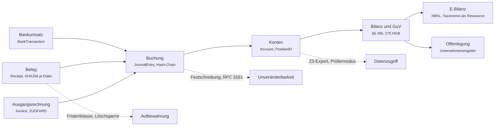
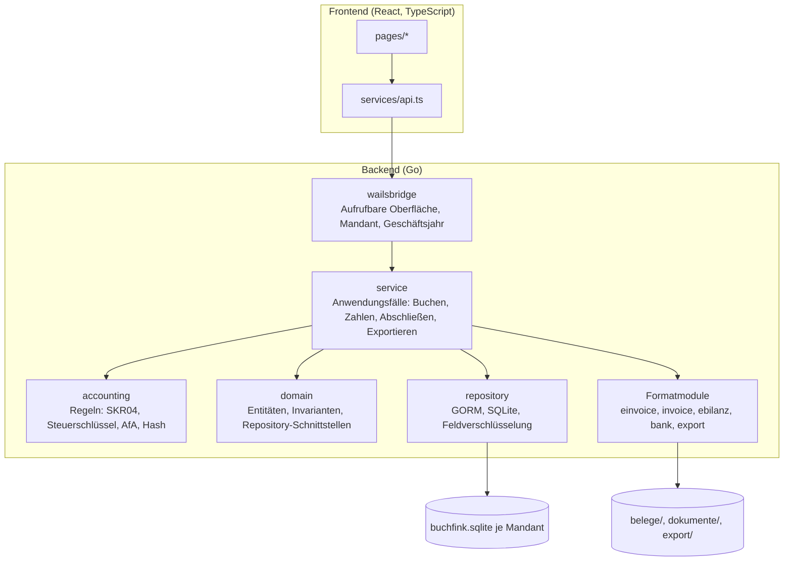
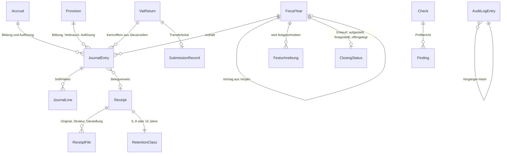
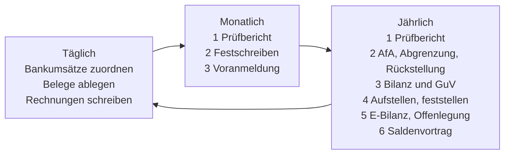

# Buchfink – Architektur und Bedienkonzept

Status: verbindlich für die Produktionsreife
Letzte Aktualisierung: 2026-09-06

Dieses Dokument beschreibt, wie Buchfink gebaut ist und wie es sich anfühlen
soll, wenn jemand ohne Buchhaltungskenntnis damit die Bücher einer kleinen
Kapitalgesellschaft führt. Es ergänzt zwei andere Dokumente: der
[Anforderungskatalog](anforderungskatalog.md) sagt, was das Gesetz verlangt und
wie weit Buchfink das erfüllt; das [Design-Konzept](design-konzept.md) sagt,
wie die Oberfläche aussieht. Hier steht, warum die Software so geschnitten ist
und welche Entscheidungen dahinterstehen.

---

## 1. Wer Buchfink bedient

Die Person am Rechner ist Gründerin oder Geschäftsführer einer UG oder GmbH.
Sie hat ein Bankkonto, stellt Rechnungen, bekommt Rechnungen, hat vielleicht
ein paar Anlagegüter und muss viermal im Jahr eine Umsatzsteuer-Voranmeldung
abgeben. Sie kennt die Wörter Soll und Haben, weiß aber nicht, was sie
bedeuten, und will das auch nicht lernen. Sie will drei Dinge: nichts
vergessen, nichts falsch machen, und am Jahresende einen Abschluss haben, den
ein Steuerberater oder das Finanzamt ohne Rückfrage annimmt.

Daraus folgt die Leitfrage für jede Funktion: **Was muss die Person heute
tun, und woran erkennt sie, dass es erledigt ist?** Buchhaltungsobjekte
(Konten, Buchungssätze, Steuerschlüssel) bleiben vorhanden und sichtbar, aber
sie sind die zweite Ebene. Die erste Ebene ist eine Aufgabenliste.

---

## 2. Grundentscheidungen

Die folgenden Entscheidungen sind bewusst getroffen und gelten bis auf
Widerruf. Jede hat eine Wirkung auf den Anforderungskatalog, die dort mit dem
Status `SCOPE` markiert ist.

| Entscheidung | Begründung | Folge |
|---|---|---|
| **Einzelplatz, ein Bearbeiter.** Buchfink läuft auf einem Rechner, ohne Benutzerverwaltung. | Die Zielgruppe hat keine Buchhaltungsabteilung. Rollen und Freigabestufen wären für eine Person Theater. | Jede Buchung speichert die Bearbeiterkennung (Betriebssystem-Benutzer und Rechnername). Funktionstrennung nach GoBD Rz 100 ff. wird in der Verfahrensdokumentation als „ein Bearbeiter, Kontrolle durch Steuerberater und Abschlussprüfung" beschrieben. Ein Prüfer bekommt den Datenträger (Z3), ergänzt um einen schreibgeschützten Prüfermodus (Z1). |
| **Local-First, Speicherort Inland.** Alle Daten liegen in einem Ordner auf dem Rechner der Anwenderin. | Kein Cloud-Zwang, keine Auftragsverarbeitung, keine Verlagerung nach § 146 Abs. 2a AO. | Sicherung und Wiederherstellung müssen Teil der Software sein. Der Speicherort wird in der Verfahrensdokumentation als Inland dokumentiert; wer den Ordner in eine ausländische Cloud synchronisiert, wird beim Einrichten darauf hingewiesen. |
| **Keine ERiC-Anbindung.** Buchfink übermittelt nichts selbst an die Finanzverwaltung. | ERiC ist eine proprietäre C-Bibliothek mit eigenen Lizenzbedingungen; ihre Einbindung würde den Build und die Lizenz des Projekts verändern. | Umsatzsteuer-Voranmeldung, Zusammenfassende Meldung und E-Bilanz entstehen als Datei bzw. als Kennziffernblatt zum Übertragen in Mein ELSTER. Das Übermittlungsprotokoll (Datum, Transferticket) wird nach der Übermittlung erfasst und ist danach unveränderlich. |
| **SKR04, Einheitsbilanz.** Ein Kontenrahmen, ein Wertansatz. | Kleine Kapitalgesellschaften stellen in der Praxis eine Einheitsbilanz auf. Zwei Bewertungskreise verdoppeln jede Erfassungsmaske. | Wo das Steuerrecht zwingend abweicht (Sonderabschreibung § 7g EStG), führt Buchfink den steuerlichen Wert am Anlagegut mit und erzeugt daraus das Verzeichnis nach § 5 Abs. 1 S. 2 EStG und die Überleitungsrechnung. Latente Steuern (§ 274 HGB) entfallen für kleine Gesellschaften nach § 274a HGB; ab mittelgroß verweist Buchfink an den Steuerberater. |
| **Steuerfälle sind eine geschlossene Liste.** | Jeder Steuerfall, den die Software kennt, muss vollständig richtig sein: Buchung, Rechnungstext, Voranmeldung, Meldung. Ein halb unterstützter Fall ist gefährlicher als ein fehlender. | Unterstützt: Inland 19 %, 7 %, 0 %, steuerfrei, innergemeinschaftlicher Erwerb, innergemeinschaftliche Lieferung, Reverse Charge als Empfänger (§ 13b Abs. 2 Nr. 1 UStG) und als Leistender (§ 3a Abs. 2 UStG), Ausfuhr. Ausgeschlossen: Kleinunternehmer, Differenzbesteuerung, Reiseleistungen, OSS/IOSS, Konsignationslager, Dreiecksgeschäft, Bauleistungen nach § 13b Abs. 2 Nr. 4 UStG. Die Oberfläche sagt bei einem ausgeschlossenen Fall, dass Buchfink ihn nicht abbildet. |
| **Keine Kasse, kein Lager, kein Lohn.** | Bargeschäft löst die KassenSichV aus, Lager braucht Inventur, Lohn ist ein eigenes Rechtsgebiet. | Das Kassenkonto 1600 bleibt bebuchbar für Auslagen und Verauslagungen, ein Kassenbuch gibt es nicht. Vorräte werden zum Stichtag als Inventurwert erfasst und als Bestandsveränderung gebucht. Lohn kommt als Sammelbuchung aus dem Lohnjournal des Lohnbüros herein. |
| **Kapitalgesellschaften zuerst.** | Der Gründungsweg, die Kapitalaufbringung, die Größenklassen und die Offenlegung sind für UG, GmbH und AG gebaut. Personenhandelsgesellschaften brauchen Kapitalkonten je Gesellschafter, Entnahmen und Einlagen. | Die Rechtsformen KG, OHG und e.K. bleiben wählbar, zeigen aber in der Oberfläche den Hinweis „Kapitalkonten und Entnahmen sind in dieser Fassung nicht abgebildet". |

---

## 3. Die Kette, an der alles hängt

Der Anforderungskatalog beschreibt die Kette vom Geschäftsvorfall bis zur
Offenlegung. In Buchfink hat jede Station eine Entität und einen Dienst.

Was heute schon funktioniert und was in dieser Runde dazukommt, steht je Station im
Anforderungskatalog. Die Architekturentscheidung ist, **dass jede Station aus
den Buchungen abgeleitet wird und nichts daneben erfasst wird**: die Bilanz
liest Kontensalden, die E-Bilanz liest die Bilanz, die Voranmeldung liest die
Steuerzeilen der Buchungen. Es gibt keine zweite Datenquelle für eine Zahl.

---

## 4. Schichten

Regeln, die diese Schichtung stützen:

1. **Ein Schreibweg ins Journal.** `service.JournalService.Post` ist die einzige
   Stelle, an der eine Buchung entsteht. Alle Anwendungsfälle (Beleg buchen,
   Zahlung zuordnen, AfA-Lauf, Saldenvortrag, Abschlussbuchung) bauen einen
   `JournalEntry` und geben ihn dorthin. Dort sitzen Ausgleich, Kontenprüfung,
   Periodensperre, Nummernvergabe und Hash-Chain.
2. **Regeln ohne Datenbank.** Das Paket `accounting` rechnet: Steuerschlüssel,
   AfA-Pläne, Wertgrenzen, Größenklassen, Bilanzgliederung. Es kennt keine
   Repositories und ist vollständig durch Tabellentests abgedeckt.
3. **Zeitabhängige Parameter als datierte Regelsätze.** Wertgrenzen, AfA-Sätze,
   Größenklassen-Schwellen, Basiszinssatz und Aufbewahrungsfristen liegen in
   `accounting/tax_params.go` als Tabellen mit Gültigkeitsbeginn. Eine
   Gesetzesänderung ist eine neue Zeile, keine Codeänderung.
4. **Formatmodule sind austauschbar.** Export (Z3, DATEV, Archiv), E-Bilanz und
   E-Rechnung lesen ein neutrales Datenmodell und schreiben ein Format. Die
   künftige Buchführungsdatenschnittstelle nach § 147b AO wird ein weiteres
   Modul, kein Umbau.
5. **Die Bridge hält den Zustand, die Dienste sind zustandsarm.** Mandant und
   aktives Geschäftsjahr leben in `wailsbridge`; die Dienste bekommen das Jahr
   gesetzt und filtern danach.

### Prüfpunkte mit Datum

Fünf Punkte stehen von außen fest und sind zu ihrem Termin nachzuprüfen. Sie
gehören in den Entwicklungsplan, nicht in eine Merkliste.

- **§ 147b AO / DSFinVBV** — offen. Die Verordnung ist nicht erlassen; der
  Diskussionsentwurf des BMF in der Fassung 2026 legt xBRL-CSV 1.0 fest. Der
  Stand ist zu jeder Jahresplanung zu prüfen. Mit der Verkündung wird der Export
  ein weiteres Formatmodul nach Regel 4, kein Umbau (Katalog PRF-06).
- **Übergangsfrist E-Rechnung, Ausstellerseite** — 01.01.2027 und 01.01.2028
  (§ 27 Abs. 38 UStG). Ab 2027 gilt die Sendepflicht bei einem Vorjahresumsatz
  über 800.000 Euro, ab 2028 für alle inländischen B2B-Umsätze. Der
  Vorjahresumsatz steht in der Buchführung und entscheidet, welcher Termin gilt.
- **Basiszinssatz nach § 247 BGB** — 1. Januar und 1. Juli jedes Jahres. Die
  Bundesbank gibt ihn halbjährlich bekannt; er wird als datierte Zeile
  nachgetragen und wirkt nur auf Zeiträume ab seinem Beginn.
- **Taxonomie-Stand der E-Bilanz** — jährlich nach dem BMF-Schreiben.
  Taxonomie 6.9 gilt für Wirtschaftsjahre ab 2026, 6.10 ab 2027. Die Ressource
  `internal/ebilanz/taxonomy_6.9.json` ist durchgehend mit `verified: false`
  markiert; vor
  der ersten Übermittlung sind ihre Elementnamen gegen die amtliche Fassung
  abzugleichen.
- **Jahresstand des SKR04** — jährlich. Der Kontenrahmen liegt als
  `internal/accounting/skr04_2026.json` bei; eine neue Fassung ist eine neue
  Datei, keine Änderung an der bestehenden.

---

## 5. Datenmodell: was dazukommt

Das bestehende Modell (Buchung, Beleg, Kontakt, Rechnung, Anlage,
Festschreibung, Audit-Log) bleibt. Für die Produktionsreife kommen wenige
Entitäten dazu, jede mit einem klaren Grund.

| Entität | Zweck | Katalog |
|---|---|---|
| **FiscalYear** | Das Geschäftsjahr wird eine Entität mit Beginn, Ende, Rumpfjahr-Kennzeichen, Vortragsstand und Abschlussstatus. Bisher war es nur ein Filterfeld an der Buchung. | GOB-06, JAB-04, JAB-09 |
| **Saldenvortrag** | Eigene Buchung mit Quelle `opening`, Gegenkonto 9000/9008/9009, wiederholbar durch Storno und Neuvortrag. Personenkonten werden je offenem Posten vorgetragen. | JAB-09, BEW-01 |
| **Abschlussbuchungen** | Erfolgskonten auf das Jahresergebnis, Umsatzsteuer-Verrechnung, Steuerrückstellung, Ergebnisverwendung. Alle mit Quelle `closing`, alle im Journal. | JAB-01, JAB-04 |
| **Accrual (Rechnungsabgrenzung)** | Start, Ende, Betrag, Konto; monatliche Auflösung als Buchung. | BEW-08 |
| **Provision (Rückstellung)** | Art, Erfüllungsbetrag, Restlaufzeit, Abzinsung aus einer pflegbaren Zinstabelle, Verbrauch und Auflösung mit Begründung. | BEW-07 |
| **VatReturn** | Ein Voranmeldungszeitraum mit allen Kennziffern, abgeleitet aus den Steuerzeilen, mit Übermittlungsprotokoll und Berichtigungskette. | UST-03, UST-01 |
| **RetentionClass am Beleg** | Fristenklasse aus der Belegart, Fristbeginn 31.12. des Entstehungsjahres, frühestes Löschdatum, Aufbewahrungs-Hold. | ARC-01, ARC-02 |
| **AuditLog mit Vorher/Nachher und Kette** | Stammdatenänderungen als Diff, jeder Eintrag verkettet, Bearbeiterkennung und Programmversion an jeder Buchung. | UNV-03, UNV-04, UNV-06 |
| **Check und Finding** | Ergebnisse der Prüfläufe (Plausibilität, Zeitgerechtigkeit, Doppelbelege) mit Zeitpunkt und Umfang, übergangene Befunde mit Begründung. | GOB-03, BEL-04, UNV-05 |

---

## 6. Bedienkonzept: der Jahreslauf strukturiert die Oberfläche

Das Menü bleibt (Übersicht, Buchhaltung, Stammdaten, Auswertungen, Verwaltung).
Mit Welle 7 ist die Gruppe „Übersicht" die Aufgabenliste und zeigt nur noch
diesen einen Eintrag; die beiden Abschlussvorgänge sind geführte Wege
geworden.

Zwei Ansichten sind mit den Wellen 5b und 5c dazugekommen, weil ihr Vorgang
nicht in einen Dialog passt: „Anzahlungen" führt den Rechnungsverbund mit
Abschlägen, Vereinnahmung und Schlussrechnung, und „Nebenpflichten" bündelt
das Verzeichnis nach § 15a UStG, die USt-IdNr.-Bestätigungen, den Belegnachweis,
die Berichte zu nicht abziehbaren Betriebsausgaben und die Kurse. Mit Welle 6 kamen die
Nachweise dazu — Änderungsprotokoll, Versionen und Datenübernahmen,
Aufbewahrungsfristen, Verfahrensdokumentation —, verteilt auf drei Seiten, die
nach der Herkunft der Daten geschnitten waren und einander gegenseitig
verwiesen. Welle 9 schneidet die Verwaltung nach dem, was der Anwender vorhat:
„Datensicherung" (Kopien anlegen, Fristen und Löschung), „Betriebsprüfung"
(Prüfermodus, Datenüberlassung, Verfahrensdokumentation zum Herausgeben) und
„Einstellungen". Die Rechnungs- und Belegdialoge verweisen auf diese Seiten,
statt die Vorgänge zu verdoppeln.

### 6.1 Die Startseite ist eine Aufgabenliste

Beim Start steht die Aufgabenliste, und die Kennzahlen stehen darunter auf
derselben Seite. Die frühere Seite „Übersicht" ist darin aufgegangen: sie
beantwortete dieselbe Frage ein zweites Mal und wäre irgendwann die veraltete
von beiden gewesen.

`TaskService.Tasks` (internal/service/task_service.go) rechnet nichts selbst.
Der Dienst fragt die Dienste, die die jeweilige Sache führen, und übersetzt
deren Antwort in Zeilen; jede Quelle hängt als eigene kleine Schnittstelle
daran und darf fehlen, ohne dass die Liste ausbleibt. Fällt eine Quelle mit
einem Fehler aus, fehlt ihre Zeile und der erste Bildschirm entsteht trotzdem.
Die Quellen, so wie sie gebaut sind:

| Quelle | Was daraus wird |
|---|---|
| Prüflauf bis heute | jeder Befund als eigene Zeile, blockierende zuerst |
| Fristen und Abschlusstermine | Voranmeldung, Zusammenfassende Meldung, Festschreibung, Aufstellung, Offenlegung |
| Bankumsätze | die ohne Zuordnung |
| Belege | abgelegt ohne Buchung, länger als die Erfassungsfrist liegen geblieben, ohne Leistungsnachweis über der Nachweisgrenze |
| Offene Posten | überfällige Forderungen mit Zahl und Betrag |
| Anlagendokumente | abgelaufene und in den nächsten dreißig Tagen ablaufende |
| Freistellungsbescheinigungen | dieselben beiden Fälle |
| Sicherung | keine seit drei Tagen, oder der letzte Lauf ist gescheitert |
| Prüfermodus | eingeschaltet, mit Frist und Grund |
| Jahreswechsel | Differenz im Saldenvortrag, offener Vortrag, nicht festgestellter Vorjahresabschluss nach Ablauf der Aufstellungsfrist, offene Ergebnisverwendung |

Sortiert wird in drei Gruppen: **überfällig** sind verstrichene Fristen,
**offen** ist die laufende Arbeit ohne Frist, **demnächst** sind die Fristen
der nächsten dreißig Tage. Eine vierte Gruppe („irgendwann") wäre eine Liste,
die niemand liest. Jede Zeile hat drei Teile: was zu tun ist, warum (ein Satz
mit der Norm hinter dem Erklärzeichen) und einen Knopf, der an die Stelle
führt, an der die Sache zu erledigen ist.

### 6.2 Monatsabschluss in drei Schritten

Der Monatsabschluss ist ein Dialog mit drei Schritten, von der Aufgabenliste
und von der Fristenseite aus erreichbar. Den Stand jedes Schrittes rechnet
`MonthCloseService.State` (internal/service/month_close_service.go) aus
Prüflauf, Festschreibung und Voranmeldung; der Dienst bucht und schreibt
nichts fest, er sagt, wo der Monat steht.

| Schritt | Was Buchfink tut | Was die Anwenderin tut |
|---|---|---|
| 1 Prüfbericht | Läuft die Plausibilitätsprüfung bis zum Monatsende: Buchungen ohne Beleg, Belege ohne Buchung, Interimskonten, offene Bankumsätze, Doppelbelege, Nummernlücken. | Klärt Befunde über den Sprung an ihre Stelle oder übergeht sie mit Begründung. |
| 2 Festschreiben | Schließt den Monat ab und holt den Zeitstempel. | Bestätigt. |
| 3 Voranmeldung | Zeigt alle Kennziffern des Vordrucks mit Drill-down bis zur Buchung und erzeugt das Kennziffernblatt als Datei. | Trägt die Werte in Mein ELSTER ein und erfasst danach Datum und Transferticket. |

Die Reihenfolge ist eine Entscheidung: Was gemeldet wird, muss vorher
unveränderlich sein, sonst weicht die Buchführung später von der Meldung ab,
und die Abweichung fällt erst dem Prüfer auf. Deshalb steht die Festschreibung
vor der Bestätigung der Übermittlung, und die Bestätigung setzt sie voraus. Das
Kennziffernblatt ist von Anfang an sichtbar — wer die Werte erst nach der
Festschreibung sähe, hätte sie in Mein ELSTER schon eingetragen. Ein Monat ohne
Voranmeldung (Zeitraum Quartal) endet nach Schritt 2; am Quartalsende folgt
Schritt 3 über die drei Monate.

### 6.3 Jahresabschluss als geführter Weg

Der Jahresabschluss ist die Stelle, an der ein Nicht-Buchhalter bisher
aussteigt. Die Jahresabschluss-Seite führt deshalb einen Weg durch die
vierzehn Abschlussbausteine, mit einer Fortschrittsanzeige („4 von 14") und
dem nächsten offenen Schritt darüber. Fachlich sind es sechs Stationen:

1. **Prüfbericht** wie im Monat, zusätzlich: Konten ohne Bilanzposition,
   Anlagen ohne AfA, nicht abgezinste Rückstellungen, übersprungene
   Abschlussbausteine.
2. **Abschlussbuchungen** in vorgegebener Reihenfolge, jede optional
   überspringbar mit Grund: AfA-Lauf, Rechnungsabgrenzung, Rückstellungen,
   Inventurwert der Vorräte, Umsatzsteuer-Verrechnung, Steuerrückstellung,
   Wertaufholung, Vorsteuerberichtigung nach § 15a UStG.
3. **Bilanz und GuV** nach §§ 266, 275 HGB in der Gliederung der
   Größenklasse, mit Vorjahresspalte, als Datei.
4. **Aufstellen und feststellen.** Statuswechsel mit Datum; der
   Feststellungsbeschluss wird als Dokument angehängt. Ab „festgestellt" ist
   das Jahr gesperrt.
5. **E-Bilanz und Offenlegung.** XBRL-Datei erzeugen, Übermittlung
   bestätigen; Offenlegungsumfang aus der Größenklasse, Frist und Nachweis.
6. **Saldenvortrag** ins neue Jahr, mit Ergebnisverwendung.

Zwei Entscheidungen bestimmen den Weg:

**Der Fortschritt kommt aus dem Backend.** `ClosingSteps` liefert die Zahl der
erledigten, der übersprungenen und der insgesamt vorhandenen Schritte
(internal/service/closing_steps_service.go). Ein übersprungener Baustein zählt
als abgeschlossen und nicht als getan. Die Ansicht zählt nicht nach: wer
dieselbe Frage zweimal beantwortet, bekommt beim nächsten Baustein zwei
Antworten.

**Ein Schritt öffnet seine Arbeit dort, wo sie wohnt.** Der Knopf springt auf
den Reiter der Abschlussbausteine (Abgrenzung, Rückstellungen, Vorräte,
Umsatzsteuer, Steuern, Ergebnis), auf den Reiter der Nebenpflichten
(Wertaufholung, Fremdwährung, Vorsteuerberichtigung) oder auf die Seite, die
den Baustein führt (Anlagevermögen, Fristen, GuV & Bilanz, E-Bilanz); die
Feststellung springt auf den Abschnitt dieser Seite. Ein eigener Dialog je
Baustein würde dieselbe Maske ein zweites Mal bauen und liefe von der Seite
weg, auf der der Baustein tatsächlich gepflegt wird; ein Skript hält die
Zuordnung vollständig (scripts/check_closing_steps.py, `task check:steps`),
damit ein neuer Baustein nicht ohne Ziel dasteht.

Zurück ist möglich, solange nichts festgeschrieben ist: ein übersprungener
Baustein lässt sich mit Grund wieder öffnen, und der Grund geht ins
Änderungsprotokoll. Zwei Sperren beenden das in der Reihenfolge, in der sie
eintreten — die Jahres-Festschreibung (§ 146 Abs. 4 AO) und die Feststellung
(§ 42a Abs. 1 GmbHG). Danach führt der Weg zurück über den Storno der Buchung
oder die Rücksetzung der Feststellung; der Knopf bleibt stehen und nennt am
Zeiger den Grund, statt zu verschwinden.

### 6.4 Sprache

Die Oberfläche spricht in Vorgängen, nicht in Konten. Ein Bankumsatz ist
„Geld erhalten" oder „Geld bezahlt", ein Beleg ist „Rechnung vom Lieferanten",
eine Abgrenzung ist „Kosten, die ins nächste Jahr gehören". Der Buchungssatz
mit Soll und Haben steht in der Vorschau jedes Vorgangs und im Journal, damit
der Steuerberater ihn sieht und die Anwenderin ihn lernen kann, wenn sie will.
Das Design-Konzept regelt die drei Stufen der Erklärung (Tooltip, Popover,
Dialog); jede gesetzliche Prüfung nennt in der zweiten Stufe die Norm.

Geprüft wird das: `scripts/check_ui_text.py` (in `task check` über das Ziel
`check:text`) liest die Seiten unter frontend/src/pages und meldet jeden
Paragraphen, der in einer Arbeitsansicht steht und nicht in ihrem Umkreis eine
Erklärkomponente hat. Hinweistexte unter einem Feld und der Kontext unter einer
Abschnittsüberschrift zählen dabei als Arbeitsansicht, auch wenn drei Zeilen
weiter ein Erklärzeichen sitzt. Die Heuristik ist grob, weil eine genaue
Prüfung den Text verstehen müsste; sie hält die Norm dort, wo sie erklärt
wird.

### 6.5 Das Prüferpaket

Ein Knopf unter „Betriebsprüfung" erzeugt in einem Ordner alles, was
eine Betriebsprüfung verlangt: den Z3-Export nach dem Beschreibungsstandard
(Datendateien plus `index.xml`), den Archivexport der Belege mit Index, das
Integritätsprotokoll, das Schlüsselverzeichnis und die
Verfahrensdokumentation in der Version, die zu den Daten gehört. Der
Prüfermodus schaltet die Oberfläche schreibgeschützt und protokolliert den
Zugriff.

### 6.6 Sicherung ohne Nachdenken

Buchfink sichert den Datenordner beim Beenden und einmal täglich in einen
gewählten Zielordner, protokolliert das Ergebnis und bietet beim Start eine
Wiederherstellung an, nach der die Integritätsprüfung läuft. Die Sicherung
ist eine ZIP-Datei mit Datenbank, Belegen, Dokumenten und Schlüsseldatei;
ihre Wiederherstellung ist ohne die Software möglich, weil das Format offen
ist.

---

## 7. Einordnung der offenen Anforderungen

Die Lückenanalyse im Anforderungskatalog ordnet jedes Kriterium einem Status
zu. Die offenen Punkte fallen in sieben Wellen. Die Reihenfolge folgt der
Frage, was einen Jahreslauf blockiert.

| Welle | Inhalt | Katalog | Warum in dieser Reihenfolge |
|---|---|---|---|
| 1 | Geschäftsjahr als Entität, Saldenvortrag, Abschluss der Erfolgskonten, Ergebnisverwendung, Abschlussstatus | GOB-06, JAB-04, JAB-09, BEW-01 | Ohne Vortrag endet die Buchhaltung nach einem Jahr. |
| 2 | Bilanz und GuV nach §§ 266, 275 HGB im Backend, Größenklassen, Vorjahresspalte, Ausgabe als Datei; E-Bilanz aus der Gliederung | JAB-01, JAB-02, JAB-03, JAB-05 | Erst mit der Gliederung gibt es eine Struktur, auf die E-Bilanz und Offenlegung zeigen. |
| 3 | Umsatzsteuer-Voranmeldung mit allen Kennziffern, Dauerfristverlängerung, Übermittlungsprotokoll, Zusammenfassende Meldung, Prüfberichte vor Festschreibung | UST-01, UST-03, UST-04, GOB-03, BEL-04, UNV-05 | Die Daten stammen aus den Buchungen; die Meldung ist die Pflicht mit dem kürzesten Takt. |
| 4 | Z3-Export mit Beschreibungsstandard, Archivexport, Sicherung und Wiederherstellung, Prüfermodus | PRF-01, PRF-02, ARC-04, ARC-08 | Betriebsprüfung und Datenverlust sind die beiden Ereignisse, die eine Buchhaltung beenden. |
| 5a | Rechnungsabgrenzung, Rückstellungen, Inventurwert, Umsatzsteuer-Verrechnung, Steuerrückstellung, Verzeichnis nach § 5 EStG | BEW-07, BEW-08, BEW-09, JAB-06 | Für die Bilanz nicht verzichtbar, aber erst mit Welle 1 und 2 sinnvoll. |
| 5b | Rechnungsnummer in einer Transaktion, Pflichtangaben, XRechnung, Storno- und Korrekturbelege, Kleinbetrag, Anzahlungen als Rechnungsverbund, Ausbuchung | RECH-02 bis RECH-09, BEL-09, UST-02 | Die Ausgangsrechnung ist der häufigste Beleg; ihre Fehler wandern in jede Meldung. |
| 5c | Vorsteuerkopplung, Vorsteuerschlüssel, Verzeichnis nach § 15a UStG, USt-IdNr.-Bestätigung, Belegnachweis, Geschenke, Fremdwährung, Abschreibungsregeln als Ressource | UST-05 bis UST-07, RECH-07, BEW-03, BEW-10, BEW-12 | Nebenpflichten, die im laufenden Jahr anfallen und im Abschluss nicht mehr nachholbar sind. |
| 6 | Änderungsprotokoll mit Vorher/Nachher und Kette, Bearbeiterkennung, Programmversion je Buchung, Aufbewahrungsfristen und Holds, Verfahrensdokumentation | UNV-03, UNV-04, UNV-06, ARC-01, ARC-02, PRF-03 | Nachweispflichten, die ohne die ersten Wellen leer blieben. |
| 7 | Aufgabenliste, Monatsabschluss-Dialog, Jahresabschluss-Weg, Mahnwesen, Bankabgleich-Vorschlag mit Sammelzahlung und gelernten Regeln, Prüfpfad und Leistungsnachweis am Eingangsbeleg, Prüfszenario mit gemessenem Klickweg (docs/pruefszenario.md) | Abschnitt 6, QUE-05, RECH-08, GOB-02 | Die Bedienung legt sich über die fertigen Funktionen. |

Nach Welle 7 folgt keine weitere. Was offen geblieben ist, hat im
[Anforderungskatalog](anforderungskatalog.md) in der Spalte Welle den Vermerk
„Politur" und nennt in der Spalte Grund, wovon es abhängt: von einer
Entscheidung, von einem Objekt, das Buchfink nicht führt, oder von einer
Handlung außerhalb des Programms. Welche Kriterien in welcher Welle lagen und was davon gebaut ist,
steht dort mit Fundstellen.
